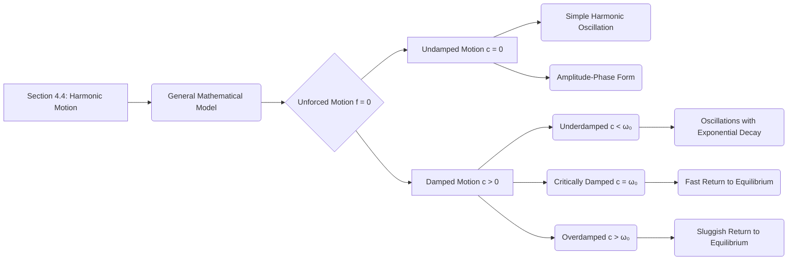
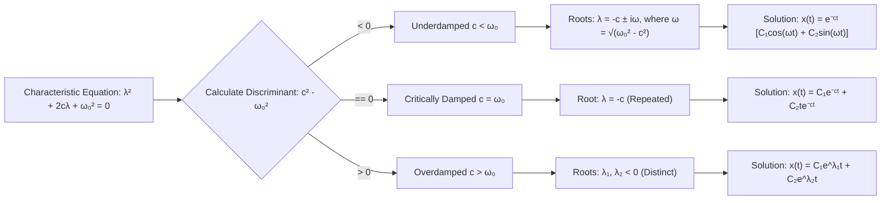

## 1. Chapter Outline (Mermaid Diagram)

## 2. Core Mathematical Models & Definitions

> [!definition] General Equation for Harmonic Motion The motion of a vibrating spring or the behavior of an $RLC$ circuit can be unified under the standard second-order linear differential equation: $$x'' + 2cx' + \omega_0^2x = f(t)$$
> 
> - **$c \ge 0$ (Damping Constant):** Represents the physical resistance in the system (e.g., friction, air resistance, or electrical resistance $R$).
> - **$\omega_0 > 0$ (Natural Frequency):** The intrinsic angular frequency of the system in the absence of damping. For a spring, $\omega_0 = \sqrt{k/m}$; for a circuit, $\omega_0 = \sqrt{1/LC}$.
> - **$f(t)$ (Forcing Term):** The external force or voltage applied to the system over time.

> [!definition] Simple (Undamped) Harmonic Motion & Amplitude-Phase Form When $c = 0$ and $f(t) = 0$, the system has no resistance and oscillates perpetually. The solution $x(t) = a \cos(\omega_0 t) + b \sin(\omega_0 t)$ can be equivalently expressed in the amplitude-phase form: $$x(t) = A \cos(\omega_0 t - \phi)$$
> 
> - **$A$ (Amplitude):** Given by $A = \sqrt{a^2 + b^2}$, this represents the maximum physical displacement of the mass from its equilibrium position.
> - **$\phi$ (Phase Angle):** Given by $\tan \phi = \frac{b}{a}$, this angle dictates the horizontal shift of the cosine wave. A positive phase shifts the graph of the cosine to the right.

## 3. Theorems & Solution Algorithms

> [!theorem] Classification of Damped Harmonic Motion For an unforced ($f(t) = 0$), damped oscillator modeled by $x'' + 2cx' + \omega_0^2x = 0$, the characteristic roots $\lambda = -c \pm \sqrt{c^2 - \omega_0^2}$ dictate three distinct physical behaviors depending on the sign of the discriminant $c^2 - \omega_0^2$:
> 
> 1. **Underdamped ($c < \omega_0$):** The roots are distinct complex conjugate numbers. The system oscillates with exponentially decaying amplitude.
> 2. **Critically Damped ($c = \omega_0$):** The system has one repeated real root. The system returns to equilibrium without oscillating, and this case acts as the dividing line between underdamping and overdamping.
> 3. **Overdamped ($c > \omega_0$):** The system has two distinct, negative real roots. Extreme damping prevents the curve from crossing the $t$-axis, causing a sluggish return to equilibrium.

**Algorithm: Damped Harmonic Motion Decision Tree**

## 4. Geometric Insights & Visual Placeholders

> ![[Pasted image 20260506142405.png]] 
>  _This diagram visually unpacks the Amplitude-Phase identity, proving how an abstract linear combination of sine and cosine functions mathematically aligns into a single shifted cosine wave of maximum height $A$, shifted by $\phi / \omega_0$._

> ![[Pasted image 20260506142513.png]]
> _This graph displays a decaying sinusoidal curve. The physical oscillation is bounded by an exponential decay envelope, representing how resistive forces continually steal energy from the system over time._

> [!picture] 📸
> ![[Pasted image 20260506142604.png]]
>  [Insert screenshot of Textbook Figure 8: The overdamped motion] _Contrasting the underdamped case, this figure visualizes how extreme damping prevents the curve from crossing the horizontal axis, killing oscillation entirely and causing the system to lazily approach zero._

## 5. Common Pitfalls & Take-home Message

> [!warning] Common Pitfalls **The Quadrant Trap for Phase Angles:** When finding the phase angle $\phi$ using the formula $\tan \phi = b/a$, it is a serious mistake to simply write $\phi = \arctan(b/a)$. The standard arctangent function only returns values between $-\pi/2$ and $\pi/2$. You must check the signs of the constants $a$ and $b$ to determine the correct quadrant in the Cartesian plane; if $a < 0$, you must physically add or subtract $\pi$ from your arctangent result to position your phase angle correctly.

**Take-home Message:** Harmonic motion is fundamentally governed by the battle between a system's restorative forces (natural frequency, $\omega_0$) and its resistive forces (damping, $c$). Depending on the ratio of these forces, the system will exhibit perpetual oscillation, decaying oscillation, or a purely exponential return to equilibrium without oscillating.