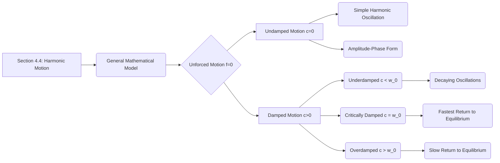

## 1. Chapter Outline (Mermaid Diagram)



## 2. Core Mathematical Models & Definitions

> [!definition] General Equation for Harmonic Motion The behavior of a vibrating spring or an $RLC$ circuit can be unified under the standard second-order linear differential equation: $$x'' + 2cx' + \omega_0^2x = f(t)$$
> 
> - **$c \ge 0$ (Damping Constant):** Represents the physical resistance in the system (e.g., friction, air resistance, or electrical resistance $R$). It is proportional to velocity $x'$.
> - **$\omega_0 > 0$ (Natural Frequency):** The intrinsic angular frequency of the system in the absence of damping. For a spring, $\omega_0 = \sqrt{k/m}$; for a circuit, $\omega_0 = \sqrt{1/LC}$.
> - **$f(t)$ (Forcing Term):** The external force or voltage applied to the system over time.

> [!definition] Simple (Undamped) Harmonic Motion When $c = 0$ and $f(t) = 0$, the system has no resistance and oscillates perpetually: $$x(t) = a \cos(\omega_0 t) + b \sin(\omega_0 t)$$ This can be translated into a more intuitive physical form: $$x(t) = A \cos(\omega_0 t - \phi)$$
> 
> - **$A$ (Amplitude):** Given by $A = \sqrt{a^2 + b^2}$, this represents the maximum physical displacement of the mass from its equilibrium position.
> - **$\phi$ (Phase Angle):** Given by $\tan \phi = \frac{b}{a}$, this angle dictates the horizontal shift of the cosine wave, adjusting for the initial displacement and velocity.

## 3. Theorems & Solution Algorithms

> [!theorem] Classification of Damped Harmonic Motion For an unforced ($f(t) = 0$), damped oscillator modeled by $x'' + 2cx' + \omega_0^2x = 0$, the characteristic roots $\lambda = -c \pm \sqrt{c^2 - \omega_0^2}$ dictate three distinct physical behaviors depending on the discriminant $c^2 - \omega_0^2$:
> 
> 1. **Underdamped ($c < \omega_0$):** Complex conjugate roots. The system oscillates with exponentially decaying amplitude.
> 2. **Critically Damped ($c = \omega_0$):** One repeated real root. The system returns to equilibrium as fast as possible without oscillating.
> 3. **Overdamped ($c > \omega_0$):** Two distinct, negative real roots. The damping is so strong that the system sluggishly returns to equilibrium without ever crossing it.

**Algorithm: Damped Harmonic Motion Decision Tree**

```
graph TD
    A[Characteristic Equation: \lambda^2 + 2c\lambda + \omega_0^2 = 0] --> B{Calculate Discriminant: c^2 - \omega_0^2}

    B -->|< 0| C[Underdamped c < \omega_0]
    C --> C1["Roots: -c ± i\omega, where \omega = \sqrt{\omega_0^2 - c^2}"]
    C1 --> C2["Solution: x(t) = Ae^{-ct} \cos(\omega t - \phi)"]

    B -->|== 0| D[Critically Damped c = \omega_0]
    D --> D1["Root: \lambda = -c (Repeated)"]
    D1 --> D2["Solution: x(t) = C_1e^{-ct} + C_2te^{-ct}"]

    B -->|> 0| E[Overdamped c > \omega_0]
    E --> E1["Roots: \lambda_1, \lambda_2 < 0 (Distinct)"]
    E1 --> E2["Solution: x(t) = C_1e^{\lambda_1 t} + C_2e^{\lambda_2 t}"]
```

## 4. Geometric Insights & Visual Placeholders

> [!picture] 📸 [Insert screenshot of Textbook Figure 3: The phase angle shifts the graph of the cosine] _This diagram visually unpacks the Amplitude-Phase identity, proving how an abstract linear combination of sine and cosine mathematically aligns into a single shifted cosine wave of maximum height $A$._

> [!picture] 📸 [Insert screenshot of Textbook Figure 7: The underdamped motion] _This graph displays $x(t) = Ae^{-ct} \cos(\omega t - \phi)$. Observe how the true motion is bounded by the exponential decay envelope $\pm A e^{-ct}$, representing how friction continually steals energy from the system while it oscillates._

> [!picture] 📸 [Insert screenshot of Textbook Figure 8: The overdamped motion] _Contrasting the underdamped case, this figure visualizes how extreme damping (like a car with highly stiff shock absorbers) prevents the curve from crossing the $t$-axis, killing oscillation entirely._

## 5. Common Pitfalls & Take-home Message

> [!warning] Common Pitfalls **The Quadrant Trap for Phase Angles:** When converting $x(t) = a \cos(\omega_0 t) + b \sin(\omega_0 t)$ to $x(t) = A \cos(\omega_0 t - \phi)$, students universally jump to the formula $\phi = \arctan(b/a)$. **This is dangerous.** The basic arctangent function only outputs angles between $-\pi/2$ and $\pi/2$. You _must_ check the signs of the constants $a$ and $b$ to determine the correct quadrant in the Cartesian plane. If $a < 0$, you must physically add $\pi$ or subtract $\pi$ to correctly position your phase angle!

**Take-home Message:** Harmonic motion is fundamentally governed by the battle between a system's restorative forces (natural frequency, $\omega_0$) and its resistive forces (damping, $c$). When damping is absent, the system oscillates forever in a pure sinusoid; however, as damping increases, it sequentially suppresses the oscillation amplitude (underdamped), perfectly arrests the oscillation (critically damped), and ultimately creates a sluggish, non-oscillating return to rest (overdamped).