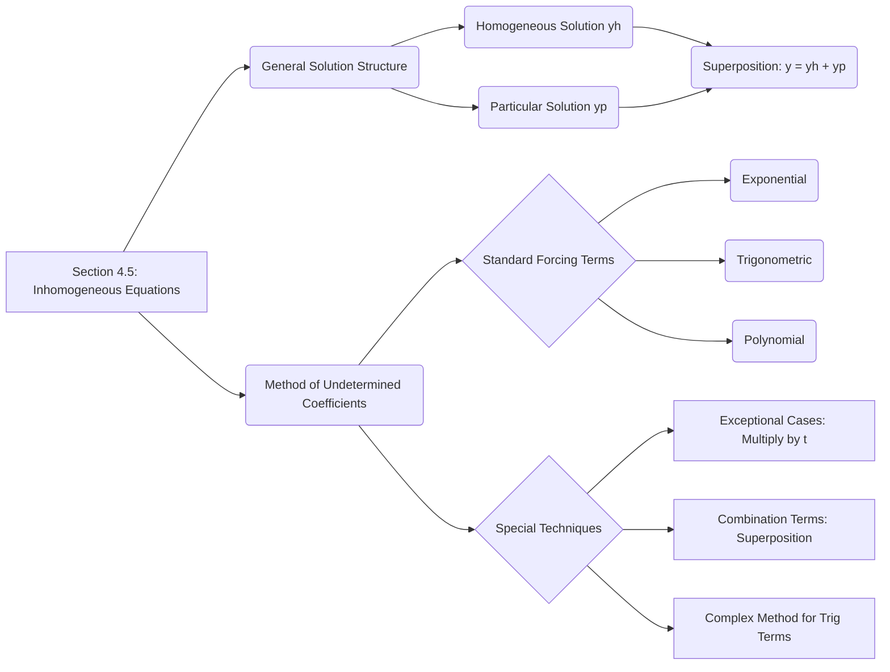
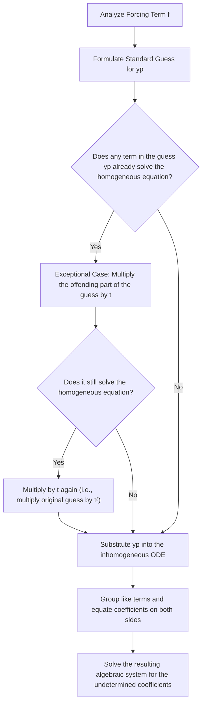

## 1. Chapter Outline (Mermaid Diagram)

## 2. Core Mathematical Models & Definitions

> [!definition] General Inhomogeneous Linear Equation A second-order inhomogeneous (or nonhomogeneous) linear differential equation takes the standard form: $$y'' + p(t)y' + q(t)y = f(t)$$
> 
> - **$p(t), q(t)$ (System Parameters):** These coefficients dictate the internal dynamics and restorative/damping forces of the system.
> - **$f(t)$ (Forcing Term):** The external force, voltage, or input applied to the system over time. If $f(t) \neq 0$, the equation is inhomogeneous.

> [!definition] Complete Solution Structure The general solution to an inhomogeneous linear equation is always constructed as a sum: $$y(t) = y_h(t) + y_p(t)$$
> 
> - **$y_h(t)$ (Homogeneous Solution):** The general solution to the associated unforced equation ($y'' + py' + qy = 0$). Physically, this represents the **transient response** or natural internal behavior of the system, which often decays over time if damping is present.
> - **$y_p(t)$ (Particular Solution):** Any single valid solution to the full inhomogeneous equation. Physically, this represents the **steady-state response** driven by the external force $f(t)$.

## 3. Theorems & Solution Algorithms

> [!theorem] Theorem 5.22: Superposition Principle for Inhomogeneous Equations Suppose that $y_{f_1}(t)$ is a particular solution to $y'' + py' + qy = f_1(t)$ and $y_{f_2}(t)$ is a particular solution to $y'' + py' + qy = f_2(t)$. Then for any constants $\alpha$ and $\beta$, the linear combination: $$y(t) = \alpha y_{f_1}(t) + \beta y_{f_2}(t)$$ is a particular solution to the combined equation: $$y'' + py' + qy = \alpha f_1(t) + \beta f_2(t)$$

> [!theorem] The Complex Method for Trigonometric Forcing When finding a particular solution for a trigonometric forcing term like $f(t) = A \cos(\omega t)$ or $A \sin(\omega t)$, it is often algebraically simpler to solve the associated complex differential equation: $$z'' + pz' + qz = A e^{i\omega t}$$ Once the complex solution $z(t)$ is found, the real part $\text{Re}(z(t))$ provides the particular solution for the cosine force, and the imaginary part $\text{Im}(z(t))$ provides the particular solution for the sine force.

**Algorithm: Method of Undetermined Coefficients Decision Tree**

## 4. Geometric Insights & Visual Placeholders

> [!picture] 📸 [Insert screenshot of Textbook plot demonstrating Transient vs. Steady-State behavior: typically a graph where the true solution oscillates wildly at first but eventually aligns perfectly with a stable sine wave] _This diagram provides the geometric intuition behind $y(t) = y_h(t) + y_p(t)$. The initial jagged curve shows the complete solution, where the homogeneous "transient" part $y_h(t)$ is still active. As $y_h(t)$ decays, the graph visually merges with the pure particular solution $y_p(t)$, which represents the long-term "steady-state" behavior driven by the external force._

## 5. Common Pitfalls & Take-home Message

> [!warning] Common Pitfalls **1. The Exceptional Case Trap:** The most frequent trap students fall into is failing to check their guess $y_p(t)$ against the homogeneous solution $y_h(t)$. If your forcing function $f(t) = 3e^{-t}$ matches a root of your characteristic equation, the standard guess $y_p = A e^{-t}$ will yield $0 = 3e^{-t}$ when substituted! You _must_ multiply your guess by $t$ to form $y_p = A t e^{-t}$.
> 
> **2. Incomplete Trigonometric Guesses:** If the forcing term is simply $f(t) = \sin(3t)$, students often incorrectly guess $y_p(t) = A \sin(3t)$. Because the first derivative of sine is cosine, substituting this into a standard ODE will generate unmatched cosine terms. Your guess must _always_ contain both parts: $y_p(t) = A \cos(3t) + B \sin(3t)$, even if the forcing term only explicitly displays one of them.

**Take-home Message:** Solving an inhomogeneous differential equation is fundamentally a two-part process: uncovering the system's unforced natural behavior ($y_h$), and algebraically tailoring a specific, structurally similar guess to match the external driving force ($y_p$). The true motion of the system is always the direct sum of its internal nature and the external influence.