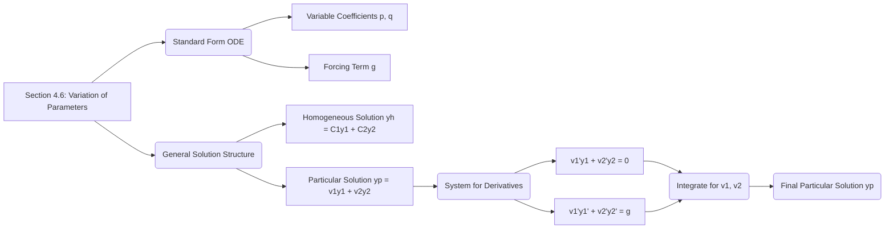
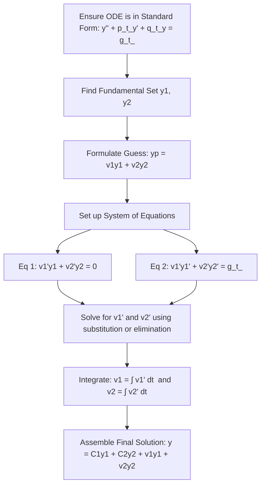

## 1. Chapter Outline (Mermaid Diagram)

## 2. Core Mathematical Models & Definitions

> [!definition] Standard Inhomogeneous Equation with Variable Coefficients The technique of variation of parameters applies to the general second-order linear differential equation: $$y'' + p(t)y' + q(t)y = g(t)$$
> 
> - **$p(t), q(t)$ (Variable Coefficients):** Unlike the method of undetermined coefficients, this method allows the system's internal parameters (damping, stiffness) to vary over time.
> - **$g(t)$ (Forcing Term):** The external force driving the system. The equation must be in exactly this standard form (with a coefficient of $1$ on $y''$) before applying the formulas.

> [!definition] Variation of Parameters Assumption Assuming a fundamental set of solutions $y_1(t)$ and $y_2(t)$ to the associated homogeneous equation ($y'' + p(t)y' + q(t)y = 0$) is known, we replace the arbitrary constants $C_1$ and $C_2$ with unknown functions $v_1(t)$ and $v_2(t)$ to form a particular solution: $$y_p(t) = v_1(t)y_1(t) + v_2(t)y_2(t)$$
> 
> - **$y_1, y_2$ (Homogeneous Solutions):** The natural, unforced motions of the system.
> - **$v_1(t), v_2(t)$ (Parameter Functions):** Time-varying "parameters" that modulate the natural motions to map out a trajectory that matches the external driving force $g(t)$.

## 3. Theorems & Solution Algorithms

> [!theorem] Variation of Parameters Theorem For the equation $y'' + p(t)y' + q(t)y = g(t)$, the unknown functions $v_1(t)$ and $v_2(t)$ are found by solving the following system of linear algebraic equations for their derivatives $v_1'$ and $v_2'$: $$v_1'y_1 + v_2'y_2 = 0$$ $$v_1'y_1' + v_2'y_2' = g(t)$$
> 
> Solving this system via elimination yields explicit formulas for the parameter functions: $$v_1(t) = \int \frac{-y_2(t)g(t)}{y_1(t)y_2'(t) - y_2(t)y_1'(t)} dt$$ $$v_2(t) = \int \frac{y_1(t)g(t)}{y_1(t)y_2'(t) - y_2(t)y_1'(t)} dt$$ The denominator $y_1(t)y_2'(t) - y_2(t)y_1'(t)$ is the Wronskian of the fundamental solutions, which is guaranteed to be non-zero since $y_1$ and $y_2$ are linearly independent.

**Algorithm: Variation of Parameters Decision Tree**

_(Note: Step 3 can alternatively be performed by plugging directly into the explicit integration formulas, though constructing and solving the $v_1', v_2'$ system manually is often safer and easier.)_

## 4. Geometric Insights & Visual Placeholders

> [!picture] 📸 [Insert screenshot of Textbook Section 4.6, Figure 1: The particular solution in Example 6.5] _This diagram plots the particular solution $y_p(t) = -(\cos t) \ln|\sec t + \tan t|$ for the differential equation $y'' + y = \tan t$. It visually demonstrates how variation of parameters successfully generates a well-behaved particular solution even when the forcing function (tangent) has vertical asymptotes and cannot be handled by the method of undetermined coefficients._

## 5. Common Pitfalls & Take-home Message

> [!warning] Common Pitfalls **1. Ignoring Standard Form:** The most devastating mistake students make is extracting $g(t)$ before dividing out the leading coefficient of $y''$. If the equation is $x^2y'' - 2xy' + 2y = x^4e^x$, you **must** divide by $x^2$ first so that $g(x) = x^2e^x$. If you use $g(x) = x^4e^x$, your integrals will be completely wrong.
> 
> **2. Adding Constants of Integration:** When integrating $v_1'$ and $v_2'$ to find $v_1$ and $v_2$, you do not need to add a $+C$. Adding a constant merely adds a multiple of the homogeneous solution $y_1$ or $y_2$ back into your particular solution, which is redundant because the general solution $y = y_h + y_p$ already accounts for them.

**Take-home Message:** While computationally heavy due to the required integration, variation of parameters is a universally powerful method that can find a particular solution for _any_ linear inhomogeneous differential equation—even those with variable coefficients or non-standard forcing terms—provided you already know the unforced homogeneous behavior.