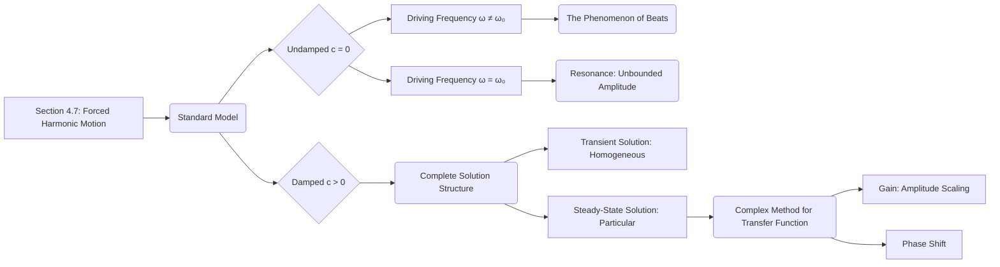
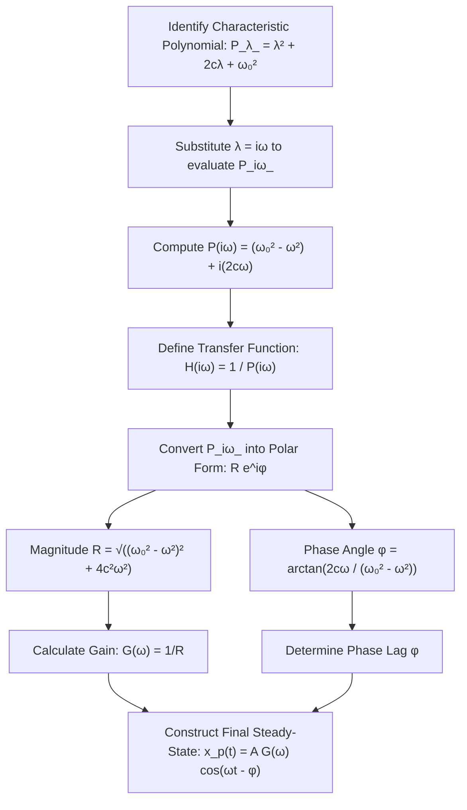

## 1. Chapter Outline (Mermaid Diagram)

## 2. Core Mathematical Models & Definitions

> [!definition] General Model for Forced Harmonic Motion The behavior of a harmonic oscillator (like a spring-mass system or an RLC circuit) driven by a sinusoidal external force is modeled by: $$x'' + 2cx' + \omega_0^2x = A \cos(\omega t)$$
> 
> - **$c$ (Damping Constant):** The internal resistance of the system.
> - **$\omega_0$ (Natural Frequency):** The inherent frequency at which the system "wants" to oscillate if left alone ($\sqrt{k/m}$ for a spring).
> - **$A$ (Forcing Amplitude):** The maximum magnitude of the external driving force.
> - **$\omega$ (Driving Frequency):** The frequency of the external pushing/pulling force.

> [!definition] Undamped Forced Motion & The Beat Phenomenon If $c=0$ and the system starts from rest, the superposition of the natural and driving frequencies yields: $$x(t) = \frac{A}{\omega_0^2 - \omega^2}(\cos \omega t - \cos \omega_0 t)$$ Using trigonometric identities, this can be rewritten in terms of the mean frequency $\bar{\omega} = (\omega_0 + \omega)/2$ and half-difference $\delta = (\omega_0 - \omega)/2$: $$x(t) = \left( \frac{A \sin(\delta t)}{2\bar{\omega}\delta} \right) \sin(\bar{\omega}t)$$
> 
> - **$\sin(\bar{\omega}t)$ (Fast Oscillation):** The rapid back-and-forth motion at the average of the two interacting frequencies.
> - **$\frac{A \sin(\delta t)}{2\bar{\omega}\delta}$ (Slow Envelope):** A slowly varying amplitude that periodically swells and shrinks, creating the audible/visual phenomenon of "beats."

> [!definition] Steady-State Solution & Gain For a damped system ($c > 0$), the homogeneous "transient" solution decays to zero. The long-term behavior is entirely dictated by the particular "steady-state" solution: $$x_p(t) = A \cdot G(\omega) \cos(\omega t - \phi)$$
> 
> - **$G(\omega)$ (Gain):** Given by $G(\omega) = \frac{1}{\sqrt{(\omega_0^2 - \omega^2)^2 + 4c^2\omega^2}}$, this scaling factor determines how much the system amplifies or suppresses the external driving amplitude $A$.
> - **$\phi$ (Phase Shift):** Given by $\tan \phi = \frac{2c\omega}{\omega_0^2 - \omega^2}$, this angle represents how far the system's response lags behind the external driving force.

## 3. Theorems & Solution Algorithms

> [!theorem] Complex Transfer Function Method To find the steady-state solution $x_p(t)$ for $x'' + 2cx' + \omega_0^2x = A \cos(\omega t)$, it is vastly simpler to solve the associated complex equation $z'' + 2cz' + \omega_0^2z = A e^{i\omega t}$ and then take its real part. The complex output is scaled by a _transfer function_ $H(i\omega) = 1/P(i\omega)$, where $P$ is the characteristic polynomial.

**Algorithm: Complex Steady-State Decision Tree**

## 4. Geometric Insights & Visual Placeholders

> [!picture] 📸 [Insert screenshot of Textbook Section 4.7, Figure 1: Beats in forced, undamped, harmonic motion] _This graph geometrically defines the "beat" phenomenon. The true fast-oscillating solution is bounded vertically by a slow-moving, periodic envelope curve (plotted in blue in the text). It illustrates how two nearly equal frequencies interfere constructively and destructively._

> [!picture] 📸 [Insert screenshot of Textbook Section 4.7, Figure 4: Forced, undamped, harmonic motion where driving frequency equals natural frequency] _This visualizes pure **resonance**. Without damping to steal energy, a driving force perfectly synchronized with the natural frequency ($\omega = \omega_0$) causes the amplitude of the system to grow linearly and unbounded over time, eventually tearing the physical system apart._

> [!picture] 📸 [Insert screenshot of Textbook Section 4.7, Figure 5: The motion of a forced spring] _This critical diagram overlays the exact overall solution with the steady-state solution. It perfectly illustrates how the jagged initial transient response (caused by initial conditions) eventually dies out due to damping, allowing the system to smoothly merge with the pure, driven steady-state wave._

## 5. Common Pitfalls & Take-home Message

> [!warning] Common Pitfalls **Ignoring the Transient Response for Initial Conditions:** Students often attempt to apply initial conditions (like $x(0)=x_0, x'(0)=v_0$) directly to the steady-state solution $x_p(t)$. This is entirely incorrect. Initial conditions must be applied to the _complete_ general solution $x(t) = x_h(t) + x_p(t)$. The initial energy in the system dictates the constants $C_1$ and $C_2$ inside the transient part $x_h(t)$, which then dictate how wildly the system behaves before settling into the steady state.

**Take-home Message:** Forced harmonic motion exposes the profound interaction between a system's internal natural frequency and external driving forces; without damping, mismatched frequencies create "beats" while perfectly matched frequencies cause catastrophic resonance, whereas with damping, all internal start-up transients eventually decay, leaving the system to vibrate eternally as a scaled, phase-shifted echo of the external force.