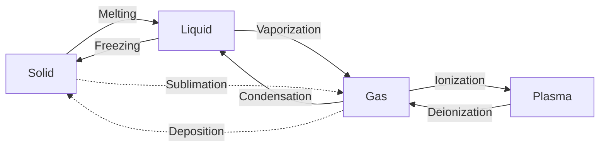
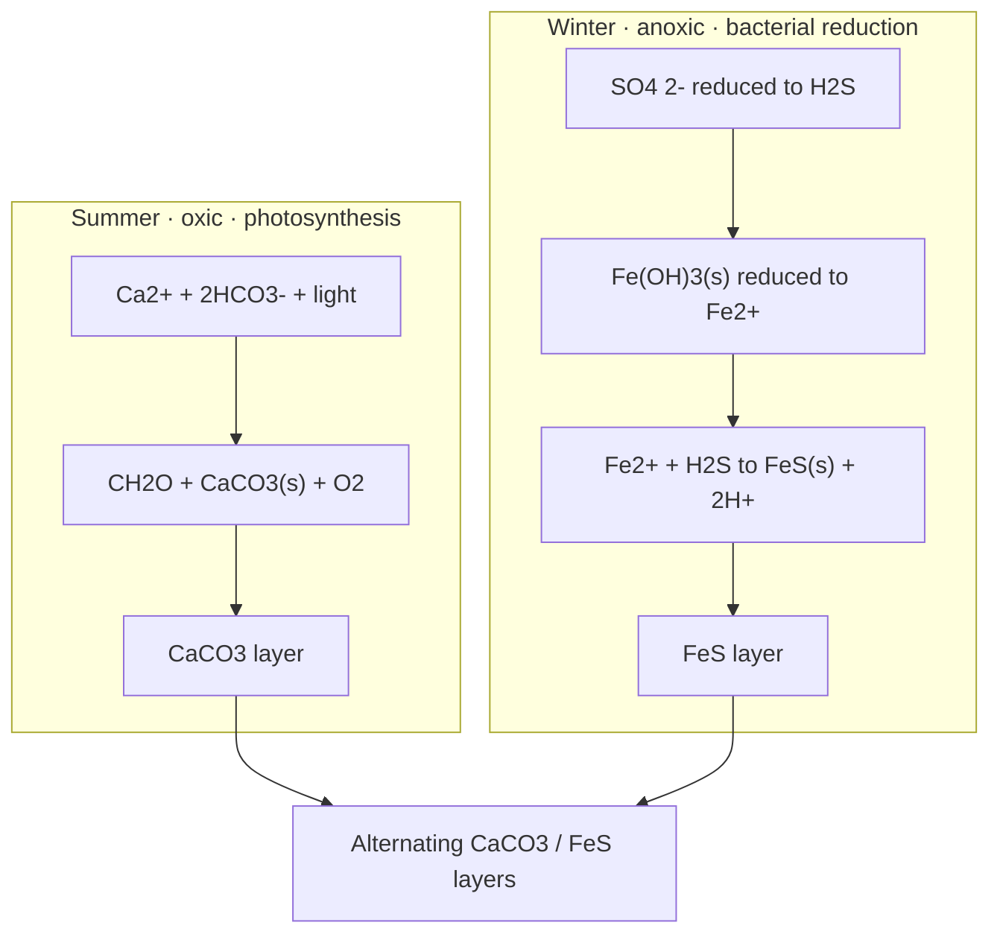
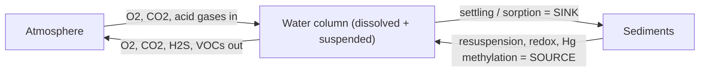

---
tags:
  - environmental-chemistry
  - aquatic-chemistry
  - phase-interaction
  - sediments
  - colloids
  - solubility
  - sorption
aliases:
  - Phase Interactions in Aquatic Chemistry
  - Aquatic Phase Interactions
  - Chapter 4 Aquatic Chemistry
  - 水环境化学中的相互作用
created: 2026-06-01
---

# Chapter 4 — Phase Interactions in Aquatic Chemistry 水相中的相互作用

> [!abstract] Core thread 主线 (read this first)
> Most important environmental processes in water are **not water reacting alone** — they are interactions between **water and another phase** (solid / gas / colloid / sediment / biomass). The chapter answers three nested questions:
> 1. **Partitioning** — how does a substance split between water and another phase? → [[#4. Solubility of Solids — K_sp & Intrinsic Solubility|solubility]], [[#3. Organic Matter & the Distribution Coefficient|distribution coefficient]], [[#5. Solubility of Gases — Henry's Law & Temperature|Henry's law]].
> 2. **Surface** — how do colloid/sediment **surfaces** grab pollutants? → [[#7. Acquiring Surface Charge|surface charge]], [[#10. Surface Sorption by Solids|sorption]], [[#11. Solute Exchange with Sediments — CEC & ECS|ion exchange]].
> 3. **Fate** — how do these interactions move pollutants around? → sediments are both a **sink and a source**; exchange with [[#14. Fate & Transport|atmosphere and sediments]].
>
> Two master switches behind almost everything: **pH** (controls surface charge & metal binding) and **pE / redox** (controls which phase/species is stable: oxidizing → oxides/carbonates, reducing → sulfides).

## Table of Contents
- [[#1. Phases & Phase Transitions]]
- [[#2. Sediments — Importance & Formation]]
- [[#3. Organic Matter & the Distribution Coefficient]]
- [[#4. Solubility of Solids — K_sp & Intrinsic Solubility]]
- [[#5. Solubility of Gases — Henry's Law & Temperature]]
- [[#6. Colloidal Particles in Water]]
- [[#7. Acquiring Surface Charge]]
- [[#8. Colloidal Properties of Clays]]
- [[#9. Aggregation — Coagulation vs Flocculation]]
- [[#10. Surface Sorption by Solids]]
- [[#11. Solute Exchange with Sediments — CEC & ECS]]
- [[#12. Trace Metals & pE · Phosphorus · Organics · Bioavailability]]
- [[#13. Interstitial / Pore Water]]
- [[#14. Fate & Transport]]
- [[#Take-home Checklist 必背清单]]
- [[#Exam Tips & Homework]]

---

## 1. Phases & Phase Transitions

Typical phases: **Solid (s)**, **Liquid (l)**, **Gas (g)**, **Plasma**. Enthalpy increases from solid → plasma.

> [!important] Why it matters
> Environmental aquatic chemistry = water (l) interacting with the other phases. Everything else in this chapter is a special case of a [[#0|phase interaction]].

---

## 2. Sediments — Importance & Formation

> [!definition] Sediment 沉积物
> Layers of finely divided matter covering the bottoms of water bodies. Mixtures of **clay, silt, sand, organic matter**, organisms, and **pollutants** (heavy metals, organics). Pollutants transfer to organisms directly or through [[#13. Interstitial / Pore Water|pore water]].

**Four formation pathways** (each = a class of chemistry):

| Pathway | Representative reaction |
|---|---|
| Physical transfer | settling of transported material |
| Chemical precipitation | $\text{Ca}^{2+}+2\text{HCO}_3^- \rightarrow \text{CaCO}_3(s)+\text{CO}_2(g)+\text{H}_2\text{O}$ ; $4\text{Fe}^{2+}+10\text{H}_2\text{O}+\text{O}_2 \rightarrow 4\text{Fe(OH)}_3(s)+8\text{H}^+$ |
| Biochemical (photosynthesis) | $\text{Ca}^{2+}+2\text{HCO}_3^- + h\nu \rightarrow \{\text{CH}_2\text{O}\}+\text{CaCO}_3(s)+\text{O}_2(g)$ ; $5\text{Ca}^{2+}+\text{H}_2\text{O}+3\text{HPO}_4^{2-}\rightarrow \text{Ca}_5\text{OH(PO}_4)_3(s)+4\text{H}^+$ |
| Anoxic bacteria → FeS | $\text{Fe}^{2+}+\text{H}_2\text{S}\rightarrow \text{FeS}(s)+2\text{H}^+$ |

> [!example] Alternating CaCO₃ / FeS layers in lake sediment (classic discussion question)
> **Summer** (light, oxic): algal photosynthesis precipitates a **CaCO₃ layer** as a byproduct.
> **Winter** (dark, anoxic): bacteria reduce Fe(III) → Fe²⁺ and SO₄²⁻ → H₂S, which combine to deposit a **FeS layer**.
> Seasonal alternation ⇒ alternating layers.

---

## 3. Organic Matter & the Distribution Coefficient

- Organic/carbonaceous sediments are key for **binding organic pollutants**; organics may be held for **years**.
- **Black carbon 黑碳**: small carbon particles left from **combustion of fossil fuels and biomass**; binds organics strongly.

> [!formula] Distribution coefficient 分配系数 $K_d$
> $$K_d=\frac{C_s}{C_w}$$
> $C_s$, $C_w$ = equilibrium concentration of the constituent **on solids** / **in solution**. Larger $K_d$ ⇒ more strongly held by the solid (better fixed in sediment).

> [!formula] Freundlich isotherm (empirical) 弗罗因德利希方程
> $$C_s=K_F\,C_w^{1/n}$$
> $K_F$ and $1/n$ are empirical constants. Used when sorption is **not** linear.

---

## 4. Solubility of Solids — $K_{sp}$ & Intrinsic Solubility

> [!definition] Solubility 溶解度
> Formation/stability of nonaqueous phases depends on solubility. Of concern mostly for **slightly soluble ("insoluble")** solids, e.g. $\text{PbCO}_3(s)\rightleftharpoons \text{Pb}^{2+}+\text{CO}_3^{2-}$.

Total solubility has **two independent contributions** — a point students often miss:

> [!formula] Total solubility = ionic dissolution + intrinsic dissolution
> $$S=\underbrace{\sqrt{K_{sp}}}_{\text{from ion dissociation}}+\underbrace{[\,\text{MX}(aq)\,]}_{\text{intrinsic solubility 本征溶解度}}$$
> **Why $\sqrt{K_{sp}}$?** For $\text{MX}(s)\rightleftharpoons \text{M}^{n+}+\text{X}^{n-}$ with $[\text{M}]=[\text{X}]=s$, $K_{sp}=s^2 \Rightarrow s=\sqrt{K_{sp}}$.
> **Intrinsic solubility** = dissolution as the **neutral molecule** $\text{MX}(s)\rightleftharpoons \text{MX}(aq)$; a constant independent of $K_{sp}$.

> [!example] CaSO₄ total solubility (25 °C)
> $K_{sp}=2.6\times10^{-5}$, intrinsic $[\text{CaSO}_4(aq)]=5.0\times10^{-3}$ M.
> $$S=\sqrt{2.6\times10^{-5}}+5.0\times10^{-3}=5.1\times10^{-3}+5.0\times10^{-3}=1.01\times10^{-2}\ \text{M}$$
> The intrinsic term is **as large as** the ionic term — using $K_{sp}$ alone badly underestimates solubility.

> [!important] Shifting solubility (Le Chatelier), PbCO₃ example
> - **↑ solubility** — chelation removes the cation: $\text{Pb}^{2+}+\text{T}^{3-}\rightleftharpoons \text{PbT}^-$ (NTA = T³⁻).
> - **↑ solubility** — acid removes the anion: $\text{H}^++\text{CO}_3^{2-}\rightleftharpoons \text{HCO}_3^-$.
> - **↓ solubility** — common-ion effect from alkalinity: $\text{CO}_3^{2-}+\text{Pb}^{2+}\rightleftharpoons \text{PbCO}_3(s)$.

---

## 5. Solubility of Gases — Henry's Law & Temperature

> [!formula] Henry's law 亨利定律
> At constant T, gas solubility ∝ partial pressure: $\quad [X(aq)]=K\,P_X$
> $K$ = Henry's-law constant (**solubility form**: concentration = K × pressure), so larger $K$ ⇒ more soluble.

> [!important] Acid–base reactions raise apparent gas solubility
> Consuming the dissolved species pulls more gas in:
> $\text{NH}_3(g)+\text{H}^+\rightleftharpoons \text{NH}_4^+(aq)$ ;  $\text{SO}_2(g)+\text{HCO}_3^-(\text{alkalinity})\rightleftharpoons \text{HSO}_3^-(aq)+\text{CO}_2$.

> [!formula] Temperature dependence (Clausius–Clapeyron form)
> $$\log\frac{C_2}{C_1}=\frac{\Delta H}{2.303\,R}\left(\frac{1}{T_1}-\frac{1}{T_2}\right)$$
> $C_1,C_2$ = gas conc. in water at $T_1,T_2$ (K); $\Delta H$ = heat of solution; $R=1.987\ \text{cal·deg}^{-1}\text{mol}^{-1}$ (⇒ $\Delta H$ in cal/mol).
> **Why solubility falls as T rises:** gas dissolution is **exothermic** ($\Delta H<0$); heating drives off the gas (Le Chatelier). (This is really a van't Hoff–type relation, but the course names it Clausius–Clapeyron.)

> [!example] Quiz 1 — O₂ solubility: 14.74 mg/L at 0 °C, 7.03 mg/L at 35 °C → estimate at 50 °C
> **Strategy:** (1) use the two known points to get $\Delta H$; (2) extrapolate to 50 °C. Convert all T to kelvin.
>
> **Step 1 — find $\Delta H$** ($T_1=273$ K, $T_2=308$ K):
> $$\log\frac{7.03}{14.74}=-0.3214,\qquad \frac{1}{273}-\frac{1}{308}=4.162\times10^{-4}\,\text{K}^{-1}$$
> $$\Delta H=\frac{2.303\times1.987\times(-0.3214)}{4.162\times10^{-4}}\approx-3.53\times10^{3}\ \text{cal/mol}\quad(\Delta H<0\ \checkmark)$$
>
> **Step 2 — extrapolate to $T_3=323$ K** (from the 0 °C point):
> $$\log\frac{C_3}{14.74}=\frac{-3533}{2.303\times1.987}\Big(\tfrac{1}{273}-\tfrac{1}{323}\Big)=(-772.1)(5.670\times10^{-4})=-0.4378$$
> $$\boxed{C_3=14.74\times10^{-0.4378}\approx 5.4\ \text{mg/L}}$$
> Using 273.15/308.15/323.15 K gives essentially the same answer (≈ 5.4 mg/L).

---

## 6. Colloidal Particles in Water

> [!definition] Colloidal particles 胶体颗粒
> Particles **1 nm – 1 μm** (minerals, microorganisms, organic matter, proteinaceous material). Defined by **surface dominance**: high surface area, high interfacial area, high surface/charge-density ratio.

- **Tyndall effect 丁达尔效应**: light scattering because particle size is the **same order as the wavelength of visible light**.
- **Three kinds**:
  - **Hydrophilic 亲水** — strong interaction with water (macromolecules, ions).
  - **Hydrophobic 疏水** — weak interaction with water; charged; form an [[#0|electrical double layer]].
  - **Association 缔合** — aggregates of ions/molecules → **[[#0|micelles]]** (e.g. sodium stearate 硬脂酸钠 soap).

> [!definition] Electrical double layer 双电层
> The charged particle surface **plus** the surrounding layer of counter-ions. Key to hydrophobic-colloid stability.

> [!definition] Micelle 胶束
> An association colloid of surfactant molecules (e.g. soap); a water-insoluble organic core can be entrained inside.

> [!important] Colloid stability 胶体稳定性
> Stabilized by **(1) surface hydration** (prevents particle contact) and **(2) surface charge** (like charges repel → prevents aggregation). At **pH 7 most colloids are negatively charged** (algal/bacterial cells, proteins, petroleum droplets). Microbial cells acquire charge by gain/loss of H⁺ on carboxyl/amino groups: $^+\text{H}_3\text{N–cell–CO}_2\text{H}$ (low pH, +) → zwitterion (neutral) → $\text{H}_2\text{N–cell–CO}_2^-$ (high pH, −).

---

## 7. Acquiring Surface Charge

> [!definition] Surface charge 表面电荷
> Net electrical charge a particle carries at its surface; governs repulsion, sorption, and ion exchange.

Three mechanisms:

**1. Surface chemical reaction** (often involving H⁺) — e.g. MnO₂:
$$\text{MnO}_2(\text{H}_2\text{O})(s)+\text{H}^+\rightarrow \text{MnO}_2(\text{H}_3\text{O})^+(s)\quad(\text{acidic, +})$$
$$\text{MnO}_2(\text{H}_2\text{O})(s)\rightarrow \text{MnO}_2(\text{OH})^-(s)+\text{H}^+\quad(\text{basic, −})$$

> [!definition] Zero point of charge (ZPC) 零点电荷
> The pH at which **number of positive sites = number of negative sites**, i.e. net surface charge = 0. Below ZPC the surface is net **positive**; above ZPC, net **negative**.

**2. Ion adsorption** — attachment of ions **on** the surface via hydrogen bonding or van der Waals forces.

> [!warning] PPT terminology error
> The slide titles this **"Ion absorption."** Attachment of ions **on a surface** is **adsorption 吸附**, not absorption (吸收, bulk uptake). Read it as **ion adsorption**.

**3. Ion replacement (isomorphous substitution)** — in clays, Al(III) substitutes for Si(IV):
$$[\text{SiO}_2]+\text{Al(III)}\rightarrow [\text{AlO}_2^-]+\text{Si(IV)}$$
One less positive charge per substitution ⇒ a **permanent negative charge** (independent of pH).

---

## 8. Colloidal Properties of Clays

> [!important] Charge & structure (discussion topic)
> Clays are widespread **as colloids in water and as solids in sediments**. They are **secondary minerals** (formed by weathering of primary rocks) — hydrated aluminum/silicon oxides built from stacked tetrahedral (Si–O) and octahedral (Al–O) sheets.
> Charge arises mainly by **Al(III)-for-Si(IV) substitution** ⇒ permanent negative layer charge, balanced by **exchangeable cations** (H⁺, K⁺, NH₄⁺) → basis of [[#11. Solute Exchange with Sediments — CEC & ECS|CEC]].

| Clay | Formula |
|---|---|
| Kaolinite | $\text{Al}_2(\text{OH})_4\text{Si}_2\text{O}_5$ |
| Montmorillonite | $\text{Al}_2(\text{OH})_2\text{Si}_4\text{O}_{10}$ |
| Nontronite | $\text{Fe}_2(\text{OH})_2\text{Si}_4\text{O}_{10}$ |
| Hydrous mica | $\text{KAl}_2(\text{OH})_2(\text{AlSi}_3)\text{O}_{10}$ |

---

## 9. Aggregation — Coagulation vs Flocculation

Aggregation converts colloids into settleable solids — vital for **wastewater biomass settling** and **sediment formation where rivers meet the sea**.

> [!definition] Coagulation 凝聚 vs Flocculation 絮凝 (don't mix these up)
> - **Coagulation** — **reduce surface-charge repulsion** (add counter-ions to neutralize charge) so particles can approach.
> - **Flocculation** — use **bridging compounds** (polymers) that form chemically bonded links **between** particles, producing **floc networks**.

- Flocculation by **polyelectrolytes** (natural or synthetic): anionic (polystyrene sulfonate, polyacrylate), cationic (polyvinyl pyridinium, polyethylene imine), nonionic (polyvinyl alcohol, polyacrylamide).
- Flocculation of **bacteria by polymers**: in biological waste treatment, much waste carbon is removed as **bacterial floc**.

---

## 10. Surface Sorption by Solids

Soluble metals (Cd²⁺, Cu²⁺, Pb²⁺, Zn²⁺) bind to solids, **especially metal oxides**, by: nonspecific **ion-exchange adsorption**, **complexation** with surface –OH groups, **coprecipitation**, or as a **discrete oxide/hydroxide** sorbed to the metal.

> [!formula] Metal sorption by chelation between two surface –OH groups
> $$2(\text{M–OH})+\text{Mt}^{Z+}\rightleftharpoons (\text{M–O})_2\text{Mt}^{(Z-2)}+2\text{H}^+$$
> (M = surface metal-oxide site; Mt = sorbing trace metal.) Metal–ligand complexes sorb similarly, e.g. $\text{M–OH}+\text{MtL}^{z+}\rightleftharpoons \text{M–OMtL}^{(z-1)}+\text{H}^+$.

- Freshly precipitated **hydrated Mn(IV) and Fe(III) oxides** are excellent sorbents; fresh MnO₂ can reach **several hundred m²/g**.
- **Anions** sorb too, but with **less specific** bonding than metals:
  - **Phosphate** displaces surface –OH (ion exchange): $2(\text{M–OH})+\text{HPO}_4^{2-}\rightleftharpoons (\text{M–O})_2\text{PO(OH)}+2\text{OH}^-$.
  - **Phosphate/sulfate** by chemical bonding, usually at **pH < 7**; **chloride/nitrate** by electrostatic attraction only.

---

## 11. Solute Exchange with Sediments — CEC & ECS

> [!definition] CEC vs ECS (commonly confused)
> - **Cation Exchange Capacity (CEC) 阳离子交换容量** — the **total** capacity of a sediment to sorb cations.
> - **Exchangeable Cation Status (ECS) 可交换阳离子程度** — the amount of a **specific** ion bonded to a given amount of sediment.
> - **Both expressed as milliequivalents (meq) per 100 g of dried solid.**

> [!important] Measurement methods
> **CEC:** (1) saturate all exchange sites with NH₄⁺ using an ammonium salt; (2) displace NH₄⁺ with NaCl; (3) measure displaced NH₄⁺.
> **ECS:** strip all exchangeable metal cations with **ammonium acetate**, then measure the concentration of the specific ion of interest.
> Common sediment cations: H⁺, K⁺, NH₄⁺, Ca²⁺, Mg²⁺, Fe²⁺, Mn²⁺, Zn²⁺, Cu²⁺, Ni²⁺.

---

## 12. Trace Metals & pE · Phosphorus · Organics · Bioavailability

> [!important] Redox (pE) controls trace-metal speciation — key exam point
> - **High pE (oxic/oxidizing)** → **oxides, hydroxides, carbonates** (e.g. HgO, $\text{Cu}_2(\text{OH})_2\text{CO}_3$, $\text{CdCO}_3$).
> - **Low pE (anoxic/reducing)** → **sulfides predominate** (e.g. CdS, PbS, HgS, ZnS).
> Availability ranking: dissolved **>** suspended-particle-bound **>** sediment-bound. Availability also depends on metal identity, chemical form (binding, oxidation state), nature of the solid, organism, and water conditions.

| Metal | Oxidizing | Reducing |
|---|---|---|
| Cd | $\text{CdCO}_3$ | CdS |
| Cu | $\text{Cu}_2(\text{OH})_2\text{CO}_3$ | CuS |
| Fe | $\text{Fe}_2\text{O}_3\cdot x\text{H}_2\text{O}$ | FeS, FeS₂ |
| Hg | HgO | HgS |
| Mn | $\text{MnO}_2\cdot x\text{H}_2\text{O}$ | MnS, MnCO₃ |
| Pb | $\text{PbCO}_3$, $2\text{PbCO}_3\!\cdot\!\text{Pb(OH)}_2$ | PbS |
| Zn | $\text{ZnCO}_3$, $\text{ZnSiO}_3$ | ZnS |

**Phosphorus** — a **limiting nutrient** for algal growth & eutrophication. Sediment forms: phosphate minerals $\text{Ca}_5\text{OH(PO}_4)_3$; **non-occluded 非封闭性磷** (PO₄³⁻ on surfaces); **occluded 封闭性磷** (inside mineral matrix); **organic** P (biomass).

**Organics on sediments**: sediments are **sinks**; colloids affect transport; sorption changes degradation rate/pathway; main sorbents are **clays + humic substances**; **sorption is roughly inversely proportional to water solubility**.

> [!definition] Bound residues 结合态残留
> Neutral organics (e.g. petroleum) sorb by **van der Waals, hydrogen bonding, charge-transfer complexation, hydrophobic interactions** — not ion exchange. Pollutants (e.g. herbicide **2,4-D**) can become **covalently bonded** to humic substances as bound residues.

> [!definition] Bioavailability 生物有效性
> The degree to which a substance can be **absorbed into the system of an organism** — the link between sediment contamination and actual toxicity.

---

## 13. Interstitial / Pore Water

> [!definition] Interstitial water / pore water 孔隙水
> Water held in **voids and pores** of sediments. Its solutes reflect sediment chemistry: products of decomposition/mineralization of planktonic biomass, largely by **anoxic bacteria**.

> [!important] Gases in pore water
> Virtually **no O₂**; N₂ largely stripped. Anoxic bacteria convert organic matter to CO₂ and CH₄:
> $$2\{\text{CH}_2\text{O}\}\rightarrow \text{CH}_4(g)+\text{CO}_2(g)$$

---

## 14. Fate & Transport

> [!important] Sediments are both a sink and a source
> Rivers carry dissolved + suspended substances far; lakes are repositories but still mix. **Wind drift**: windblown surface water moves at **2–3 % of wind velocity**; in a **shallow unstratified** lake the return current can stir sediment and release substances, whereas a **stratified** lake keeps a quiescent hypolimnion and undisturbed sediment.

- **Atmosphere exchange** — in: O₂ (fish), CO₂ (algae), acid gases/particles; out: O₂ (photosynthesis), CO₂ (degradation), H₂S (SO₄²⁻ reduction), VOCs.
- **Sediment exchange** — pollutants settle into sediment (the **lead sediment record** tracks the rise/fall of leaded gasoline) but can be **remobilized** physically, chemically, or biochemically (e.g. **Hg → organic Hg**).

---

## Take-home Checklist 必背清单

> [!success] Definitions — be able to state each in one line
> 1. **Sediment** — bottom layers of fine matter (clay/silt/sand/organics/pollutants).
> 2. **Black carbon** — carbon particles from fossil-fuel/biomass combustion; binds organics.
> 3. **Colloidal particles** — 1 nm–1 μm; surface-dominated.
> 4. **Electrical double layer** — charged surface + counter-ion layer.
> 5. **Surface charge** — net charge at a particle surface.
> 6. **CEC / ECS** — total cation-sorption capacity / amount of a specific ion; both in **meq/100 g**.
> 7. **Bioavailability** — degree a substance is absorbed into an organism.
> 8. **Distribution coefficient** — $K_d=C_s/C_w$.
> 9. **Solubility** — total dissolved = $\sqrt{K_{sp}}$ + intrinsic solubility.
> 10. **Hydrophilic / hydrophobic** — strong / weak interaction with water.
> 11. **Micelle** — surfactant association colloid.
> 12. **Zero point of charge (ZPC)** — pH where net surface charge = 0.
> 13. **Coagulation / flocculation** — neutralize charge / bridge with polymers.

> [!success] Discussion topics (be able to explain)
> 1. **Formation of lake sediment** — physical/chemical/biochemical; summer CaCO₃ vs winter FeS layers.
> 2. **Phase interactions in fate & transport** — air↔water gas exchange; sediment sink↔source; wind mixing.
> 3. **Charge & crystal structure in clay minerals** — sheet structure; Al(III)-for-Si(IV) substitution → permanent negative charge → exchangeable cations.
> 4. **Surface sorption by solids** — ion exchange, –OH complexation/chelation, coprecipitation; Mn/Fe oxides; anion sorption (P/S chemical, Cl/NO₃ electrostatic).

---

## Exam Tips & Homework

> [!important] Likely exam points
> - **Two calculations almost certainly appear:** (a) total solubility $=\sqrt{K_{sp}}+$ intrinsic; (b) **gas-solubility-vs-T** (Quiz 1 type) — remember: first get $\Delta H$ from two points, then extrapolate; keep **T in kelvin**; $\Delta H<0$ for gases.
> - **Henry's law direction:** solubility ∝ partial pressure; ↑T ⇒ ↓gas solubility (exothermic).
> - **Distinguish pairs:** coagulation vs flocculation; CEC vs ECS; adsorption vs absorption; occluded vs non-occluded P; hydrophilic vs hydrophobic.
> - **3 ways colloids/clays acquire charge** (surface reaction / ion adsorption / isomorphous substitution) + **ZPC** definition and pH dependence.
> - **pE rule:** oxic → oxides/carbonates; anoxic → sulfides (give CdS/PbS vs CdCO₃/HgO).
> - **Sediment = sink AND source** (lead record; Hg methylation); CaCO₃/FeS seasonal layering.
> - Units to never forget: **CEC/ECS in meq per 100 g**.

> [!todo] Homework — textbook p. 105
> Questions **1, 6, 9, 11, 13, 14, 15, 18, 21, 23**.

> [!warning] Minor PPT typos (for accuracy)
> - p.21 "Ion **absorption**" → should be **adsorption** (吸附). *(flagged above)*
> - p.3 "dis**a**ssociated electrons" → "**dissociated**".
> - p.16 "same order of **sized** wavelength light" → "same order of **size as the wavelength of** light".
> - p.37 figure is labelled **"Figure 5.8"** — a leftover number from the textbook's Chapter 5; the content (wind drift / lake mixing) belongs in this chapter.

---
> [!note] Related notes
> [[Acids Bases and pH in Water]] · [[Oxidation-Reduction and pE]] · [[Eutrophication and Nutrients]] · [[Heavy Metals in the Environment]] · [[Adsorption Isotherms]]
