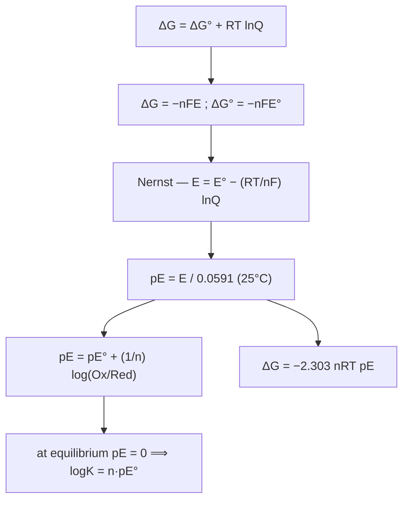

# Chapter 3 · Oxidation–Reduction in Aquatic Chemistry

> [!abstract] Core thread / 核心主线 One idea ties the whole chapter together: **redox is to electrons what acid–base is to protons**. We define an _electron activity_ **pE** (mirror of pH), connect it to electrode potential **E**, free energy **ΔG**, and equilibrium constant **K** through the **Nernst equation**, then use it to (1) rank electron acceptors in natural water (the _redox ladder_), (2) bound where water itself is stable, and (3) build the **iron pE–pH diagram** — the chapter's flagship worked example. Applications: Fenton chemistry, photocatalysis, corrosion.

## Contents

- [[#1. Redox Basics]]
- [[#2. Half-Reactions, Cells & SHE]]
- [[#3. Electron Activity & pE]]
- [[#4. The Nernst Equation]]
- [[#5. Equilibrium, Free Energy & One Electron-Mole]]
- [[#6. The Redox Ladder in Natural Water]]
- [[#7. Stability Window of Water]]
- [[#8. pE in Real Waters]]
- [[#9. ★ The Iron pE–pH Diagram]]
- [[#10. Natural Reductants]]
- [[#11. Photochemistry — Superoxide, Fenton & TiO₂]]
- [[#12. Corrosion]]
- [[#13. Errata in the Slides]]
- [[#14. Exam Focus & Homework]]
- [[#15. Take-Home Checklist]]

---

## 1. Redox Basics

> [!definition] Oxidation number & the two directions / 氧化数 Written as a Roman numeral after the element, e.g. **Au(I)Cl**, **Au(III)Cl₃**.
> 
> - **Oxidation** = increase in oxidation number = **loses electrons**.
> - **Reduction** = decrease in oxidation number = **gains electrons**.

> [!definition] Oxidant vs reductant / 氧化剂 vs 还原剂
> 
> - **Oxidizing agent (oxidant)** raises another species' oxidation number → it is _itself reduced_.
> - **Reducing agent (reductant)** lowers another's oxidation number → it is _itself oxidized_.

|Oxidation (氧化)|Reduction (还原)|
|---|---|
|**+ O** / **− H**|**− O** / **+ H**|
|+ electronegative element|− electronegative element|
|− electropositive element|+ electropositive element|
|**loses electron**|**gains electron**|

> [!tip] Organic shortcut Organic molecule **gains O or loses H → oxidized**; **loses O or gains H → reduced**.

---

## 2. Half-Reactions, Cells & SHE

> [!definition] Half-reaction / 半反应 Any redox reaction = an **oxidation half** + a **reduction half**. e.g. $\text{Fe} + \text{Cd}^{2+} \rightarrow \text{Fe}^{2+} + \text{Cd}$: $$\text{Fe} \rightarrow \text{Fe}^{2+} + 2e^- \quad(\text{ox})\qquad \text{Cd}^{2+}+2e^- \rightarrow \text{Cd}\quad(\text{red})$$

> [!definition] SHE, E and E⁰ / 标准氢电极、电极电位 **Standard Hydrogen Electrode (SHE)**: $2H^+ + 2e^- \rightleftharpoons H_2$, with $E^0 \equiv 0.00\ \text{V}$ _by convention_ (at $[H^+]=1$ M, $P_{H_2}=1$ atm).
> 
> - Potential of an electrode measured **vs SHE** = its **electrode potential E**.
> - At unit activities of all participants → the **standard electrode potential E⁰**.
> - e.g. $\text{Fe}^{3+}+e^- \rightleftharpoons \text{Fe}^{2+}$, $E^0 = +0.77\ \text{V}$.

---

## 3. Electron Activity & pE

> [!important] The e⁻ ↔ H⁺ analogy (the conceptual key / 核心类比) **pH** measures proton activity → how acidic/basic. **pE** measures electron activity → how oxidizing/reducing. A redox step (transfer of e⁻) is usually **coupled to H⁺ transfer**, so pE and pH go hand in hand.

> [!definition] pE / 电子活度 $$pE = -\log a_{e^-} \qquad\big(\text{cf. } pH = -\log a_{H^+}\big)$$
> 
> - **High pE** (low $a_{e^-}$) → **oxidizing** (e.g. chlorinated water).
> - **Low pE** (high $a_{e^-}$) → **reducing** (e.g. anoxic digester).
> - Free $e^-$ and free $H^+$ never exist alone in water — always bound to solvent/solute.

> [!formula] pE ↔ E at 25 °C $$pE = \frac{E}{2.303RT/F} = \frac{E}{0.0591}, \qquad pE^0 = \frac{E^0}{0.0591}$$ $R = 8.314\ \text{J K}^{-1}\text{mol}^{-1}$, $F = 96485\ \text{C mol}^{-1}$, $2.303RT/F = 0.0591\ \text{V}$. e.g. $\text{Fe}^{3+}/\text{Fe}^{2+}$: $pE^0 = 0.77/0.0591 \approx \mathbf{13.2}$.

---

## 4. The Nernst Equation

> [!formula] Nernst equation (half-cell) / 能斯特方程 For $Ox + ne^- \rightleftharpoons Red$, starting from $\Delta G = \Delta G^0 + RT\ln Q$ and $\Delta G = -nFE$: $$E = E^0 - \frac{RT}{nF}\ln\frac{a_{Red}}{a_{Ox}} = E^0 + \frac{0.0591}{n}\log\frac{a_{Ox}}{a_{Red}}\quad(25^\circ\text{C})$$ In pE form (divide by 0.0591): $$\boxed{,pE = pE^0 + \frac{1}{n}\log\frac{a_{Ox}}{a_{Red}},}$$

> [!example] Fe³⁺/Fe²⁺ electrode pE $[\text{Fe}^{3+}] = 2.35\times10^{-3}$ M, $[\text{Fe}^{2+}] = 7.85\times10^{-5}$ M, $n=1$: $$pE = 13.2 + \log\frac{2.35\times10^{-3}}{7.85\times10^{-5}} = 13.2 + 1.48 = \mathbf{14.7}$$ More Fe³⁺ relative to Fe²⁺ ⇒ higher pE (more oxidizing).

> [!warning] E⁰ (and pE⁰) are intensive — they do NOT scale Multiplying a half-reaction by a coefficient leaves **E⁰ and pE⁰ unchanged** (only ΔG scales). For a full cell: $E^0_{cell} = E^0_{cathode} - E^0_{anode}$. **Positive ⇒ reaction goes to the right.** e.g. $\text{Fe}^{3+} + \tfrac12 H_2 \rightarrow \text{Fe}^{2+} + H^+$, $E^0 = 0.77\ \text{V} > 0$ ⇒ H₂ reduces Fe³⁺.

|Reduction half-reaction|pE⁰|tendency|
|---|---|---|
|Hg²⁺ + 2e⁻ ⇌ Hg|13.35|strongest oxidant|
|Fe³⁺ + e⁻ ⇌ Fe²⁺|13.2||
|Cu²⁺ + 2e⁻ ⇌ Cu|5.71||
|2H⁺ + 2e⁻ ⇌ H₂|0.00|reference (SHE)|
|Pb²⁺ + 2e⁻ ⇌ Pb|−2.13|most easily oxidized|

**Higher pE⁰ → stronger oxidant (more readily reduced).**

---

## 5. Equilibrium, Free Energy & One Electron-Mole

> [!formula] pE⁰ ↔ K and ΔG At equilibrium the net driving force vanishes (**pE = 0**): $$\boxed{\log K = n,pE^0}$$ $$\Delta G = -nFE = -2.303nRT,pE, \qquad \Delta G^0 = -2.303nRT,pE^0$$

> [!example] Cu²⁺ + Pb ⇌ Cu + Pb²⁺ $pE^0 = 5.71 - (-2.13) = 7.84$, $n = 2$: $$\log K = 2 \times 7.84 = 15.7,\qquad K = \frac{[\text{Pb}^{2+}]}{[\text{Cu}^{2+}]}$$

> [!definition] One electron-mole / 单电子摩尔 To compare ΔG between _different_ redox reactions fairly, write each as the transfer of **exactly 1 mol e⁻ (n = 1)**. Then $\log K = pE^0$ directly. e.g. nitrification (N goes −3 → +5, **8 electrons**): $$\tfrac18 NH_4^+ + \tfrac14 O_2 \rightleftharpoons \tfrac18 NO_3^- + \tfrac14 H^+ + \tfrac18 H_2O,\quad pE^0 = 20.75 - 14.90 = 5.85$$ ⇒ $\log K = 5.85$, $K = 7.08\times10^{5}$.

---

## 6. The Redox Ladder in Natural Water

> [!important] Redox ladder / 氧化还原序列 (★ key environmental concept) Use **pE⁰(W)** = pE⁰ at pH 7 ($a_{H^+}=10^{-7}$): $;pE^0(W) = pE^0 - 7,(n_{H^+}/n_{e^-})$. Ranking pE⁰(W) gives the **order in which microbes consume electron acceptors** as O₂ is used up:

|Process (microbial)|per-e⁻ half-reaction|pE⁰(W)|
|---|---|---|
|Aerobic respiration|¼O₂ + H⁺ + e⁻ ⇌ ½H₂O|**+13.75**|
|Denitrification|⅕NO₃⁻ + 6/5 H⁺ + e⁻ ⇌ ¹⁄₁₀N₂ + ⅗H₂O|+12.65|
|Nitrate → ammonium|⅛NO₃⁻ + 5/4 H⁺ + e⁻ ⇌ ⅛NH₄⁺ + ⅜H₂O|+6.15|
|Sulfate reduction|⅛SO₄²⁻ + 5/4 H⁺ + e⁻ ⇌ ⅛H₂S + ½H₂O|≈ −3.5|
|Methanogenesis|⅛CO₂ + H⁺ + e⁻ ⇌ ⅛CH₄ + ¼H₂O|−4.13|

> **Sequence (decreasing pE):** O₂ → NO₃⁻ → Mn(IV) → Fe(III) → SO₄²⁻ → CO₂. Higher pE⁰(W) = more energy-yielding ("preferred") acceptor.

> [!example] Three microbial redox reactions to memorize (§3.1)
> 
> - **O₂ depletion by biomass oxidation:** ${CH_2O} + O_2 \rightarrow CO_2 + H_2O$
> - **Reductive dissolution of iron oxide (releases soluble Fe):** $Fe(OH)_3(s) + 3H^+ + e^- \rightarrow Fe^{2+} + 3H_2O$
> - **Nitrification:** $NH_4^+ + 2O_2 \rightarrow NO_3^- + 2H^+ + H_2O$

---

## 7. Stability Window of Water

> [!formula] pE–pH limits of water stability **Oxidizing (upper) limit — Oxygen Evolution (OER):** $2H_2O \rightarrow O_2 + 4H^+ + 4e^-$. From $\tfrac14O_2 + H^+ + e^- \rightleftharpoons \tfrac12H_2O$ ($pE^0 = 20.75$) at $P_{O_2}=1$ atm: $$pE = 20.75 - pH$$ **Reducing (lower) limit — Hydrogen Evolution (HER):** $2H_2O + 2e^- \rightarrow H_2 + 2OH^-$. From $H^+ + e^- \rightleftharpoons \tfrac12H_2$ ($pE^0 = 0$) at $P_{H_2}=1$ atm: $$pE = -pH$$ Water is **thermodynamically stable between these two lines.**

---

## 8. pE in Real Waters

> [!example] Oxic water — pH 7, in equilibrium with air ($P_{O_2}=0.21$ atm) $$pE = 20.75 + \log!\big(P_{O_2}^{1/4}[H^+]\big) = 20.75 + \tfrac14\log 0.21 - 7 = \mathbf{13.58}$$

> [!example] Anoxic water — pH 7, methanogenesis, $P_{CH_4} = P_{CO_2}$ $$pE = 2.87 + \log[H^+] = 2.87 - 7 = \mathbf{-4.13}$$ Back-calculating O₂: $P_{O_2} \approx 3.0\times10^{-72}$ atm — physically meaningless. **Takeaway:** in anoxic water, **pE (not $P_{O_2}$) is the meaningful redox descriptor.**

---

## 9. ★ The Iron pE–pH Diagram

> [!abstract] Inputs ($[\text{Fe}]_{max} = 1.0\times10^{-5}$ M)
> 
> - **I.** $\text{Fe}^{3+} + e^- \rightleftharpoons \text{Fe}^{2+}$, $;pE^0 = +13.2$
> - **II.** $\text{Fe(OH)}_2(s) + 2H^+ \rightleftharpoons \text{Fe}^{2+} + 2H_2O$, $;K = [\text{Fe}^{2+}]/[H^+]^2 = 8.0\times10^{12}$
> - **III.** $\text{Fe(OH)}_3(s) + 3H^+ \rightleftharpoons \text{Fe}^{3+} + 3H_2O$, $;K' = [\text{Fe}^{3+}]/[H^+]^3 = 9.1\times10^{3}$

> [!formula] The seven boundary lines (★ exam gold)
> 
> |Boundary|Equation|Type|
> |---|---|---|
> |O₂–H₂O|$pE = 20.75 - pH$|sloped (top)|
> |H₂–H₂O|$pE = -pH$|sloped (bottom)|
> |Fe³⁺ / Fe²⁺|$pE = 13.2$|horizontal|
> |Fe³⁺ / Fe(OH)₃|$pH = 2.99$|vertical|
> |Fe²⁺ / Fe(OH)₂|$pH = 8.95$|vertical|
> |Fe²⁺ / Fe(OH)₃|$pE = 22.2 - 3pH$|sloped|
> |Fe(OH)₂ / Fe(OH)₃|$pE = 4.3 - pH$|sloped|

> [!tip] How each line is derived (the "why")
> 
> - **Horizontal (Fe³⁺/Fe²⁺):** set $[\text{Fe}^{3+}]=[\text{Fe}^{2+}]$ in $pE = pE^0 + \log\frac{[\text{Fe}^{3+}]}{[\text{Fe}^{2+}]}$ ⇒ $pE = 13.2$ (valid only at low pH where both are soluble).
> - **Vertical (solid ⇌ ion):** pH-only; set the ion $=10^{-5}$ in K or K′. III: $10^{-5} = 9.1\times10^{3}[H^+]^3 \Rightarrow pH = 2.99$; II: $10^{-5} = 8.0\times10^{12}[H^+]^2 \Rightarrow pH = 8.95$.
> - **Sloped Fe²⁺/Fe(OH)₃:** substitute $[\text{Fe}^{3+}]=K'[H^+]^3$ and $[\text{Fe}^{2+}]=10^{-5}$ into the Nernst line ⇒ $pE = 13.2 + \log K' + 3\log[H^+] + 5 = \mathbf{22.2 - 3pH}$.
> - **Sloped Fe(OH)₂/Fe(OH)₃:** substitute $[\text{Fe}^{3+}]=K'[H^+]^3$ and $[\text{Fe}^{2+}]=K[H^+]^2$ ⇒ $pE = 13.2 + \log\frac{K'}{K} + \log[H^+] = \mathbf{4.3 - pH}$.

> [!important] Reading the diagram (environmental interpretation)
> 
> 1. **Fe³⁺** — tiny region at **high pE + low pH** (e.g. acid mine drainage exposed to air).
> 2. **Fe²⁺** — large region at **low pE, wide pH** (groundwater, anoxic bottom water). On contact with air ⇒ precipitates **Fe(OH)₃**.
> 3. **Fe(OH)₃(s)** — dominates a **very large region** (Fe(III) oxides/hydroxides are extremely insoluble).
> 4. **Fe(OH)₂(s)** — limited region; in real waters usually replaced by **FeS or FeCO₃**.

> [!example] Why metallic iron corrodes in water $\tfrac12\text{Fe}^{2+} + e^- \rightleftharpoons \tfrac12\text{Fe}$, $pE^0 = -7.45$; at $[\text{Fe}^{2+}] = 10^{-5}$: $$pE = -7.45 + \tfrac12\log10^{-5} = -9.95$$ This lies **below the H₂ line** ⇒ metallic Fe is thermodynamically unstable in water: it **reduces water to H₂ and dissolves as Fe²⁺** (= corrosion).

---

## 10. Natural Reductants

> [!definition] Natural reductants / 天然还原剂 **Humic substances** can act as reducing agents in natural water, likely via the **quinone / hydroquinone (对苯二酚)** couple: $$\text{quinone} + 2H^+ + 2e^- \rightleftharpoons \text{hydroquinone}$$ They function as **electron shuttles**, ferrying electrons to Fe(III) during microbe-mediated reduction of **Fe(III) → Fe(II)**.

---

## 11. Photochemistry — Superoxide, Fenton & TiO₂

> [!definition] Free radical & superoxide / 自由基、超氧离子 A **free radical** carries an unpaired electron (•). **Superoxide $O_2^{\bullet-}$** forms when photochemically excited NOM (humic substances) reacts with dissolved O₂; in water it converts to **H₂O₂**.

> [!important] Fenton reaction (★ basis of Advanced Oxidation Processes) $$\text{Fe(II)} + H_2O_2 \rightarrow \text{Fe(III)} + OH^- + HO^{\bullet}$$ The **hydroxyl radical $HO^{\bullet}$** is extremely reactive and **oxidizes (mineralizes) organic pollutants**.

> [!definition] TiO₂ photocatalysis Under UV ($\lesssim 388$ nm; bandgap ≈ **3.2 eV**): $;TiO_2 + h\nu \rightarrow e^-_{cb} + h^+_{vb}$.
> 
> - **Hole $h^+$** oxidizes (via •OH) → degrades organics to CO₂, H₂O…
> - **Electron $e^-$** reduces O₂ → $O_2^{\bullet-}$.
> - **Doping** (metal/non-metal) narrows the gap so visible light can be used.

---

## 12. Corrosion

> [!definition] Corrosion / 腐蚀 An **electrochemical cell set up on a metal surface**. **Anode (oxidation):** $;M \rightarrow M^{2+} + 2e^-$. **Cathode (commonly oxygen species):** $$2H^+ + 2e^- \rightarrow H_2$$ $$O_2 + 2H_2O + 4e^- \rightarrow 4OH^-$$ $$O_2 + 4H^+ + 4e^- \rightarrow 2H_2O$$ $$O_2 + 2H_2O + 2e^- \rightarrow 2OH^- + H_2O_2$$ Note: O₂ can also **inhibit** corrosion by forming a protective oxide coating (passivation). **Bacteria** frequently drive corrosion cells.

---

## 13. Errata in the Slides

> [!warning] Slide errors to correct
> 
> - **Table 3.1, reaction #2 (denitrification):** the two columns are **swapped**. Correct values: $pE^0 = +21.05$ (standard) and $pE^0(W) = +12.65$ (pH 7). Check: $E^0 \approx 1.24$ V ⇒ $pE^0 \approx 21$; W-correction $-7\times\frac65 = -8.4 \Rightarrow 12.65$. The 12.65 value is what correctly places denitrification just below O₂ on the redox ladder.
> - **Slides 42–43** write reaction I as "$\text{Fe}^{3+} + e^- \rightleftharpoons \text{Fe}^{2+} + 2H_2O$" — the "**+2H₂O**" is spurious. It is simply $\text{Fe}^{3+} + e^- \rightleftharpoons \text{Fe}^{2+}$.
> - **pE–E relation** is laid out confusingly on a few slides; read it as $pE = E \div (2.303RT/F) = E/0.0591$.

---

## 14. Exam Focus & Homework

> [!tip] Most likely exam points
> 
> - Convert **E⁰ ↔ pE⁰** ($/0.0591$); write Nernst and its pE form; remember **E⁰ is intensive**.
> - **$\log K = n,pE^0$**; one-electron-mole reactions and $\Delta G = -2.303nRT,pE$.
> - Compute **pE of oxic vs anoxic water**.
> - **Construct / read the iron pE–pH diagram** — all 7 boundary equations **plus** their interpretation.
> - **Redox ladder** order; **Fenton reaction**; corrosion half-reactions.
> 
> **Homework — textbook p.82: 1, 3, 6, 8, 9, 15, 18, 19, 20.**

---

## 15. Take-Home Checklist

> [!success] Take-home (slide 55) — full coverage **Definitions**
> 
> - [ ] Half-reaction, cell reaction, half-cell
> - [ ] Redox reaction, electron activity & pE
> - [ ] Standard electrode potential vs electrode potential
> - [ ] Nernst equation
> - [ ] Reaction in one-electron-mole
> - [ ] Free radical
> 
> **Redox chemistry processes in water**
> 
> - [ ] Nernst ↔ Gibbs free energy relationship
> - [ ] Equilibrium constant & pE⁰ ($\log K = n,pE^0$)
> - [ ] pE–pH diagram for iron in water
> - [ ] pE & gas pressures in natural water
> - [ ] Fenton reaction & its application
> - [ ] Photochemical reaction & its application

---

## Related concept notes

[[Nernst Equation]] · [[Electron Activity (pE)]] · [[pE–pH Diagram]] · [[Redox Ladder]] · [[Standard Hydrogen Electrode]] · [[Fenton Reaction]] · [[Free Radical]] · [[Corrosion]] · [[Humic Substances]]