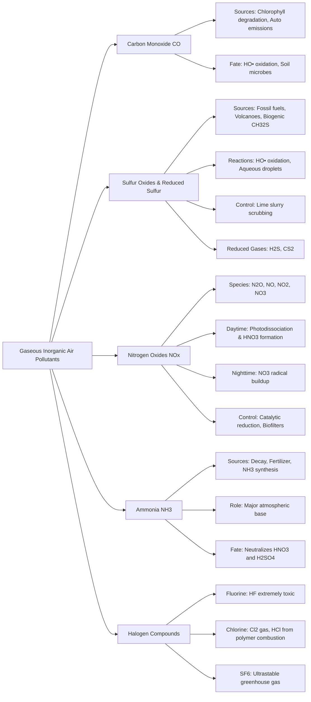

Here is the note based on the provided chapter on Gaseous Inorganic Air Pollutants.

## 1. Chapter Global Mind Map

## 2. Key Concepts & Definitions

- **Photochemical smog conditions**: Atmospheric conditions characterized by the presence of nitrogen oxides, hydrocarbons, and sunlight, which strongly accelerate the oxidation of pollutants like $SO_2$.
- **Leaf chlorosis**: A severe plant disease condition characterized by the yellowing of leaves, often triggered by acute exposure to atmospheric sulfur dioxide ($SO_2$).
- **Lime slurry scrubbing**: A wet throw-away pollution control process that utilizes calcium hydroxide ($Ca(OH)_2$) to absorb and remove $SO_2$ from industrial stack gases before they reach the atmosphere.
- **Biofilters**: An experimental pollution control system consisting of microorganisms immobilized on fixed or fluidized supports, utilized to biologically metabolize and remove $NO_x$ from exhaust gases.
- **Singlet atomic oxygen**: A highly reactive, excited state of atomic oxygen formed in the stratosphere via the photodissociation of $N_2O$, which subsequently drives the formation of nitric oxide ($NO$).

## 3. Crucial Formulas & Theorems

**1. Atmospheric Oxidation of Carbon Monoxide** $$CO + HO^\bullet \rightarrow CO_2 + H$$ _Parameters:_ $HO^\bullet$ is the hydroxyl radical. _Significance:_ This is the primary atmospheric sink for carbon monoxide, representing an intermediate step in the overarching oxidation of methane ($CH_4$).

**2. Oxidation of Hydrogen Sulfide to Sulfur Dioxide** $$H_2S + HO^\bullet \rightarrow HS^\bullet + H_2O$$ $$HS^\bullet + O_2 \rightarrow HO^\bullet + SO$$ $$SO + O_2 \rightarrow SO_2 + O$$ _Parameters:_ $H_2S$ is hydrogen sulfide, and $HS^\bullet$ is the mercapto radical. _Significance:_ Demonstrates the rapid, radical-driven hydrogen abstraction mechanism by which highly toxic, naturally occurring $H_2S$ is converted into $SO_2$ in the atmosphere.

**3. Stone Damage by Sulfur Dioxide** $$CaCO_3\cdot MgCO_3 + 2SO_2 + O_2 + 9H_2O \rightarrow CaSO_4\cdot 2H_2O + MgSO_4\cdot 7H_2O + 2CO_2$$ _Parameters:_ $CaCO_3\cdot MgCO_3$ is dolomite stone, and $CaSO_4\cdot 2H_2O$ is gypsum. _Significance:_ Illustrates the severe material damage caused by $SO_2$ pollution, which chemically weathers and destroys historical stone structures and building surfaces.

**4. Wet Scrubbing of Stack Gas (Lime Slurry)** $$Ca(OH)_2 + SO_2 \rightarrow CaSO_3 + H_2O$$ _Parameters:_ $Ca(OH)_2$ is basic calcium hydroxide, and $CaSO_3$ is solid calcium sulfite. _Significance:_ The most commonly used industrial acid-base neutralization reaction to prevent sulfur emissions during coal combustion. The $CaSO_3$ can be further oxidized to produce usable gypsum.

**5. Atmospheric Neutralization by Ammonia** $$NH_3 + HNO_3 \rightarrow NH_4NO_3(s)$$ $$NH_3 + H_2SO_4 \rightarrow NH_4HSO_4(s)$$ _Parameters:_ $NH_3$ is atmospheric ammonia gas. _Significance:_ Ammonia acts as the atmosphere's primary base, reacting with secondary acidic pollutants ($HNO_3, H_2SO_4$) to form solid ammonium salt aerosols, which severely impact visibility.

## 4. Logic & Step-by-step Walkthrough

### Walkthrough 1: The Diurnal (Day/Night) Cycle of Nitrogen Oxides ($NO_x$)

**Scenario:** The speciation and chemical behavior of $NO_x$ change drastically depending on the presence or absence of sunlight.

- **Step 1: Daytime Photodissociation.** During the day, $NO_2$ absorbs ultraviolet light ($\lambda < 398 \text{ nm}$) and breaks down into nitric oxide ($NO$) and atomic oxygen ($O$). $$NO_2 + h\nu \rightarrow NO + O$$
- **Step 2: Daytime Acid Formation.** Simultaneously, the abundant hydroxyl radicals ($HO^\bullet$) generated by sunlight react aggressively with $NO_2$ to form nitric acid ($HNO_3$), washing out as acid rain. $$HO^\bullet + NO_2 \rightarrow HNO_3$$
- **Step 3: Nighttime Radical Buildup.** When the sun sets, photodissociation stops. Reactions like $O_3 + NO_2 \rightarrow NO_3 + O_2$ continue. Because there is no sunlight to rapidly destroy the newly formed $NO_3$ radical, its concentration builds up significantly during the night, driving dark photochemical smog chemistry.
- **Step 4: N2O5 Formation.** The $NO_3$ reacts with excess $NO_2$ in the dark to form dinitrogen pentoxide ($N_2O_5$), which ultimately reacts with water vapor to yield more nitric acid. $$NO_2 + NO_3 \rightarrow N_2O_5$$

### Walkthrough 2: Generation of Dangerous Hydrofluoric Acid (HF) from Minerals

**Scenario:** Fluorine compounds are rare but exceptionally dangerous air pollutants. They are often inadvertently released when heating silica-containing minerals.

- **Step 1: High-Temperature Reaction.** Calcium fluoride ($CaF_2$), occurring naturally in ores, reacts with silica ($SiO_2$) during intense heating or smelting. $$2CaF_2 + 3SiO_2 \rightarrow 2CaSiO_3 + SiF_4$$
- **Step 2: Hydrolysis in the Atmosphere.** The released silicon tetrafluoride gas ($SiF_4$) encounters water vapor in the atmosphere.
- **Step 3: Acid Release.** The $SiF_4$ violently hydrolyzes to produce solid silica and highly corrosive, deeply toxic hydrofluoric acid gas ($HF$). $$SiF_4 + 2H_2O \rightarrow SiO_2 + 4HF$$
- **Conclusion:** Industrial smelting without proper exhaust treatment can release $HF$ vapor. Exposure even at part-per-thousand levels is fatal, as $HF$ penetrates skin to relentlessly attack bone tissue.

## 5. Exhaustive Take-home Messages (Exam Prep Focus)

### A. Core Definitions

- **CO (Carbon Monoxide):** A toxic, odorless gas produced by the incomplete combustion of hydrocarbons, chlorophyll degradation, and plant decay, which acts as a major intermediate in the atmospheric methane oxidation cycle.
- **SO2 (Sulfur Dioxide):** An acidic gaseous pollutant primarily emitted from fossil fuel combustion and volcanic activity, responsible for respiratory irritation, leaf chlorosis, and the formation of acid rain/haze.
- **NOx (Nitrogen Oxides):** A collective term for $NO$ and $NO_2$, primarily generated by high-temperature internal combustion engines, which serve as the primary precursors for ozone destruction, acid rain, and photochemical smog.
- **Halide Contained Gases:** Inorganic atmospheric species containing halogens (F, Cl), including $Cl_2$, $HCl$, $SF_6$, and $HF$, which are notable for their acute toxicity or extreme environmental stability.
- **HF (Hydrofluoric Acid):** An exceptionally dangerous and highly corrosive inorganic gas/liquid that causes severe, painless initial burns, penetrates deeply into tissues, and actively dissolves bone calcium.

### B. Process Discussions & Analysis

**1. Environmental chemistry behavior of CO:** $CO$ has a residence time of roughly 36–110 days in the atmosphere. Approximately 2/3 of atmospheric $CO$ originates as an intermediate during the radical oxidation of methane. Its primary environmental sink is oxidation by the hydroxyl radical ($HO^\bullet$) into $CO_2$. A secondary sink relies on the biological metabolism of $CO$ by soil microorganisms. Because of automotive emissions, localized high concentrations of $CO$ frequently plague urban microclimates, where it acts as a dangerous human asphyxiant by binding to hemoglobin.

**2. Environmental chemistry behavior of SO2:** Over 100 million tons of sulfur enter the atmosphere annually. $SO_2$ is highly reactive and readily undergoes oxidation into sulfuric acid ($H_2SO_4$). This oxidation occurs via three primary pathways: 1) Radical oxidation by $HO^\bullet$ in photochemical smog conditions; 2) Aqueous phase oxidation dissolved inside water aerosol droplets via $O_3$ or $H_2O_2$; and 3) Heterogeneous catalysis on the surfaces of solid particles. The resulting sulfates interact with atmospheric $NH_3$ to form persistent visibility-reducing hazes.

**3. Environmental chemistry behavior of NOx:** $NO_x$ chemistry is deeply tied to altitude and solar radiation. In the stratosphere, $N_2O$ breaks down to yield atomic oxygen, which then forms $NO$. In the troposphere, $NO$ is rapidly oxidized to $NO_2$. $NO_2$ dictates the atmospheric daytime/nighttime cycle: sunlight forces it to photodissociate (producing ozone), while darkness allows it to combine with the $NO_3$ radical. Ultimately, $NO_x$ is permanently scrubbed from the atmosphere by conversion into soluble nitric acid ($HNO_3$), which washes out in precipitation. To control these processes, modern combustion engines utilize exact excess air ratios, lower temperatures, and catalytic converters.

**4. Environmental chemistry behavior of halide contained gases:** Halide gases exhibit extreme behavioral disparities in the atmosphere. On one end, sulfur hexafluoride ($SF_6$) is utterly inert and "ultrastable," making it a highly potent and long-lasting greenhouse gas. Conversely, gases like $Cl_2$ and $HCl$ (generated from the combustion of organohalide polymers like PVC) are highly reactive and dissolve into atmospheric moisture to form highly corrosive acidic mists.

**5. Hazardous effects of HF:** $HF$ vapor is uniquely hazardous. Unlike other strong acids (like $HCl$) that burn the skin surface immediately, $HF$ exposure may not be immediately painful or visible. The intact $HF$ molecule effortlessly permeates lipid barriers in human skin and deep tissue. Once inside, it dissociates and releases fluoride ions that aggressively bind with calcium and magnesium, systematically destroying bone mass and severely disrupting biological electrical signaling.

> **⚠️ Common Pitfalls / Key Exam Concepts:**
> 
> - **NO vs NO2 Toxicity:** Do not treat $NO_x$ as uniformly toxic in the exact same manner. $NO$ acts similarly to $CO$ (binding to hemoglobin), whereas $NO_2$ is a severe respiratory irritant that specifically triggers lung inflammation and fibrosis.
> - **$SO_2$ Removal Location:** Understand the difference between pre-combustion and post-combustion control. _Physical separation_ or _fluidized beds_ target sulfur _during or before_ the coal burns. _Lime slurry scrubbing_ strictly targets the $SO_2$ exhaust gas _after_ combustion has already taken place.