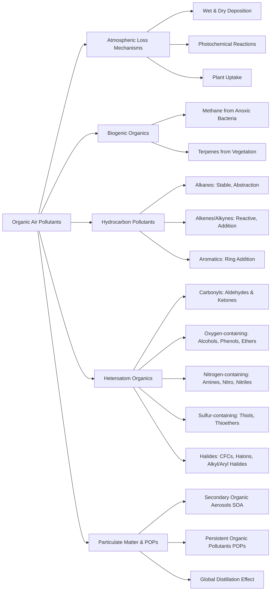

Here is the note based on the provided chapter on Organic Air Pollutants.

## 1. Chapter Global Mind Map

## 2. Key Concepts & Definitions

- **Biogenic organic compounds**: Organic substances (such as methane and terpenes) that are naturally produced by living organisms and act as significant participants in atmospheric chemistry.
- **Persistent Organic Pollutants (POPs)**: Poorly biodegradable organic compounds (like hexachlorobenzene or PCBs) that persist for years, distribute globally, and bioaccumulate in the fatty tissues of higher-level organisms.
- **Global Distillation**: A physical atmospheric process where volatile organic pollutants vaporize in warm equatorial/temperate regions and are carried by air currents to condense in cold polar or mountainous regions.
- **Secondary Organic Aerosol (SOA)**: Fine atmospheric particulate matter formed from the condensation of oxidation products of volatile organic compounds (such as the photochemical oxidation of terpenes).
- **Chromophore**: A specific functional group within a molecule (such as the carbonyl $C=O$ group) that is capable of absorbing ultraviolet photons ($h\nu$) and initiating photochemical cleavage.
- **Addition vs. Abstraction reactions**: **Addition reactions** occur when reactive species (like $HO^\bullet$ or $O_3$) attack the double bonds of alkenes or aromatic rings; **abstraction reactions** occur when radicals strip hydrogen atoms away from stable, single-bonded alkanes.

## 3. Crucial Formulas & Theorems

**1. Biogenic Methane Production (Anoxic Bacteria)** $$2{\text{CH}_2\text{O}} \rightarrow \text{CH}_4 + \text{CO}_2$$ _Parameters:_ ${\text{CH}_2\text{O}}$ represents generic organic biomass. $\text{CH}_4$ is methane. _Significance:_ This represents the fundamental anoxic biological process that makes methane the most abundant organic compound in the atmosphere (heavily sourced from wetlands and the flatulent emissions of domesticated animals).

**2. Photochemical Cleavage of Carbonyls (Aldehydes)** $$\text{HCHO} + h\nu \rightarrow \text{HCHO}^* \rightarrow \text{H}^\bullet + \text{HCO}^\bullet$$ _Parameters:_ $\text{HCHO}$ is formaldehyde, $h\nu$ represents an ultraviolet photon, and the asterisk ($^*$) denotes an energetically excited state. $\text{HCO}^\bullet$ is the formyl radical. _Significance:_ Demonstrates how carbonyl compounds act as chromophores, absorbing solar radiation to generate highly reactive free radicals that propagate photochemical smog chain reactions.

**3. Stratospheric Ozone Depletion by CFCs** $$\text{CF}_2\text{Cl}_2 + h\nu \rightarrow \text{Cl}^\bullet + \text{CF}_2\text{Cl}^\bullet$$ $$\text{Cl}^\bullet + \text{O}_3 + h\nu \rightarrow \text{ClO}^\bullet + \text{O}_2$$ _Parameters:_ $\text{CF}_2\text{Cl}_2$ is a chlorofluorocarbon (Freon-12). $\text{Cl}^\bullet$ is the highly reactive free chlorine radical. _Significance:_ Shows the extreme environmental hazard of CFCs. Because they are ultrastable in the troposphere, they migrate intact to the stratosphere where high-energy UV light breaks their $C-Cl$ bonds, unleashing a catalytic cycle that destroys the protective ozone layer.

## 4. Logic & Step-by-step Walkthrough

### Walkthrough 1: The Dynamics of Global Distillation (The "Grasshopper Effect")

**Scenario:** Heavily restricted agricultural pesticides (like Chlordane) are found in high concentrations in the pristine, isolated ice of the Arctic and the fatty tissues of polar bears. How does it get there?

- **Step 1: Vaporization.** POPs are applied in warmer equatorial and temperate regions. Driven by ambient heat, these semi-volatile compounds transition into the gas phase.
- **Step 2: Atmospheric Transport.** The vaporized organohalides are caught in global atmospheric circulation cells and transported long distances toward the poles.
- **Step 3: Condensation.** As the air masses reach cold polar or high-altitude mountainous regions, the temperature drop forces the POPs to condense out of the gas phase and deposit onto snow, ice, or water.
- **Step 4: Fractionation.** The pollutants naturally fractionate based on volatility. The least volatile POPs deposit near their source, intermediate ones reach polar regions, and highly volatile ones remain widely distributed.
- **Step 5: Bioaccumulation.** Once in the polar ecosystem, these highly lipophilic (fat-loving) chemicals are rapidly absorbed by microorganisms and biomagnify up the food chain into apex predators.

### Walkthrough 2: Photochemical Oxidation of Terpenes to form SOAs

**Scenario:** Pine forests emit massive amounts of natural terpenes (like $\alpha$-pinene and limonene), which undergo reactions to form particulate haze (Secondary Organic Aerosol).

- **Step 1: Radical/Ozone Attack.** Terpenes contain reactive carbon-carbon double bonds ($C=C$). Atmospheric oxidants—primarily the hydroxyl radical ($HO^\bullet$) during the day, $O_3$, or the $NO_3$ radical at night—attack these bonds via addition reactions.
- **Step 2: Ring Cleavage & Oxidation.** The initial attack splits the double bond, creating unstable oxygenated intermediates. For example, Limonene reacts with $O_3$ to form oxidized fragments like 4-Acetyl-1-methylcyclohexene and formaldehyde.
- **Step 3: Condensation to Particulates.** As these organic molecules accumulate oxygen atoms (forming aldehydes, ketones, and carboxylic acids like pinonic acid), their vapor pressure drastically drops. They condense from gases into fine liquid or solid particles, forming visible haze (SOA) over forested regions.

## 5. Exhaustive Take-home Messages (Exam Prep Focus)

This section perfectly maps to the 6 definitions and 2 discussion points strictly required by the final "Take-home Message" slide (Slide 36) of the source document.

### A. Core Definitions

1. **Direct effect:** An immediate, primary adverse health or environmental impact caused exactly by the emitted chemical itself (e.g., exposure to airborne vinyl chloride directly causing liver cancer).
2. **Secondary pollutants:** Hazardous compounds not emitted directly from a source, but formed in the atmosphere via chemical or photochemical reactions of primary precursors (e.g., photochemical smog, ozone, or secondary organic aerosols).
3. **Wet deposition and dry deposition:** The two primary removal routes for atmospheric organics. _Wet deposition_ is the dissolution and washout of water-soluble pollutants via rain or snow; _dry deposition_ is the physical settling, impaction, or direct absorption of gases and particles onto land, water, or plant surfaces.
4. **POPs (Persistent Organic Pollutants):** A class of highly stable, poorly biodegradable organohalides (like PCBs, Chlordane) that linger in the environment for decades, distribute globally, and bioaccumulate in the fatty tissues of animals and humans.
5. **SOA (Secondary Organic Aerosol):** Fine atmospheric particulate matter that is generated chemically _in situ_ when volatile organic compounds (like biogenic terpenes or anthropogenic hydrocarbons) undergo oxidation to form heavier, low-volatility products that condense into particles.
6. **CFCs (Chlorofluorocarbons):** Synthetic, ultrastable halocarbon gases (freons) that persist long enough to reach the stratosphere, where they are photolyzed to release chlorine radicals that catalytically destroy the protective ozone layer.

### B. Process Discussions & Analysis

**1. Characters of POPs (Persistent Organic Pollutants)** To analyze POPs for exams, you must recall their four defining environmental behaviors:

- **Extreme Longevity:** They feature highly stable carbon-halogen bonds that make them fiercely resistant to biological, chemical, and photochemical degradation. They last in the Earth System for years or decades.
- **Global Distribution & Fractionation:** Via the Global Distillation effect, atmospheric heating at the equator vaporizes them, and wind carries them to cold polar regions where they condense. They "fractionate" sequentially according to their volatility.
- **Bioaccumulation:** POPs are highly lipophilic (fat-soluble) and hydrophobic (water-repelling). They aggressively partition into the fatty tissue of living organisms, biomagnifying to dangerous concentrations at higher levels of the food chain.

**2. Classification of organic compounds** Atmospheric organic compounds must be classified by their origins and their structural reactivity:

- **Origin Classification:** They are either _Biogenic_ (produced by life, like bacterial methane or tree-emitted terpenes, which dominate total atmospheric mass) or _Anthropogenic_ (industrial emissions, engine exhaust).
- **Structural & Reactivity Classification:**
    - **Alkanes:** Saturated and relatively stable; they react slowly via $H$-atom _abstraction_ by $HO^\bullet$.
    - **Alkenes/Alkynes/Terpenes:** Unsaturated and highly reactive; they rapidly undergo _addition_ reactions across their double/triple bonds by $HO^\bullet, O_3$, and $NO_3$ radicals, serving as the primary drivers of photochemical smog and SOA formation.
    - **Aromatics:** Ring structures (benzene, toluene) that are attacked by $HO^\bullet$ to form stable phenols and reactive hydroperoxyl radicals ($HOO^\bullet$).
    - **Oxygenated (Carbonyls/Alcohols/Acids):** Compounds like aldehydes possess a chromophore ($C=O$) that allows them to absorb UV light and break into free radicals, actively fueling atmospheric chain reactions.
    - **Heteroatoms (N, S, Halogens):** Amines/Nitro compounds act as mutagens/carcinogens; Thiols generate massive odor problems; Organohalides (CFCs, POPs) cause long-term global ozone and bioaccumulation hazards.

> **⚠️ Common Pitfalls / Key Exam Concepts:**
> 
> - **Biogenic vs. Anthropogenic Volume:** A common mistake is assuming that industrial emissions produce the majority of atmospheric organics. In reality, **biogenic methane** and **biogenic terpenes** far outweigh anthropogenic organics by mass globally.
> - **$NO_3$ Radical Timing:** Remember that the $NO_3$ radical is the dominant oxidizer for alkenes _at night_. During the day, sunlight destroys $NO_3$, making the $HO^\bullet$ radical the dominant daytime oxidizer.
> - **Direct vs Secondary Toxicity:** Do not confuse the toxicity of the source gas with the toxicity of the product. Many VOCs are relatively harmless on their own (direct effect) but are heavily regulated because they are the _precursors_ to highly toxic secondary pollutants like photochemical smog and ozone.