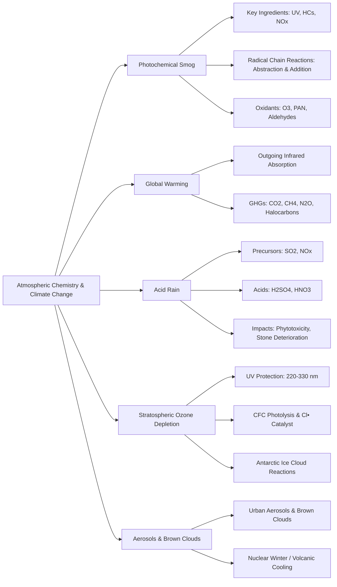

Here is the note based on the provided chapters covering Photochemical Smog and The Endangered Global Atmosphere.

## 1. Chapter Global Mind Map

## 2. Key Concepts & Definitions

- **Photochemical smog**: An oxidizing atmospheric phenomenon formed in the troposphere's planetary boundary layer, characterized by eye irritation, low visibility, and the generation of secondary oxidants like $O_3$, strictly requiring UV radiation, hydrocarbons, and nitrogen oxides.
- **Odd hydrogen radicals**: Ubiquitous, highly reactive intermediate species—such as the hydroxyl ($HO^\bullet$) and hydroperoxyl ($HOO^\bullet$) radicals—that propagate complex chain reactions during smog formation.
- **Peroxyacyl nitrates (PANs)**: A highly toxic class of secondary photochemical oxidants (e.g., $CH_3C(O)OONO_2$) formed by the addition reaction of organic peroxyl radicals with $NO_2$, serving as a classic symptom of photochemical smog.
- **Radiative forcing**: The capacity of specific trace gases in the atmosphere (like $CO_2$ and $CH_4$) to trap and absorb outbound infrared radiation emitted by the Earth, thereby warming the planet.
- **Nuclear winter**: A theoretical catastrophic climate cooling scenario triggered by massive amounts of sooty particulate matter (from nuclear war or extreme volcanic eruptions) reaching stratospheric altitudes, blocking incoming solar radiation, and preventing greenhouse heat retention.
- **Urban aerosol**: A brown-cloud-type particulate phenomenon afflicting urban areas, primarily consisting of very fine respirable particles chemically generated from gaseous precursors (like sulfates and nitrates) rather than direct dust emissions.

## 3. Crucial Formulas & Theorems

**1. Primary Initiation of Photochemical Smog** $$NO_2 + h\nu (\lambda < 394 \text{ nm}) \rightarrow NO + O$$ $$O_2 + O + M \rightarrow O_3 + M$$ _Parameters:_ $NO_2$ is nitrogen dioxide, $h\nu$ is solar UV radiation, $O$ is highly reactive atomic oxygen, and $M$ is an energy-absorbing third body (like $N_2$ or $O_2$). _Significance:_ This is the fundamental photochemical trigger for smog. Sunlight cleaves $NO_2$ to generate atomic oxygen, which immediately collides with ambient oxygen gas to form ozone ($O_3$).

**2. Radical Generation via Excited Oxygen** $$O^* + H_2O \rightarrow 2HO^\bullet$$ _Parameters:_ $O^*$ represents electronically excited atomic oxygen, and $HO^\bullet$ is the hydroxyl radical. _Significance:_ This reaction demonstrates how trace atmospheric water vapor converts highly energetic oxygen atoms into the hydroxyl radical, the primary "detergent" and chain-propagating species in the atmosphere.

**3. Catalytic Destruction of Stratospheric Ozone** $$CF_2Cl_2 + h\nu \rightarrow Cl^\bullet + CF_2Cl^\bullet$$ $$Cl^\bullet + O_3 \rightarrow ClO^\bullet + O_2$$ $$ClO^\bullet + O \rightarrow Cl^\bullet + O_2$$ _Parameters:_ $CF_2Cl_2$ is a chlorofluorocarbon (CFC). $Cl^\bullet$ is the chlorine free radical. _Significance:_ CFCs migrate to the stratosphere and are photolyzed by intense UV light to release free chlorine. The chlorine radical acts as a pure catalyst, relentlessly converting protective ozone ($O_3$) back into normal oxygen ($O_2$) without being consumed itself (destroying up to 10,000 ozone molecules per $Cl^\bullet$).

**4. Chemical Weathering by Acid Rain** $$2H^+ + CaCO_3(\text{limestone}) \rightarrow Ca^{2+} + CO_2(g) + H_2O$$ _Parameters:_ $CaCO_3$ represents calcium carbonate, the primary mineral in limestone and marble. _Significance:_ Shows the direct, irreversible neutralization reaction where acid precipitation (supplying $H^+$) physically dissolves and destroys historical buildings and monuments.

## 4. Logic & Step-by-step Walkthrough

### Walkthrough 1: The Diurnal (Daily) Chemical Sequence of Photochemical Smog

**Scenario:** A generalized timeline of chemical species variations during a highly polluted, sunny day in an urban environment.

- **Step 1: Early Morning (Traffic Peak).** Commuter traffic emits massive amounts of primary pollutants: Nitric oxide ($NO$) and unburned non-methane hydrocarbons (HCs) from exhaust and crankcases. NO levels peak first.
- **Step 2: Mid-Morning Oxidation.** Atmospheric oxidants and radicals begin reacting with the HCs. The resulting peroxyl radicals ($ROO^\bullet$) efficiently oxidize the ambient $NO$ into $NO_2$. Consequently, $NO$ levels drop while $NO_2$ levels hit their maximum.
- **Step 3: Midday Photolysis.** As the sun reaches its peak intensity, the accumulated $NO_2$ undergoes rapid photodissociation, yielding atomic oxygen and ultimately driving massive ozone ($O_3$) formation.
- **Step 4: Afternoon Oxidant Peak.** Because the hydrocarbon radicals continuously oxidize $NO$ to $NO_2$ _without_ consuming $O_3$, ozone and other secondary oxidants (aldehydes, PAN) accumulate heavily in the atmosphere, creating the classic blinding smog peak in the mid-afternoon.

### Walkthrough 2: Methane Abstraction & Smog Propagation

**Scenario:** How a simple alkane like methane ($CH_4$) fuels complex, smog-forming chain reactions via abstraction and radical transfer.

- **Step 1: Hydrogen Abstraction.** A highly reactive hydroxyl radical ($HO^\bullet$) attacks methane, stripping a hydrogen atom to form water and leaving a reactive methyl radical: $$CH_4 + HO^\bullet \rightarrow H_3C^\bullet + H_2O$$
- **Step 2: Oxygen Addition.** The methyl radical instantly reacts with abundant atmospheric oxygen to form a methyl peroxyl radical: $$H_3C^\bullet + O_2 + M \rightarrow H_3COO^\bullet + M$$
- **Step 3: Nitrogen Oxidation.** The methyl peroxyl radical aggressively attacks nitric oxide ($NO$), stealing an oxygen atom to regenerate $NO_2$ (which can then be photolyzed to make more ozone): $$H_3COO^\bullet + NO \rightarrow H_3CO^\bullet + NO_2$$
- **Conclusion:** This chain demonstrates the "engine" of smog: hydrocarbons act as the fuel that converts harmless $NO$ into smog-generating $NO_2$.

## 5. Exhaustive Take-home Messages (Exam Prep Focus)

This section systematically covers the 9 explicit review points exactly as required by the "Take-home Message" slide (Slide 67) of the source document.

### A. Core Definitions

1. **Three key elements for photochemical smog formation:** Photochemical smog strictly requires the simultaneous presence of 1) Ultraviolet (UV) radiation from sunlight, 2) Hydrocarbons (HCs), and 3) Nitrogen oxides ($NO_x$).
2. **Photochemical oxidant:** Reactive atmospheric species that oxidize target molecules (like $I^-$ to $I_3^-$). The primary photochemical oxidant is ozone ($O_3$), with others including $H_2O_2$, organic hydroperoxides ($ROOH$), and PANs.
3. **Critical greenhouse gases:** The specific gases regulated by agreements like the Kyoto Protocol that strongly absorb infrared radiation: $CO_2, CH_4, N_2O$, Hydrofluorocarbons (HFCs), Perfluorocarbons (PFCs), Sulfur hexafluoride ($SF_6$), and Nitrogen trifluoride ($NF_3$) .
4. **Global warming:** The warming of the Earth's lower atmosphere caused by the reabsorption of outbound infrared radiation by accumulated greenhouse gases (primarily $CO_2$ and $CH_4$).
5. **Ozone depletion:** The catalytic destruction of the stratospheric ozone layer (which protects Earth from 220-330 nm UV radiation) primarily driven by anthropogenic chlorofluorocarbons (CFCs) releasing photolyzed chlorine radicals.
6. **Acid rain formation:** The process by which primary acid-forming gases (like $SO_2$ from burning pyrite-containing coal, and $NO_x$) are oxidized in the atmosphere by radicals or $O_3$ to form strong aqueous acids like $H_2SO_4$ and $HNO_3$.

### B. Process Discussions & Analysis

**1. Key chemical reactions and mechanism of photochemical smog formation** Smog operates via a massive radical chain reaction. It _initiates_ when UV light splits $NO_2$ into $NO$ and $O^\bullet$, allowing $O^\bullet$ to combine with $O_2$ to form ozone ($O_3$). Simultaneously, radical species like $HO^\bullet$ attack atmospheric hydrocarbons to generate organic radicals ($R^\bullet$). These organic radicals readily absorb $O_2$ to form peroxyl radicals ($ROO^\bullet$). These peroxyl radicals act as the critical "pump" that continuously oxidizes $NO$ back into $NO_2$. Because $NO_2$ is continuously regenerated without sacrificing the newly formed ozone, $O_3$ and other toxic byproducts rapidly accumulate.

**2. Species variation in a smoggy day** The temporal dynamics of smog are highly predictable. In the pre-dawn/early morning, non-methane hydrocarbons and $NO$ spike due to rush hour traffic. By 8 A.M., radical chain reactions begin oxidizing the $NO$ pool, causing $NO_2$ levels to peak. Once the sun is high (noon to 4 P.M.), $NO_2$ photolysis reaches maximum efficiency, crashing $NO_2$ levels while causing secondary oxidants (Ozone and Aldehydes) to hit their absolute daily maximums.

**3. Abstraction and addition reactions**

- **Abstraction:** Saturated hydrocarbons (alkanes) react when a powerful radical (like $HO^\bullet$ or $O^\bullet$) literally "plucks" a hydrogen atom off the molecule, creating water and a reactive alkyl radical ($R^\bullet$).
- **Addition:** Unsaturated hydrocarbons (alkenes) are far more reactive. Radicals ($HO^\bullet$) or Ozone ($O_3$) directly attach across the $C=C$ double bond, rapidly cleaving the molecule into oxygenated fragments (aldehydes, ketones) that fuel severe smog events.

> **⚠️ Common Pitfalls / Key Exam Concepts:**
> 
> - **$NO_3$ Radical Timing:** Remember that the nitrate radical ($NO_3$) is highly photolyzable. Therefore, it is rapidly destroyed during the day (lifetime of ~5 seconds) and is only an important reactive species _at night_.
> - **CFC Substitutes and the "Double-Edged Sword":** When discussing replacements for ozone-depleting CFCs (like HFC-134a), remember that while they successfully lack chlorine (saving the ozone layer), they are extremely potent greenhouse gases, thereby substituting one global atmospheric crisis for another.
> - **Ozone Location Dictates Toxicity:** Students often confuse ozone's role. _Stratospheric_ ozone is vital for shielding biological life from 290-320 nm UV radiation. Conversely, _Tropospheric_ ozone (in the planetary boundary layer) is a highly toxic photochemical oxidant that causes respiratory distress, plant toxicity, and rubber degradation.