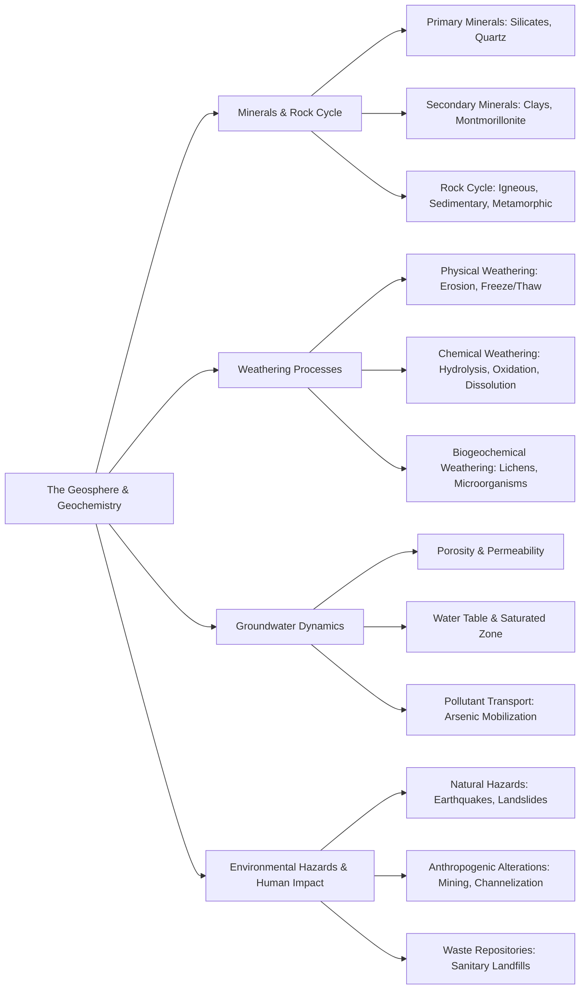

Here is the highly structured learning note based on the provided chapter on the Geosphere and Geochemistry.

## 1. Chapter Global Mind Map

## 2. Key Concepts & Definitions

- **Evaporites**: Soluble salts that precipitate from a solution under special arid conditions, commonly resulting from the evaporation of seawater or brine sources.
- **Sublimates**: Mineral substances that are condensed near the mouths of volcanic fumaroles from originally gaseous magmatic emissions.
- **Porosity**: A fundamental physical characteristic of rock formations that determines the percentage of the rock's total volume available to contain water.
- **Permeability**: A physical characteristic describing the ease with which water can flow through a porous rock formation.
- **Lithification**: The specific geological process denoting the conversion and compaction of loose sediments into solid sedimentary rocks.
- **Sanitary landfill**: A designated waste repository within the geosphere where refuse undergoes both aerobic and anaerobic biodegradation over time.

## 3. Crucial Formulas & Theorems

**1. Acid Hydrolysis of Feldspar to Kaolinite Clay** $$2\text{KAlSi}_3\text{O}_8(s) + 2\text{H}^+ + 9\text{H}_2\text{O} \rightarrow \text{Al}_2\text{Si}_2\text{O}_5(\text{OH})_4(s) + 2\text{K}^+(aq) + 4\text{H}_4\text{SiO}_4(aq)$$ _Parameters:_ $\text{KAlSi}_3\text{O}_8$ is the primary mineral feldspar (orthoclase), and $\text{Al}_2\text{Si}_2\text{O}_5(\text{OH})_4$ is the secondary clay mineral kaolinite. _Significance:_ This chemical weathering reaction illustrates how massive, solid primary igneous rocks are broken down by environmental acids and water to form highly reactive, finely divided secondary clay minerals.

**2. Chemical Weathering via Oxidation (Pyrite)** $$4\text{FeS}_2(s) + 15\text{O}_2(g) + (8+2x)\text{H}_2\text{O} \rightarrow 2\text{Fe}_2\text{O}_3 \cdot x\text{H}_2\text{O}(s) + 8\text{SO}_4^{2-}(aq) + 16\text{H}^+(aq)$$ _Parameters:_ $\text{FeS}_2$ is solid iron pyrite. _Significance:_ Demonstrates a severe oxidative weathering mechanism where sulfur-bearing minerals interact with oxygen and water to generate massive amounts of soluble sulfate and highly corrosive acid ($\text{H}^+$).

**3. Reductive Mobilization of Arsenic** $$\text{FeO}(\text{OH})(\text{As})(s) + {\text{CH}_2\text{O}} \rightarrow \text{Fe}^{2+}(aq) + \text{As}(aq)$$ _Parameters:_ $\text{FeO}(\text{OH})(\text{As})$ represents arsenic co-precipitated with iron oxide minerals, and ${\text{CH}_2\text{O}}$ represents decomposing organic biomass (like peat or humic substances). _Significance:_ Explains the dangerous groundwater pollution mechanism where microbial breakdown of organics creates a reducing environment, dissolving the iron mineral lattice and mobilizing toxic arsenic into drinking water aquifers.

**4. Biodegradation in the Geosphere** $$\text{Aerobic: } {\text{CH}_2\text{O}} + \text{O}_2 \rightarrow \text{CO}_2 + \text{H}_2\text{O}$$ $$\text{Anaerobic: } 2{\text{CH}_2\text{O}} \rightarrow \text{CO}_2 + \text{CH}_4$$ _Parameters:_ ${\text{CH}_2\text{O}}$ represents organic refuse or biomass. _Significance:_ Dictates the chemical fate of solid wastes in sanitary landfills, transitioning from an initial oxygen-consuming phase to a prolonged, methane-generating anaerobic phase.

## 4. Logic & Step-by-step Walkthrough

### Walkthrough 1: The Continuous Rock Cycle

**Scenario:** Rock materials continuously change forms through different temperature, pressure, and chemical regimes in the geosphere.

- **Step 1: Igneous Formation.** Deep beneath the Earth's surface, rock and minerals melt into magma. As it cools under water-deficient, chemically reducing, high-temp/high-pressure conditions, it solidifies into **Igneous rock** (e.g., granite, basalt).
- **Step 2: Weathering & Sedimentation.** When igneous rocks are uplifted and exposed to wet, oxidizing, low-temperature surface conditions, they are no longer in chemical equilibrium. They disintegrate via physical and chemical weathering into loose sediments.
- **Step 3: Lithification.** These sediments are transported by wind/water, deposited, and eventually undergo **lithification**, compressing into **Sedimentary rock**.
- **Step 4: Metamorphism.** If the sedimentary rock is subjected to intense heat and pressure deep underground, it deforms and recrystallizes into **Metamorphic rock**, which may eventually melt back into magma, completing the cycle.

### Walkthrough 2: Generation of Secondary Clays and Cation Exchange

**Scenario:** Clays are critical for neutralizing pollutants, but they are not formed identically to the rocks they reside on.

- **Step 1: Primary Mineral Breakdown.** A primary silicate mineral like feldspar undergoes extensive acid hydrolysis and chemical weathering over geological time.
- **Step 2: Microcrystalline Restructuring.** The remnants recrystallize into sheet-like, hydrous aluminum silicates known as clays (e.g., montmorillonite or illite).
- **Step 3: Isomorphic Substitution.** During this crystallization, atoms of slightly lower charge but similar size naturally replace structural atoms (e.g., $\text{Al}^{3+}$ replaces $\text{Si}^{4+}$ in the tetrahedral layer).
- **Step 4: Cation Exchange Capacity (CEC) Development.** This substitution leaves the clay lattice with a permanent net _negative_ charge. To achieve electrical neutrality, the clay binds exchangeable positive cations (like $\text{H}^+, \text{Na}^+, \text{Ca}^{2+}$) to its surface. This high CEC allows the soil to actively trap and hold cationic pollutants and vital nutrients.

## 5. Exhaustive Take-home Messages (Exam Prep Focus)

### A. Core Definitions

1. **Mineral:** A naturally occurring substance that possesses two unique characteristics: a defined chemical composition (expressed via a chemical formula) and a highly ordered crystal structure (the specific geometric arrangement of its atoms).
2. **Crystal structure:** The specific, highly ordered, three-dimensional way in which atoms are arranged relative to each other within a mineral.
3. **Clay:** A microcrystalline, hydrous aluminum silicate formed as a secondary mineral from the weathering of primary rocks. They possess sheet-like structures and acquire a negative surface charge through ion replacement.
4. **CEC (Cation Exchange Capacity):** A quantitative measurement of a clay's ability to hold and exchange positive ions, expressed as milliequivalents of monovalent cations per 100 grams of dry clay.
5. **Weathering:** The environmental breakdown of rock into finely divided particulate forms or dissolved solutions, driven by a combination of physical, chemical, and biogeochemical processes.
6. **Environmental geochemistry:** A specialized branch of geochemistry focused on exploring the complex interactions among the rock, water, air, and biological systems that ultimately dictate the chemical characteristics of the Earth's surface environment.
7. **Geochemistry:** The broad scientific discipline dealing with chemical species, reactions, and processes specifically within the lithosphere and their interactions with other environmental spheres.
8. **Nature hazards:** Destructive events originating from geospheric dynamics, including internal processes (earthquakes and volcanoes driven by tectonic and magmatic shifts) and surface processes (landslides and sinkholes driven by erosion and gravity).

### B. Process Discussions & Analysis

**1. Classification of different weathering processes** Weathering is the geosphere's mechanism for driving unstable rocks toward equilibrium with surface conditions.

- **Physical weathering** involves strictly mechanical breakdown forces, such as wind/water erosion and the expansion forces of freezing/thawing ice, which grind rocks down without altering their fundamental chemical formulas.
- **Chemical weathering** involves aqueous geochemical processes. Because rocks form under extreme underground conditions, they are unstable in wet, oxidizing surface air. Chemical weathering forces them toward equilibrium via hydration, direct dissolution, acid hydrolysis, oxidation, and complexation.
- **Biogeochemical weathering** occurs when miniature ecosystems (lichens, cyanobacteria, fungi) colonize rock cavities. These organisms accelerate rock breakdown by excreting organic acids and complexing agents that actively dissolve the mineral lattice to extract nutrients.

**2. Crystal structure and function of different mineral structures** The function and reactivity of a mineral are entirely dictated by its crystal structure. Primary silicate minerals (like quartz) have tightly bound, rigid tetrahedral structures making them highly resistant to chemical attack. Conversely, secondary clay minerals possess distinct _sheet-like_ crystal structures. Functionally, the geometry of these clay sheets permits "ion replacement" (isomorphic substitution), where $\text{Si}^{4+}$ is structurally replaced by $\text{Al}^{3+}$. This specific structural defect imparts a permanent negative charge to the entire clay layer. Because of this structural phenomenon, clays function as the geosphere's primary chemical buffer, utilizing their Cation Exchange Capacity (CEC) to sequester heavy metal pollutants, neutralize acids, and trap essential agricultural nutrients preventing them from washing away.

> **⚠️ Common Pitfalls / Key Exam Concepts:**
> 
> - **Primary vs. Secondary Minerals:** Do not confuse these classes. Primary minerals (like feldspar or olivine) solidify directly from hot, molten magma. Secondary minerals (like montmorillonite clay) **never** form from magma; they are strictly the low-temperature, water-driven _weathering products_ of primary minerals.
> - **The Cause of Clay CEC:** Students often assume clays are negatively charged simply because they are "dirty." Exam answers must specify that the negative charge arises internally from **isomorphic ion replacement** (e.g., Al(III) replacing Si(IV) in the crystal lattice).