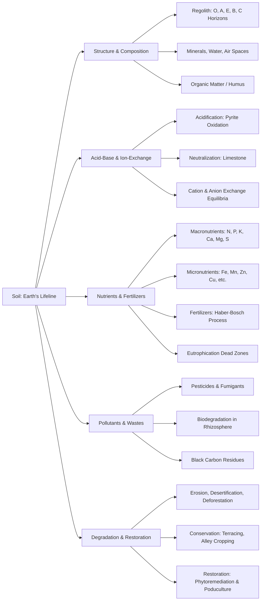

## 1. Chapter Global Mind Map

## 2. Key Concepts & Definitions

- **Pedology**: The scientific study of soil, including its formation, chemistry, morphology, and classification.
- **Humus**: The most abundant organic component in soil, consisting of degradation-resistant residue from plant decay that improves physical properties and acts as a reservoir of fixed nitrogen.
- **Rhizosphere**: The highly active micro-ecological zone in the soil immediately surrounding plant roots, characterized by high biological activity and rapid biodegradation of organic wastes.
- **Alley cropping**: An agroforestry and soil conservation practice involving the planting of crops between rows of trees on a slope to prevent erosion and add fertility.
- **Poduculture**: A soil restoration technique where crops are grown in designated "pods" filled with artificial topsoil, typically excavated into heavily depleted soil, gravel, or sand beds.
- **Phytoremediation**: An environmental remediation technique utilizing specific plants to absorb, sequester, or degrade pollutant metals and organic contaminants from the soil.

## 3. Crucial Formulas & Theorems

**1. Pyrite Oxidation (Severe Soil Acidification)** $$4\text{FeS}_2 + \frac{7}{2}\text{O}_2 + \text{H}_2\text{O} \rightarrow \text{Fe}^{2+} + 2\text{H}^+ + 2\text{SO}_4^{2-}$$ _Parameters:_ $\text{FeS}_2$ is solid pyrite (iron disulfide), $\text{Fe}^{2+}$ is the ferrous ion, and $\text{H}^+$ represents acid protons. _Significance:_ This reaction illustrates how exposing pyrite-containing soils to oxygen and water rapidly generates massive amounts of acidity (dropping pH < 3) and releases potentially phytotoxic $\text{Fe}^{2+}$, forming what are known as "cat clays."

**2. Ion-Exchange Equilibrium Constant** $$K_c = \frac{N_K[\text{Na}^+]}{N_{Na}[\text{K}^+]}$$ _Parameters:_ $K_c$ is the exchange constant for the reaction $\text{Soil}}\text{Na}^+ + \text{K}^+(aq) \rightleftharpoons \text{Soil}}\text{K}^+ + \text{Na}^+(aq)$. $N_K$ and $N_{Na}$ are the equivalent fractions of the respective cations bound to the solid soil matrix, while bracketed terms are their concentrations in the surrounding aqueous soil solution. _Significance:_ Quantifies the soil's preference for holding specific nutrient cations over others, dictating how effectively soils can retain fertilizers (like Potassium, $\text{K}^+$) versus leaching them into groundwater.

**3. The Haber-Bosch Process** $$\text{N}_2 + 3\text{H}_2 \xrightarrow{\text{Catalyst, } 500^\circ\text{C, } 1000\text{ atm}} 2\text{NH}_3$$ _Parameters:_ $\text{N}_2$ is atmospheric nitrogen, and $\text{NH}_3$ is ammonia. _Significance:_ The fundamental industrial synthesis pathway for nitrogen fertilizers. This intense catalytic fixation of nitrogen allows for modern agriculture but also leads to massive anthropogenic imbalances in the global nitrogen cycle.

**4. Solubilization of Phosphate Minerals** $$2\text{Ca}_5\text{F}(\text{PO}_4)_3 + 14\text{H}_3\text{PO}_4 + 10\text{H}_2\text{O} \rightarrow 2\text{HF}(g) + 10\text{Ca}(\text{H}_2\text{PO}_4)_2\cdot\text{H}_2\text{O}$$ _Parameters:_ $\text{Ca}_5\text{F}(\text{PO}_4)_3$ is highly insoluble fluorapatite. $\text{Ca}(\text{H}_2\text{PO}_4)_2$ is soluble superphosphate. _Significance:_ Demonstrates the chemical treatment required to convert unavailable, insoluble rock phosphates into soluble superphosphate fertilizers that plant roots can readily absorb.

## 4. Logic & Step-by-step Walkthrough

### Walkthrough 1: The Pathway from Nitrogen Fertilizer to Aquatic Dead Zones

**Scenario:** The application of synthetic fertilizers on agricultural land heavily impacts distant aquatic ecosystems (e.g., the Gulf of Mexico Dead Zone).

- **Step 1: Industrial Fixation.** Atmospheric $\text{N}_2$ is chemically reduced using the Haber-Bosch process to form ammonia ($\text{NH}_3$), which is applied to fields directly or converted to ammonium nitrate/urea.
- **Step 2: Soil Conversion & Leaching.** In the soil, bacteria convert ammonium into nitrate ($\text{NO}_3^-$) for plant uptake. Because nitrate is highly soluble and weakly bound by negatively charged soil particles, excess nitrate easily leaches away with irrigation or rainfall.
- **Step 3: Transport & Eutrophication.** The runoff carries these concentrated algal nutrients (N and P) into river systems (like the Mississippi River), eventually reaching coastal marine waters. The nutrient influx triggers explosive phytoplankton (algal) blooms.
- **Step 4: Hypoxia (Dead Zone Formation).** The massive algal biomass eventually dies and sinks. Heterotrophic bacteria decompose this dead organic matter, aggressively consuming the dissolved oxygen ($\text{O}_2$) in the water column. The water becomes severely hypoxic or anoxic, killing all resident marine life and producing toxic $\text{H}_2\text{S}$.

### Walkthrough 2: Chemical Dynamics of Waterlogged Soils

**Scenario:** When soil becomes completely saturated with water (waterlogged), its physical and chemical properties shift drastically, threatening plant survival.

- **Step 1: Oxygen Depletion.** Water fills all the air spaces in the soil structure. The decay of organic matter by aerobic microbes quickly consumes the remaining trapped oxygen, preventing atmospheric $\text{O}_2$ from diffusing in.
- **Step 2: Redox Shift.** The soil environment shifts from oxic to severely anoxic (reducing). The pE (electron activity) drops significantly.
- **Step 3: Metal Reduction and Toxicity.** In the absence of oxygen, anaerobic bacteria begin using oxidized metals as electron acceptors. Harmless solid minerals like $\text{MnO}_2$ and $\text{Fe}_2\text{O}_3$ are chemically reduced to soluble $\text{Mn}^{2+}$ and $\text{Fe}^{2+}$ ions.
- **Conclusion:** These heavy metal ions flood the soil solution. At elevated concentrations, $\text{Fe}^{2+}$ and $\text{Mn}^{2+}$ are highly phytotoxic (poisonous to plants), causing crop failure in flooded fields.

## 5. Exhaustive Take-home Messages (Exam Prep Focus)

This section systematically covers 100% of the requirements mapped from the "Take-home Message" section (Slide 39) of the source material.

### A. Core Definitions

1. **Soil:** A variable, complex mixture of minerals, organic matter, and water that serves as the final product of rock weathering, acting as Earth's essential receptor for pollutants and medium for plant life.
2. **Pedology:** The formal scientific study of soils, encompassing their composition, structure, formation, and classifications.
3. **Waterlogging:** A condition where the air spaces within soil are completely saturated with water, leading to anoxic conditions and the dangerous release of phytotoxic $\text{Fe}^{2+}$ and $\text{Mn}^{2+}$ ions.
4. **Macronutrients:** Essential elements (like C, H, O, N, P, K, Ca, Mg, S) required in relatively large, substantial quantities for the formation of plant biomass and vital structural fluids.
5. **Micronutrient:** Trace elements (like B, Cl, Cu, Fe, Mn, Zn, Mo) that are absolutely essential for plant survival—typically functioning as critical enzyme co-factors—but only required at very low concentration levels.
6. **Hyperaccumulators:** Highly specialized plants (like the "Copper flower") that can absorb and tolerate extraordinary concentrations of heavy metals in their biomass, making them primary candidates for phytoremediation.
7. **Soil erosion:** The physical degradation and loss of fertile topsoil, primarily driven by wind and water forces, often exacerbated by deforestation, drought, and poor agricultural practices.

### B. Process Discussions & Analysis

**1. Structure of soil** Soil is highly organized into vertical layers called the _Regolith_. The top layer is the **O horizon** (decaying plant biomass), followed by the **A horizon/Topsoil** (rich in humus and biological activity). Below this is the **E horizon** (a leached layer), the **B horizon/Subsoil** (where eluted clays and salts accumulate), and finally the **C horizon** (weathered parent rock resting on bedrock). A healthy structure includes loose textures with ample air spaces to support oxygenation, water drainage, and the complex communities of the rhizosphere.

**2. Function of organic matter in soil** Although making up 5% or less of soil mass, organic matter (especially Humus) is the critical lifeline of soil functionality. It exhibits four primary mechanisms: 1) It drastically increases the soil's capacity to hold moisture; 2) It acts as an immense ion-exchange reservoir, holding onto nutrient cations and exchanging them safely with plant roots; 3) It serves as the primary carbon and energy food source for vital soil microorganisms; 4) It actively drives chemical weathering of parent minerals to release locked inorganic nutrients.

**3. Soil remediation and restoration** When soil degrades (via erosion, acidification, or pollution), active _restoration ecology_ is required. Physical mechanisms include terracing slopes to halt erosion or leaching salts out with water. Chemical mechanisms involve neutralizing acidic soils with limestone ($CaCO_3$). Biological mechanisms include _phytoremediation_ (using roots to pull toxic pollutants out of the earth) or deploying _poduculture_ to grow crops in artificial, contained soil pockets when the native ground is entirely depleted or barren.

**4. Composition and function of soil** Soil acts as an environmental buffer. It regulates water supplies, filtering contaminants before they reach groundwater aquifers. Compositionally, it requires a delicate balance of minerals, organic matter, water, and gases. Variations in its composition dictate its chemical behavior—for instance, the presence of specific clays dictates its Cation Exchange Capacity (CEC), directly controlling whether the soil can retain applied N-P-K fertilizers or whether those chemicals will rapidly leach out and cause downstream eutrophication.

> **⚠️ Common Pitfalls / Key Exam Concepts:**
> 
> - **Cation vs. Anion Exchange:** Do not assume they behave the same. Soils naturally possess extensive _cation_ exchange capacities due to negatively charged clays and humus. _Anion_ exchange is much weaker and heavily pH-dependent, meaning negatively charged nutrients like nitrate ($\text{NO}_3^-$) are very easily lost to leaching.
> - **Acidification Triggers:** Students often forget that _oxidation_ causes acidity in soil. The oxidation of iron pyrite ($\text{FeS}_2$) or even the bacterial oxidation of ammonium fertilizers ($\text{NH}_4^+ \rightarrow \text{NO}_3^-$) releases $\text{H}^+$ protons into the soil, requiring limestone buffering.