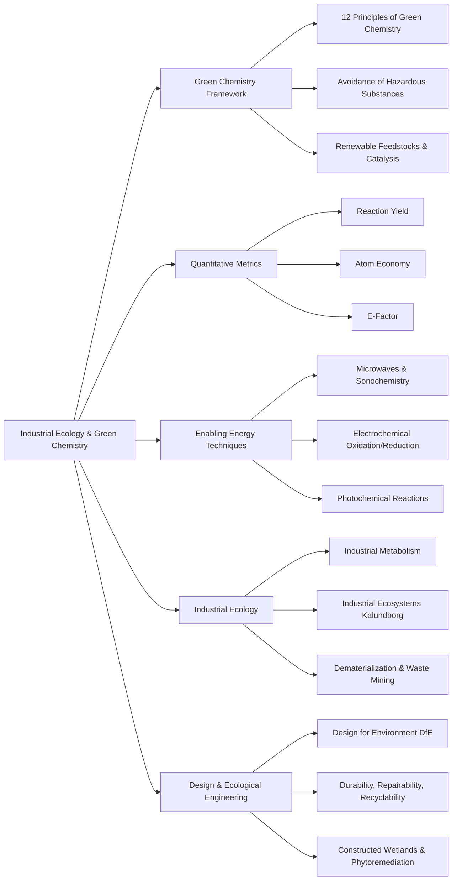

## 1. Chapter Global Mind Map

## 2. Key Concepts & Definitions

- **Green Chemistry**: The sustainable practice of chemical science and technology within the framework of industrial ecology that is safe, non-polluting, consumes minimum energy/materials, produces little to no waste, and minimizes the use of hazardous substances.
- **Industrial Ecology**: A comprehensive approach to the production, distribution, utilization, and termination of goods and services that requires minimum inputs of raw materials and energy, minimum waste production, and maximum circulation of materials within industrial systems.
- **Industrial Metabolism**: The processes to which materials and components are subjected in industrial ecosystems, functioning analogously to natural ecosystems but typically resulting in more true waste.
- **Design for Environment (DfE)**: The practice of designing and engineering products, processes, and facilities in a way that minimizes their adverse environmental impacts while maximizing their beneficial environmental effects.
- **Ecological Engineering**: A discipline that seeks to seamlessly integrate the anthrosphere and its industrial activities with natural ecosystems to the mutual advantage of both (e.g., using constructed wetlands to purify water).
- **Globally Harmonized System (GHS)**: An internationally standardized system for the classification and labeling of chemicals using specific diamond-shaped symbols to indicate hazards like flammability, toxicity, or environmental danger.

## 3. Crucial Formulas & Theorems

**1. Atom Economy** $$\text{Atom Economy} = \frac{\text{Molar mass of desired product}}{\text{Total molar mass of materials generated}}$$ _Parameters:_ The numerator is the mass of the specific target chemical, and the denominator is the sum mass of all products and byproducts produced in the reaction. _Significance:_ This is a core metric of Green Chemistry. Unlike traditional "yield," which only evaluates if the reactants were fully consumed, Atom Economy evaluates how efficiently the atoms of the reactants were actually incorporated into the _desired_ product rather than being discarded as inherent byproduct waste.

**2. Environmental Factor (E-factor)** $$\text{E-factor} = \frac{\text{Total mass of waste}}{\text{Total mass of product}}$$ _Parameters:_ Total mass of waste includes all unreacted starting materials, byproducts, and solvents lost during the process. _Significance:_ Provides a direct, real-world quantification of the environmental footprint of a chemical manufacturing process. A lower E-factor strictly indicates a greener, more sustainable process.

**3. Electrochemical Energizing Reactions** $$\text{Reduction: } \text{Na}^+ + e^- \rightarrow \text{Na}$$ $$\text{Oxidation: } 2\text{Cl}^- \rightarrow \text{Cl}_2 + 2e^-$$ _Parameters:_ $e^-$ represents an electron introduced via electrical current. _Significance:_ Demonstrates how adding or removing electrons via direct electrical current (e.g., in molten NaCl) can drive chemical reactions cleanly without the need for external, fuel-burning heating or the introduction of toxic chemical reducing/oxidizing agents.

## 4. Logic & Step-by-step Walkthrough

### Walkthrough 1: The Kalundborg Industrial Ecosystem Paradigm

**Scenario:** Establishing an industrial ecosystem where facilities operate synergistically to eliminate waste and optimize resource consumption.

- **Step 1: Anchor Establishment.** A primary energy/materials producer acts as the core of the system. In Kalundborg, the ASNAES electrical power plant serves this role, burning coal and oil to produce electricity.
- **Step 2: Thermal and Water Synergies.** Instead of dumping waste heat and water, the power plant pipes its excess steam directly to a neighboring petroleum refinery, pharmaceutical plant (Novo Nordisk), greenhouses, and residential homes. Cooling water is routed to fish farms.
- **Step 3: Material Byproduct Synergies.** The power plant produces fly ash, which is entirely redirected to a cement and road material manufacturer. It also utilizes a scrubber to remove sulfur, producing calcium sulfate, which is piped directly to a gypsum wallboard manufacturer (Gyproc).
- **Step 4: Chemical Looping.** The neighboring Statoil petroleum refinery removes sulfur from crude oil, which is directly fed to a Kemira sulfuric acid plant rather than being landfilled. The refinery also returns fuel gas back to the power plant.
- **Conclusion:** By interconnecting the "waste" output pipes of one facility directly to the "raw material" input pipes of another, the industrial ecosystem mimics a natural ecosystem, achieving massive dematerialization and near-zero environmental pollution.

### Walkthrough 2: Alternative Energy Inputs in Green Chemistry

**Scenario:** Traditional chemical synthesis relies on external heating, which is inefficient, highly hazardous, and limits reaction specificity. Green chemistry utilizes novel energy introductions.

- **Step 1: Microwave Excitation.** Instead of bulk heating, microwaves (1 cm to 1 m wavelengths) are applied. These cause rapid re-orientation of polar molecules in solvents or solvent-free mixtures, creating intense, highly localized heating that speeds up the reaction without burning the bulk material.
- **Step 2: Sonochemistry.** Ultrasound energy is introduced. This creates acoustic cavitation (microscopic bubbles that form and collapse), adding immense energy to localized molecular regions without heating the entire reactor mixture.
- **Step 3: Photochemical Initiation.** Ultraviolet or visible electromagnetic radiation ($h\nu$) is beamed into the system. This introduces a precise, massive quantum of energy to _individual_ target molecules, causing specific bonds to break or react without heating the surroundings.
- **Conclusion:** Replacing bulk thermal heating with targeted energy vectors (microwaves, ultrasound, photons, or electrons) makes reactions drastically safer, more efficient, and minimizes the thermodynamic generation of unwanted waste byproducts.

## 5. Exhaustive Take-home Messages (Exam Prep Focus)

### A. Core Definitions

1. **Green chemistry and its 12 principles:** The sustainable practice of chemical science that minimizes waste, energy, and hazards. Its 12 principles include: preventing waste, maximum safety, minimizing synthesis hazards, using renewable feedstocks, using catalysts, avoiding derivatives, maximizing atom economy, using safe media, maximizing energy efficiency, designing for degradability, utilizing real-time monitoring, and minimizing accident potential.
2. **Atom economy:** The ratio of the molar mass of the desired product to the total molar mass of all generated materials, used to evaluate how efficiently a reaction incorporates source atoms into the final useful product.
3. **E-factor:** The ratio of the total mass of waste produced to the total mass of the desired product, serving as a primary metric for industrial process cleanliness.
4. **Industrial ecology:** A holistic approach to industrial manufacturing that mimics natural ecosystems by minimizing virgin material/energy inputs, minimizing waste outputs, and maximizing internal material circulation.
5. **Industrial ecosystem:** An integrated network of industrial facilities—including materials producers, energy sources, manufacturers, waste processors, and consumers—that share resources and byproducts to eliminate net waste (e.g., Kalundborg).
6. **Industrial metabolism:** The flow, processing, and transformation of materials and energy within an industrial ecosystem, analogous to biological metabolism but currently producing more non-recyclable "true waste".
7. **Design for environment (DfE):** An engineering paradigm focused on designing products and processes that minimize adverse environmental impacts from their inception by prioritizing durability, repairability, and recyclability.
8. **Ecological engineering:** The integration of anthropogenic activities with natural biological ecosystems to mutual advantage, such as using phytoremediation (plants) to restore chemically contaminated soils.
9. **Hazardous substance:** Any material that poses a danger to living organisms, materials, structures, or the environment, including combustibles, oxidizers, reactives, corrosives, and toxics.
10. **GHS symbols:** The Globally Harmonized System of Classification and Labelling of Chemicals, which uses standardized diamond-shaped pictograms (e.g., skulls for poison, flames for flammability) to universally communicate chemical hazards.

### B. Process Discussions & Analysis

**1. Implementing Green Chemistry & Synthetic Substitution** Green chemistry forces a paradigm shift from "end-of-pipe" pollution control to "source reduction". In synthetic chemistry, this is achieved by substituting old, hazardous feedstocks with environmentally benign ones, utilizing solvent-free synthesis, substituting toxic organic solvents with supercritical carbon dioxide ($CO_2$ at >304.6 K and 73.8 atm), and using precise catalysts instead of stoichiometric blocking agents.

**2. Hazard Identification and the NFPA/GHS Systems** To safely design for the environment, chemists must systematically classify hazards. The NFPA 704 system uses a diamond to rank severity (0 to 4) for Health (Blue), Flammability (Red), Reactivity (Yellow), and Specific Hazards (White). Green chemistry specifically targets the elimination of Heavy Metals and Persistent non-biodegradable organics from the supply chain. Successful DfE implementation historically includes replacing ozone-depleting CFC refrigerants and replacing toxic PCBs in electrical equipment with benign alternatives.

**3. Attributes of a Successful Industrial Ecosystem** For an industrial ecosystem to survive, it requires adequate sustainable energy, high system diversity (robust character), and aggressive materials management. This materials management is governed by _Dematerialization_ (using physically less material to achieve the same function), _Substitution_ (using abundant materials instead of scarce ones), _Recycling_, and _Waste Mining_ (extracting value from discarded products).

> **⚠️ Common Pitfalls / Key Exam Concepts:**
> 
> - **Yield vs. Atom Economy:** Do not confuse these two terms. A chemical reaction can easily have a **100% Yield** (meaning every single drop of reactant was consumed to make the product), but still possess a terrible **Atom Economy** if the fundamental chemical mechanism forces half the mass of the reactants to split off as an unavoidable, useless byproduct. Green chemistry demands high atom economy, not just high yield.
> - **Industrial vs. Natural Metabolism:** While industrial ecology tries to mimic nature, the key distinction is that natural ecosystems have _virtually no true waste_ (everything is a feedstock for something else). Modern industrial metabolism, despite improvements, still generates significant terminal "true waste" that exits the loop.