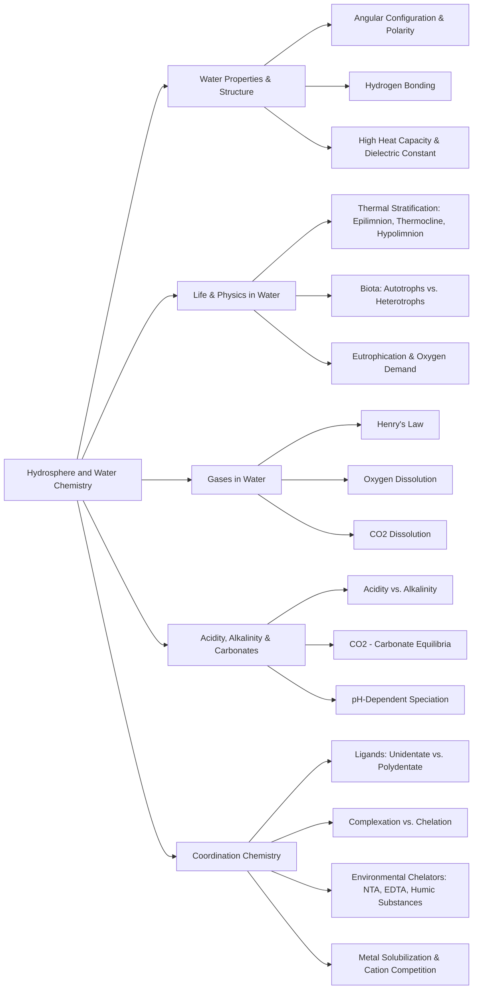

Here is the note based on the provided chapter on the Hydrosphere and Water Chemistry.
## 1. Chapter Global Mind Map

## 2. Key Concepts & Definitions

- **Hydrology**: The general study of water.
- **Limnology**: The scientific study of fresh water ecosystems.
- **Oceanography**: The scientific study of the oceans.
- **Autotrophic organisms**: Organisms (like photosynthetic algae) that utilize solar or chemical energy to synthesize complex biochemicals from simple inorganic compounds.
- **Heterotrophic organisms**: Organisms (like decomposers) that metabolize organic materials and break down material of biological origin.
- **Eutrophication**: A condition caused by excess productivity in water, leading to the decay of excess biomass, consumption of dissolved oxygen, and odor production.
- **Complexation**: A chemical process wherein a single ligand binds with a metal ion using exactly one coordination bond.
- **Chelation**: A chemical process wherein a single ligand (polydentate) binds with a metal ion using more than one coordination bond simultaneously.
- **Humic substances**: Biodegradation-resistant residues remaining from the decay of plant biomass that can strongly chelate metals and cause water coloration.

## 3. Crucial Formulas & Theorems

**1. Henry's Law** $$H^{cp} = \frac{c_a}{p}$$ _Parameters:_ $c_a$ is the concentration of a species in the aqueous phase (mol/L or M), and $p$ is the partial pressure of that species in the gas phase (atm). $H^{cp}$ is the Henry's law constant. _Significance:_ This determines the equilibrium concentration of gases like $O_2$ and $CO_2$ dissolved in natural waters.

**2. Complete Alkalinity Formula** $$[\text{alk}] = [\text{HCO}_3^-] + 2[\text{CO}_3^{2-}] + [\text{OH}^-] - [\text{H}^+]$$ _Parameters:_ Bracketed terms represent the molar concentrations of the respective ions. _Significance:_ Represents the total capacity of a water body to neutralize protons ($H^+$). Carbonate is multiplied by 2 because each $CO_3^{2-}$ ion can neutralize two protons.

**3. Acid-Base Equilibria for Carbon Dioxide** $$K_{a1} = \frac{[\text{H}^+][\text{HCO}_3^-]}{[\text{CO}_2]}$$ $$K_{a2} = \frac{[\text{H}^+][\text{CO}_3^{2-}]}{[\text{HCO}_3^-]}$$ _Parameters:_ $K_{a1}$ and $K_{a2}$ are the stepwise acid dissociation constants for dissolved carbon dioxide. _Significance:_ These dictate the speciation fractions ($\alpha$) of $CO_2$, $HCO_3^-$, and $CO_3^{2-}$ at any given pH, forming the fundamental pH buffering system of Earth's waters.

**4. Formation Constants (Stepwise and Overall)** $$K_1 = \frac{[\text{ZnNH}_3^{2+}]}{[\text{Zn}^{2+}][\text{NH}_3]}$$ $$\beta_2 = \frac{[\text{Zn}(\text{NH}_3)_2^{2+}]}{[\text{Zn}^{2+}][\text{NH}_3]^2} = K_1 K_2$$ _Parameters:_ $K_1$ is the stepwise formation constant for adding one ligand; $\beta_2$ is the overall formation constant for multiple ligands. _Significance:_ Quantifies the thermodynamic stability of a metal-ligand complex in aqueous solution, which controls heavy metal toxicity and transport.

## 4. Logic & Step-by-step Walkthrough

### Walkthrough: Solubilization of Lead by NTA with Calcium Competition

**Scenario:** Evaluating whether the chelating agent NTA can dissolve highly toxic lead ($Pb^{2+}$) from solid $PbCO_3$ at pH 7.00, and how the presence of natural Calcium ($Ca^{2+}$) interferes.

- **Step 1: Determine the primary lead solubilization reaction without competition.** At pH 7.00, unchelated NTA is primarily present as $HT^{2-}$. It reacts with lead carbonate: $$PbCO_3(s) + HT^{2-} \rightleftharpoons PbT^- + HCO_3^-$$ By combining the $K_{sp}$ of $PbCO_3$, $K_{a3}$ of NTA, formation constant $K_f$, and $K_{a2}$ of carbonate, the equilibrium constant is calculated as $K = 4.06 \times 10^{-2}$.
- **Step 2: Calculate the degree of lead solubilization.** Assuming $[HCO_3^-] = 1.00 \times 10^{-3} \text{ M}$, the ratio of complexed lead to free NTA is: $$\frac{[PbT^-]}{[HT^{2-}]} = \frac{K}{[HCO_3^-]} = \frac{4.06 \times 10^{-2}}{1.00 \times 10^{-3}} = 40.6$$ _Conclusion:_ Without calcium, the reaction strongly favors solubilizing toxic lead into the water.
- **Step 3: Introduce Calcium competition.** Calcium also strongly reacts with NTA: $Ca^{2+} + HT^{2-} \rightleftharpoons CaT^- + H^+$. At $[Ca^{2+}] = 1.00 \times 10^{-3} \text{ M}$ and pH=7 ($[H^+] = 10^{-7} \text{ M}$), the ratio $\frac{[CaT^-]}{[HT^{2-}]}$ becomes $77.5$.
- **Step 4: Calculate the net effect of Calcium on Lead.** Subtracting the Ca reaction from the Pb reaction yields a displacement constant $K'' = 5.24$. Solving the new ratio: $\frac{[PbT^-]}{[CaT^-]} = 0.524$.
- **Conclusion:** Only about 1/3 of the NTA binds with $Pb^{2+}$, while 2/3 binds with the harmless $Ca^{2+}$. The presence of excess calcium significantly inhibits the release of toxic lead into the environment.

## 5. Exhaustive Take-home Messages (Exam Prep Focus)

### A. Core Definitions

- **Hypolimnion, thermocline and epilimnion layer:** The three distinct vertical temperature layers of a stratified body of water. The epilimnion is the relatively warm, oxygen-rich top layer; the hypolimnion is the cold, relatively oxygen-poor bottom layer; and the thermocline is the transitional middle layer.
- **Hydrogen, coordinational and covalent bonds:** A hydrogen bond connects two polar water molecules; a coordinational bond occurs when a ligand donates a lone pair of electrons to an empty orbital on a metal cation; a covalent bond features a shared pair of electrons.
- **Autotropic & heterotrophic organics (organisms):** Autotrophs synthesize complex biochemicals using solar/chemical energy and inorganic compounds; heterotrophs metabolize existing organic materials.
- **Decomposers and productivity, eutrophication:** Decomposers break down biological material. High productivity (excess algal growth) leads to eutrophication, where the subsequent decay of this excess biomass completely consumes dissolved oxygen.
- **DO, BOD, COD:** Dissolved Oxygen (DO), Biochemical Oxygen Demand (BOD), and Chemical Oxygen Demand (COD)—metrics used to quantify the oxygen status and organic pollution load in water.
- **Henry’s law:** A principle stating that the solubility of a gas in a liquid is directly proportional to the partial pressure of the gas in contact with the liquid.
- **Acidity, alkalinity and pH:** Acidity is the capacity to neutralize $OH^-$; alkalinity is the capacity to neutralize $H^+$; pH is the intensity factor representing free hydrogen ion concentration.
- **Coordination chemistry:** The branch of chemistry dealing with metal ions bound to surrounding ligands.
- **Ligand:** A Lewis base equipped with nonbonding lone pair electrons that it can donate to an empty orbital of a metal cation.
- **Coordinational bonding:** The specific bond formed between a Lewis acid (metal) and Lewis base (ligand).
- **Coordinational number, sphere:** The coordination number is the amount of donor atoms directly surrounding one metal cation. The coordination sphere is the geometric shell of these atoms.
- **Complexation and Chelation:** Complexation features a single ligand binding to a metal with one bond; Chelation features a single polydentate ligand binding to a metal with multiple bonds simultaneously.
- **Stepwise formation and stepwise ionization constant:** Equilibrium constants defining the sequential addition of ligands to a metal ($K_1, K_2$) or the sequential loss of protons from a polyprotic acid ligand ($K_{a1}, K_{a2}$).
- **Degree of solubilization:** The mathematical ratio of the complexed/solubilized metal to the uncomplexed ligand (e.g., $[PbT^-] / [HT^{2-}]$).
- **Humic substances:** Biodegradation-resistant organic residues (humin, humic acid, fulvic acid) from plant decay that act as natural chelating agents in water.

### B. Process Discussions & Analysis

- **Structure and properties of water:** Water possesses an angular configuration, causing unique polarity and hydrogen bonding. This results in an exceptionally high dielectric constant, high heat capacity, transparency for photosynthesis, and extraordinary solvent capabilities for ionic and polar species.
- **Major aquatic chemical process:** Aquatic systems are dynamic, driven by gas exchanges (atmosphere), acid-base neutralizations, precipitation/solubility reactions, chelation/complexation of metals, and redox/biochemical reactions (photosynthesis/microbial action).
- **Equilibrium of CO2 and carbonate in water:** $CO_2$ dissolves to form slight amounts of $H_2CO_3$, which undergoes stepwise dissociation into $HCO_3^-$ and $CO_3^{2-}$. The dominant species is highly dependent on the pH, and this equilibrium ultimately controls both the pH and the alkalinity capacity of natural water systems.
- **pH dependent distribution of species as a function of pH for NTA with metal salts:** Chelating ligands like NTA ($H_3T$) undergo pH-dependent deprotonation. At low pH, they are fully protonated and cannot bind metals effectively. As pH increases, they lose protons (forming $H_2T^-$, $HT^{2-}$, and $T^{3-}$), exposing electron pairs that exponentially increase their ability to bind and solubilize heavy metals.
- **Effect of Calcium ion upon the reaction of chelating agents:**
    
    > **⚠️ Common Pitfall / Key Exam Concept:** When analyzing pollutant chelating agents (like EDTA or NTA) in natural water, you _cannot_ assume they will exclusively target heavy metals (like $Pb^{2+}$ or $Cd^{2+}$). Hard water naturally contains massive amounts of $Ca^{2+}$ which aggressively competes for the chelator. As proven in the calculations, $Ca^{2+}$ will intercept the majority of the chelating agent, significantly suppressing the agent's ability to solubilize and transport toxic heavy metals from the sediment.