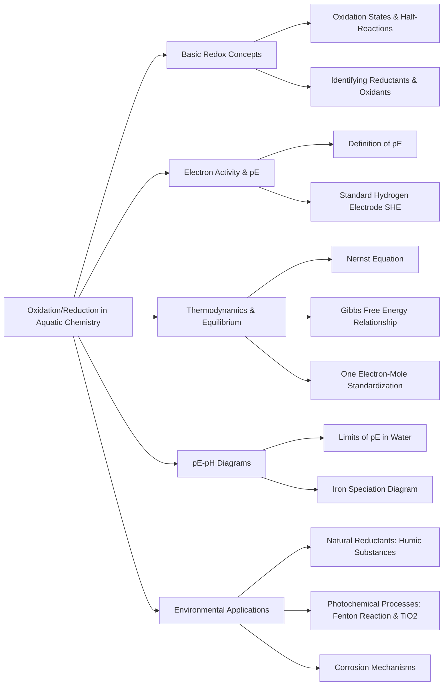

Here is the note based on the provided chapter on Oxidation/Reduction in Aquatic Chemistry.

## 1. Chapter Global Mind Map

## 2. Key Concepts & Definitions

- **Oxidation**: A chemical process characterized by an increase in the oxidation number of an element, often visualized as a loss of electrons.
- **Reduction**: A chemical process characterized by a decrease in the oxidation number of an element, often visualized as a gain of electrons.
- **Oxidizing agent (Oxidant)**: A reagent that increases the oxidation number of an element in a given substance by accepting its electrons.
- **Reducing agent (Reductant)**: A reagent that lowers the oxidation number of an element in a given substance by donating electrons.
- **pE**: The negative base-10 logarithm of electron activity in an aquatic medium, acting as an analog to pH to express the degree to which a solution is oxidizing or reducing.
- **Standard Hydrogen Electrode (SHE)**: A reference electrode assigned a standard potential ($E^0$) of exactly 0.00 volts when all reaction participants are at unit activity.
- **One Electron-Mole Reaction**: A thermodynamic convention where redox reactions are written based on the transfer of exactly one mole of electrons, making it meaningful to compare free-energy changes between different reactions.
- **Fenton reaction**: A chemical mechanism where $Fe(II)$ reacts with hydrogen peroxide ($H_2O_2$) to produce highly reactive hydroxyl radicals ($HO^\bullet$), which can effectively oxidize organic pollutants.
- **Superoxide ion**: A free radical species ($O_2^{\bullet-}$) with an unpaired electron, produced by the action of photochemically excited natural organic matter upon dissolved oxygen.

## 3. Crucial Formulas & Theorems

**1. Definition of pE** $$pE = -\log(a_{e^-})$$ _Parameters:_ $a_{e^-}$ is the activity of the electron in solution. _Significance:_ This is the foundational expression for aquatic redox chemistry, establishing an intensity factor for the oxidizing/reducing power of a solution, perfectly analogous to pH for acid-base chemistry.

**2. The Nernst Equation (Standard and pE formats)** $$E = E_0 - \frac{RT}{nF}\ln Q$$ $$pE = pE^0 + \frac{1}{n}\log \frac{[Ox]}{[Red]}$$ _Parameters:_ $E$ is the actual electrode potential, $E_0$ is the standard electrode potential, $R$ is the molar gas constant, $T$ is absolute temperature, $n$ is the number of moles of electrons transferred, $F$ is the Faraday constant, and $Q$ is the reaction quotient. _Significance:_ Determines the actual potential (and pE) of an electrochemical cell under non-standard conditions, adjusting for the real-world concentrations/activities of the oxidized ($[Ox]$) and reduced ($[Red]$) species in natural waters.

**3. Relationship between Free Energy and pE** $$\Delta G = -2.303nRT(pE)$$ $$\Delta G^0 = -2.303nRT(pE^0)$$ _Parameters:_ $\Delta G$ is the actual Gibbs free energy change, and $\Delta G^0$ is the standard free energy change. _Significance:_ Unifies thermodynamic driving forces with aquatic electron activity; a positive pE indicates a negative $\Delta G$ (spontaneous reaction), demonstrating the directionality of redox reactions.

**4. Equilibrium Constant from pE (for a 1-electron transfer)** $$\log K = pE^0$$ _Parameters:_ $K$ is the equilibrium constant, and $pE^0$ is the standard pE of the reaction. _Significance:_ Directly links standard reduction potential to the chemical equilibrium state. For a reaction transferring $n$ electrons, this generalizes to $\log K = n \cdot pE^0$.

## 4. Logic & Step-by-step Walkthrough

### Walkthrough 1: Establishing the Thermodynamic Limits of pE in Water

**Scenario:** Water itself can be oxidized to oxygen gas or reduced to hydrogen gas. Thus, there are pH-dependent absolute limits to the pE values where natural water remains stable.

- **Step 1: Calculate the Oxidizing Limit.** Water acts as a reducing agent and is oxidized to oxygen gas. The relevant half-reaction is $\frac{1}{4}O_2 + H^+ + e^- \rightleftharpoons \frac{1}{2}H_2O$ with $pE^0 = 20.75$.
- **Step 2: Apply the Nernst Equation.** Setting the partial pressure of $O_2$ to its atmospheric maximum (1.00 atm), the equation becomes $pE = pE^0 + \log(P_{O_2}^{1/4}[H^+])$.
- **Step 3: Simplify for the Upper Boundary.** Since $P_{O_2} = 1$, the log term simplifies to just $\log[H^+]$ (which is $-pH$). Therefore, the absolute upper limit for water stability is defined by the linear boundary: $pE = 20.75 - pH$.
- **Step 4: Calculate the Reducing Limit.** Water acts as an oxidant and is reduced to hydrogen gas. The half-reaction is $H^+ + e^- \rightleftharpoons \frac{1}{2}H_2$ with $pE^0 = 0.00$.
- **Step 5: Simplify for the Lower Boundary.** Setting $P_{H_2} = 1.00$ atm, the Nernst equation simplifies to $pE = 0.00 + \log[H^+]$, establishing the absolute lower boundary: $pE = -pH$.
- **Conclusion:** Any pE-pH coordinate above $pE = 20.75 - pH$ will spontaneously oxidize water into $O_2$, and any coordinate below $pE = -pH$ will spontaneously reduce water into $H_2$.

### Walkthrough 2: Deriving the $Fe^{2+} / Fe(OH)_3$ Boundary in a pE-pH Diagram

**Scenario:** To track iron speciation in aquatic environments, we must find the boundary equation separating soluble $Fe^{2+}$ from solid rust, $Fe(OH)_3$.

- **Step 1: Establish the competing equilibria.** We have two linked reactions.
    1. The redox reaction: $Fe^{3+} + e^- \rightleftharpoons Fe^{2+}$ ($pE^0 = 13.2$).
    2. The solubility/acid-base reaction: $Fe(OH)_3(s) + 3H^+ \rightleftharpoons Fe^{3+} + 3H_2O$ ($K' = \frac{[Fe^{3+}]}{[H^+]^3} = 9.1 \times 10^3$).
- **Step 2: Substitute $[Fe^{3+}]$ into the Nernst Equation.** The Nernst equation for the redox half-reaction is $pE = pE^0 + \log\frac{[Fe^{3+}]}{[Fe^{2+}]}$. Rearranging the solubility product gives $[Fe^{3+}] = K'[H^+]^3$. Substituting this yields: $pE = pE^0 + \log\frac{K'[H^+]^3}{[Fe^{2+}]}$.
- **Step 3: Expand the log terms.** $pE = 13.2 + \log K' + \log([H^+]^3) - \log[Fe^{2+}]$.
- **Step 4: Plug in standard aquatic limits.** Assuming a maximum concentration threshold for dissolved iron of $[Fe^{2+}] = 1.0 \times 10^{-5}$ M, and knowing $\log(9.1 \times 10^3) \approx 3.96$, we get: $pE = 13.2 + 3.96 - 3pH - (-5.00)$.
- **Conclusion:** The final boundary equation is exactly $pE = 22.2 - 3pH$. Below this line, soluble $Fe^{2+}$ dominates; above it, solid $Fe(OH)_3$ precipitates.

## 5. Exhaustive Take-home Messages (Exam Prep Focus)

### A. Core Definitions

- **Half-reaction, cell reaction, half-cell**: A half-reaction visually separates either the oxidation or reduction portion of a redox process; a half-cell is the physical/electrochemical compartment where a half-reaction occurs; the cell reaction is the overall combination of two complementary half-reactions.
- **Redox reaction, electron activity and pE**: A redox reaction involves the transfer of electrons altering elements' oxidation states. Electron activity defines the theoretical concentration of "free" electrons, quantified by the pE scale ($-\log(a_{e^-})$) to express reducing intensity.
- **Standard electrode potential and electrode potential**: The electrode potential ($E$) measures the actual voltage/reaction tendency relative to the SHE. The standard electrode potential ($E^0$) is the specific potential when all participants are strictly at unit activity (e.g., 1.00 M, 1.00 atm).
- **Nernst equation**: The core mathematical formula linking theoretical standard potential ($E^0$ or $pE^0$) to actual potential ($E$ or $pE$) by accounting for the variable real-world concentrations of oxidized and reduced species in the water.
- **Reaction in one-electron-mole**: A standardized framework where redox equations are chemically balanced so that exactly 1 mole of electrons is transferred ($n=1$). This allows for direct, 1-to-1 thermodynamic free energy comparisons between different environmental redox processes.
- **Free radical**: An extremely reactive chemical species bearing an unpaired electron (such as the superoxide ion $O_2^{\bullet-}$ or the hydroxyl radical $HO^\bullet$), critical in propagating photochemical degradation in natural waters.

### B. Process Discussions & Analysis

- **Nernst equation and Gibbs free energy relationship**: The Nernst equation serves as the bridge between cell potential and standard thermodynamic feasibility. Because $\Delta G = -nFE$, a positive cell potential ($E$) guarantees a negative $\Delta G$, indicating that the redox reaction will proceed spontaneously.
- **Equilibrium constant and pE0**: At chemical equilibrium, the actual driving force drops to zero ($pE = 0$). By setting the Nernst equation to zero, the standard potential ($pE^0$) can be directly used to calculate the equilibrium constant: $\log K = n \cdot pE^0$.
- **pE-pH diagram for iron in water**: A master variable diagram demonstrating that soluble, toxic $Fe^{2+}$ only persists at relatively low pH and low pE (reducing, anoxic groundwaters). Upon contact with high pE environments (surface oxygen), the boundaries aggressively shift, forcing massive precipitation of insoluble $Fe(OH)_3$.
- **pE and pressure of gases in nature water**: pE governs gas solubility limits. High pE dictates massive oxygen presence ($P_{O_2} \approx 0.21$ atm at pH 7, pE 13.58). Conversely, low pE anoxic environments facilitate the microbial generation of extreme reducing gases like methane ($CH_4$), where oxygen partial pressures physically plummet to absurdly low values (e.g., $10^{-72}$ atm).
- **Fenton reaction and its application**: A powerful environmental remediation tool where aqueous $Fe(II)$ catalytically decomposes $H_2O_2$ to generate highly destructive $HO^\bullet$ radicals. These radicals non-selectively attack and rapidly oxidize persistent organic pollutants in wastewater.
- **Photochemical reaction and its application**: Sunlight/UV acts as an energy pump. Semiconductors like $TiO_2$ absorb photons to excite electrons from the valence band to the conduction band, creating electron-hole pairs ($e^-_{cb}$ and $h^+_{vb}$). These migrating charges drive intense redox reactions on the catalyst surface, destroying VOCs, $NO_x$, and complex organic pollutants.

> **⚠️ Common Pitfalls & Confusions:**
> 
> - **Confusing $E$ and $\Delta G$ signs:** Remember that spontaneity requires a _positive_ $E$ (or pE) but a _negative_ $\Delta G$. They are inherently opposite in sign.
> - **Ignoring "n" in standard equilibrium:** When calculating the equilibrium constant $K$ directly from $pE^0$, students frequently forget to multiply by $n$ (the number of electrons transferred). The formula is strictly $\log K = n \cdot pE^0$ unless the reaction was specifically standardized to a "one electron-mole" format.
> - **Misinterpreting pE-pH solid lines:** The lines on a pE-pH diagram (like the iron system) do not represent complete disappearance of a species; they represent the exact coordinates where the activities of the bordering species are strictly _equal_ to each other (or equal to a defined trace limit, like $10^{-5}$ M).