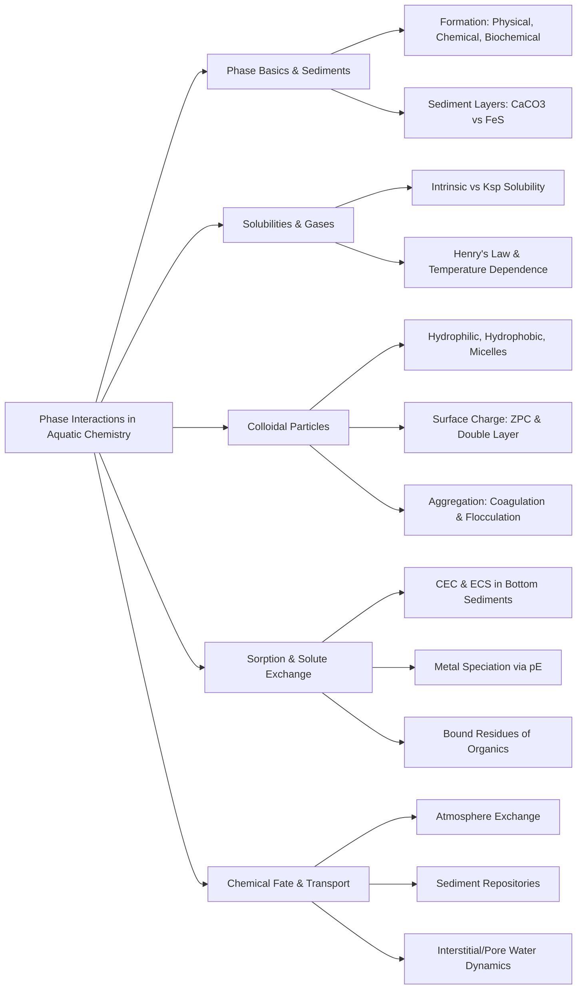

Here is the note based on the provided chapter on Phase Interactions in Aquatic Chemistry
## 1. Chapter Global Mind Map

## 2. Key Concepts & Definitions

- **Interstitial water (Pore water)**: Water held in the voids and pores within bottom sediments, containing solutes that reflect the chemical, biochemical, and anoxic bacterial conditions of the sediment matrix.
- **Tyndall effect**: A light scattering phenomenon caused by colloidal particles, which occurs because the particles are of the same order of size as the wavelength of visible light.
- **Bound residues**: Pollutant compounds (such as herbicides or petroleum) that become covalently or strongly bound to humic substances in sediments and soil, altering their degradation pathways and rates.
- **Occluded phosphorus**: A form of phosphorus where orthophosphate ions are physically contained or trapped within the solid mineral matrix (such as aluminosilicates), limiting its immediate availability.
- **Nonspecific ion exchange adsorption**: A relatively weak surface interaction where soluble metal ions are electrostatically held onto the surfaces of metal oxides without forming discrete chemical bonds.

## 3. Crucial Formulas & Theorems

**1. Distribution Coefficient ($K_d$)** $$K_d = \frac{C_s}{C_w}$$ _Parameters:_ $C_s$ is the equilibrium concentration of the constituent on the solid phase, and $C_w$ is the equilibrium concentration in the aqueous solution. _Significance:_ Quantifies the partitioning of a pollutant or solute between water and sedimentary/solid materials.

**2. Freundlich Equation** $$C_s = K_F C_w^{1/n}$$ _Parameters:_ $K_F$ and $1/n$ are empirical constants specific to the sorbent and sorbate system. _Significance:_ A more empirical expression used to model the nonlinear adsorption of solutes onto solid sediment surfaces over a range of concentrations.

**3. Total Aqueous Solubility ($S$)** $$S = (K_{sp})^{1/2} + [\text{Intrinsic Solubility}]$$ _Parameters:_ $K_{sp}$ is the solubility product constant governing ionic dissociation, and intrinsic solubility is the concentration of the dissolved neutral, undissociated form of the solid (e.g., $[CaSO_4(aq)]$). _Significance:_ Demonstrates that the total solubility of an ionic solid is the sum of both its dissociated ions (calculated via $K_{sp}$) and the significant portion that dissolves as neutral ion pairs.

**4. Henry's Law** $$[\text{X}(aq)] = K P_X$$ _Parameters:_ $[\text{X}(aq)]$ is the aqueous concentration of the gas, $P_X$ is the partial pressure of the gas, and $K$ is the Henry's law constant. _Significance:_ States that at a constant temperature, the solubility of a gas in water is directly proportional to its partial pressure in the overlying atmosphere.

**5. Clausius–Clapeyron Equation (Gas Solubility Temperature Dependence)** $$\log \frac{C_2}{C_1} = \frac{\Delta H}{2.303R} \left[ \frac{1}{T_1} - \frac{1}{T_2} \right]$$ _Parameters:_ $C_1$ and $C_2$ are gas concentrations at absolute temperatures $T_1$ and $T_2$, $\Delta H$ is the heat of solution, and $R$ is the ideal gas constant. _Significance:_ Predicts how the solubility of environmental gases (like $O_2$ or $CO_2$) changes as water temperature fluctuates across seasons or industrial thermal pollution events.

## 4. Logic & Step-by-step Walkthrough

### Walkthrough 1: The Formation of Alternate Layers in Lake Sediments

**Scenario:** Bottom sediments in lakes often display distinctly alternating layers (varves) of calcium carbonate ($CaCO_3$) and iron sulfide ($FeS$) due to seasonal biogeochemical shifts.

- **Step 1: Summer Photosynthesis.** During the summer, autotrophic organisms vigorously photosynthesize in the epilimnion. They consume $CO_2/HCO_3^-$, which shifts the equilibrium and triggers the chemical precipitation of $CaCO_3$ alongside newly formed biomass. _Reaction:_ $Ca^{2+} + 2HCO_3^- + h\nu \rightarrow {CH_2O} + CaCO_3(s) + O_2(g)$
- **Step 2: Winter Anoxic Reduction.** During the winter, biological productivity drops, and ice cover may deplete oxygen, creating anoxic (reducing) conditions at the lake bottom.
- **Step 3: Bacterial Action.** Anaerobic bacteria reduce ambient sulfate ($SO_4^{2-}$) to hydrogen sulfide ($H_2S$) and reduce $Fe(III)$ to soluble $Fe^{2+}$.
- **Step 4: Precipitation of Iron Sulfide.** The newly generated $Fe^{2+}$ and $H_2S$ react to precipitate solid black iron sulfide over the summer's calcium carbonate layer. _Reaction:_ $Fe^{2+} + H_2S \rightarrow FeS(s) + 2H^+$
- **Conclusion:** This cyclical physical and biochemical process generates physically distinct, alternating bands of $CaCO_3(s)$ and $FeS(s)$ in the sedimentary record.

### Walkthrough 2: Acquisition of Surface Charge by Colloidal $MnO_2$

**Scenario:** Colloidal particles achieve stability primarily through electrical double layers generated by surface charge. Hydrated manganese dioxide ($MnO_2$) acquires its charge in water depending on the ambient pH.

- **Step 1: Hydration of the Surface.** Freshly precipitated $MnO_2$ strongly interacts with water, causing the surface to become covered with hydroxyl (-OH) groups, forming $MnO_2(H_2O)$.
- **Step 2: Acidic Conditions (Gain of $H^+$).** If the water pH drops (acidic conditions), the surface hydroxyl groups accept additional protons from the water, granting the colloidal particle a net positive charge: _Reaction:_ $MnO_2(H_2O)(s) + H^+ \rightarrow MnO_2(H_3O)^+(s)$
- **Step 3: Basic Conditions (Loss of $H^+$).** If the water pH rises (basic conditions), the surface hydroxyl groups donate protons to the surrounding $OH^-$, leaving the colloidal particle with a net negative charge: _Reaction:_ $MnO_2(H_2O)(s) \rightarrow MnO_2(OH)^-(s) + H^+$
- **Conclusion:** The exact pH at which the number of positive sites equals the number of negative sites is known as the Zero Point of Charge (ZPC). Any shift away from the ZPC dictates the colloidal charge and therefore its stability and metal-binding behavior.

## 5. Exhaustive Take-home Messages (Exam Prep Focus)

This section perfectly maps to the 13 definitions and 4 discussion points explicitly required by the final "Take-home Message" slide of the source document.

### A. Core Definitions

1. **Sediment:** Layers of finely divided matter (mixtures of clay, silt, sand, and organics) covering the bottoms of water bodies that host organisms and act as sinks for pollutants.
2. **Black carbon:** Small carbonaceous particles left over from the incomplete combustion of fossil fuels and biomass, present in sediments and highly effective at binding organic pollutants.
3. **Colloidal particles:** Finely divided particles ranging in size from 1 nm to 1 $\mu$m that remain suspended in water due to high surface area, hydration, and surface charge repulsions.
4. **Electrical double layer:** The stabilizing structure around a hydrophobic colloidal particle composed of the charged particle surface itself and an surrounding, neutralizing cloud of counter-ions.
5. **Surface charge:** The electric potential present on a particle's surface, acquired through chemical reactions (like $H^+$ loss/gain), ion absorption, or structural ion replacement.
6. **CEC and ECS:** Cation Exchange Capacity (CEC) is the total capacity of a sediment to sorb/exchange cations (measured in meq/100g); Exchangeable Cation Status (ECS) refers to the specific amounts of individual ions currently bonded to those exchange sites.
7. **Bioavailability:** The degree to which a sediment-bound contaminant can be liberated, transported across a biological membrane, and absorbed into the system/receptors of a living organism .
8. **Distribution coefficient ($K_d$):** A mathematical ratio ($C_s/C_w$) describing how a chemical constituent partitions between the solid sedimentary phase and the dissolved aqueous phase.
9. **Solubility:** The maximum concentration of a solid that can dissolve into a phase; critically dependent on intrinsic solubility (neutral forms) and solubility products (dissociated ions).
10. **Hydrophilic and hydrophobic:** Hydrophilic colloids interact strongly with water and macromolecules; hydrophobic colloids interact weakly with water and rely strictly on electrical double layers for stability against aggregation.
11. **Micelle:** An association colloid formed by the aggregation of amphiphilic molecules (like soap), which can entrain water-insoluble organic matter within their hydrophobic cores.
12. **Zero point of charge (ZPC):** The specific pH condition at which a colloidal surface (like hydrated $MnO_2$) possesses an equal number of positive and negative surface sites, resulting in a net surface charge of zero.
13. **Coagulation and flocculation:** Coagulation is the aggregation of particles via the reduction of electrostatic surface charge repulsion; flocculation is aggregation via the use of bridging compounds/polymers to physically link particles into networks.

### B. Process Discussions & Analysis

**1. Formation of lake sediment** Sediments are generated through a combination of physical mass transfer (suspended stream material settling), chemical precipitation, and heavy biochemical intervention. Biologically, summer photosynthesis removes $CO_2$, raising pH and driving the precipitation of $CaCO_3$ along with dead biomass. Conversely, winter anoxia promotes anaerobic bacterial reduction of $SO_4^{2-}$ and $Fe(III)$, creating highly insoluble $FeS$ which settles as alternate dark layers.

**2. Phase Interactions in Chemical Fate and Transport** The hydrosphere serves as the master transport matrix. Wind shear on lakes creates surface drift and return currents that can disturb bottom sediments, re-suspending bound pollutants into the water column. Furthermore, phase interactions govern atmosphere/water exchange (e.g., $O_2$ dissolving in, $H_2S$ and volatile organics escaping out). Sediments fundamentally act as both massive historical sinks (e.g., sequestering lead from 20th-century gasoline) and potential future sources if chemical parameters change.

**3. Charge and crystal structure in clay minerals** Clays (like kaolinite and montmorillonite) are secondary minerals consisting of hydrated aluminum and silicon oxide layers (O sheets and T sheets). They inherently function as colloidal particles and sedimentary binders. They acquire robust negative surface charges not primarily through protonation, but through isomorphic substitution—such as swapping a $Si(IV)$ atom with an $Al(III)$ atom in the crystal lattice—which creates a permanent charge imbalance that is satisfied by exchangeable external cations ($K^+, Ca^{2+}$).

**4. Surface sorption by solids** Bottom solids (especially freshly precipitated $MnO_2$ and $Fe_2O_3$ which have massive surface areas) are aggressive sorbents. Soluble metals ($Cd^{2+}, Pb^{2+}$) attach to these phases via nonspecific ion exchange, direct complexation with surface hydroxyl (-OH) groups, or total coprecipitation into the lattice. Importantly, the speciation of these sorbed trace metals is entirely governed by ambient pE/redox conditions: highly oxidizing (high pE) environments favor metal oxides and carbonates, whereas strongly reducing (low pE) environments force metals to precipitate predominantly as highly insoluble sulfides.

> **⚠️ Common Pitfalls / Key Exam Concepts:**
> 
> - **Coagulation vs. Flocculation:** Do not use these interchangeably. Coagulation strictly relates to _neutralizing electrostatic charges_ so particles can collide. Flocculation involves _physical structural bridging_ (using polyelectrolytes or bacterial polymers) to tie already neutralized particles into large webs.
> - **Solubility Underestimation:** When calculating the total solubility of an ionic compound (like $CaSO_4$), failing to add the _intrinsic solubility_ (the neutral $[CaSO_4(aq)]$ species) to the $K_{sp}$ derived ions will result in underestimating how much of the solid can genuinely enter the aqueous phase.