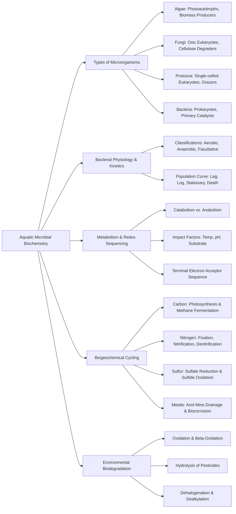

Here is the note based on the provided chapter on Aquatic Microbial Biochemistry.

## 1. Chapter Global Mind Map

## 2. Key Concepts & Definitions

- **Microorganisms**: Living catalysts (including bacteria, fungi, protozoa, and algae) that mediate almost all major chemical processes in water and soil.
- **Chemoheterotrophs**: Microorganisms (like most bacteria and all fungi) that utilize organic matter for both their energy source and their carbon source.
- **Photoautotrophs**: Microorganisms (like algae and cyanobacteria) that use light energy to convert inorganic carbon ($CO_2$ or $HCO_3^-$) into biomass via photosynthesis.
- **Anabolism**: The metabolic pathway responsible for biomolecule synthesis (macromolecules), which consumes usable energy (ATP).
- **Catabolism**: The metabolic pathway responsible for the breakdown of biomolecules, which yields usable energy and waste heat.
- **Cometabolism**: A biodegradation process where an organism breaks down a recalcitrant pollutant (like an organohalide) alongside a primary, energy-yielding substrate.

## 3. Crucial Formulas & Theorems

**1. Logarithmic Bacterial Growth Equation** $$\frac{dN}{dt} = kN \quad \text{or} \quad \ln\left(\frac{N}{N_0}\right) = kt$$ _Parameters:_ $N$ is the number of bacterial cells at time $t$, $N_0$ is the initial number of cells, and $k$ is the first-order growth rate constant. _Significance:_ Describes the log phase of a bacterial population curve where rapid, uninhibited doubling occurs. During this phase, microbial transformations of environmental chemical species are extremely rapid.

**2. Photosynthetic Biomass Production** $$\text{CO}_2 + \text{H}_2\text{O} + h\nu \rightarrow {\text{CH}_2\text{O}} + \text{O}_2$$ _Parameters:_ $h\nu$ represents solar energy, and ${\text{CH}_2\text{O}}$ represents generic biological cellular material (biomass). _Significance:_ The fundamental photochemical reaction executed by algae and cyanobacteria that introduces organic carbon and oxygen into aquatic ecosystems.

**3. Methane Fermentation** $$2{\text{CH}_2\text{O}} \rightarrow \text{CO}_2 + \text{CH}_4$$ _Parameters:_ ${\text{CH}_2\text{O}}$ is organic biomass. _Significance:_ A critical anoxic process in bottom sediments and waste digesters where specialized bacteria metabolize organic matter into methane gas fuel ($\Delta G^0 = -5.55$ kcal).

**4. Initial Acid Mine Drainage Reaction (Pyrite Oxidation)** $$2\text{FeS}_2(s) + 2\text{H}_2\text{O} + 7\text{O}_2 \rightarrow 4\text{H}^+ + 4\text{SO}_4^{2-} + 2\text{Fe}^{2+}$$ _Parameters:_ $\text{FeS}_2$ is solid pyrite. _Significance:_ The primary bacterially-mediated step in coal mine pollution, which generates high concentrations of sulfuric acid ($H^+$ and $SO_4^{2-}$) and soluble $Fe^{2+}$.

## 4. Logic & Step-by-step Walkthrough

### Walkthrough 1: Sequence of Microbial Mediation in a Eutrophic Lake (Depleting Oxygen)

**Scenario:** A water body initially contains a large excess of organic material and various electron acceptors ($O_2, NO_3^-, SO_4^{2-}, HCO_3^-$). How do bacteria process this?

- **Step 1: Oxic Respiration.** Bacteria will always utilize the most thermodynamically favorable electron acceptor first. They use dissolved $O_2$ to oxidize the organics, yielding massive energy ($\Delta G^0 = -29.9$ kcal/e-mol).
- **Step 2: Denitrification / Nitrate Reduction.** Once $O_2$ is entirely depleted (anoxia), facultative and anaerobic bacteria shift to the next best energetic option: $NO_3^-$. Nitrate is reduced to $N_2$ gas or $NH_4^+$ ($\Delta G^0 = -28.4$ to $-19.6$ kcal/e-mol).
- **Step 3: Sulfate Reduction.** When nitrate is gone, the pE drops further. Bacteria begin using $SO_4^{2-}$ as the terminal electron acceptor, converting it into toxic, foul-smelling $H_2S$ ($\Delta G^0 = -5.9$ kcal/e-mol).
- **Step 4: Methane Fermentation.** In deeply anoxic sediments where no other inorganic electron acceptors remain, bacteria utilize the carbon in the biomass itself ($HCO_3^-$ or $CO_2$) to produce $CH_4$ ($\Delta G^0 = -5.6$ kcal/e-mol).
- **Conclusion:** Microbial metabolic pathways in natural waters sequentially step down an energetic "ladder", driven strictly by the thermodynamic availability of electron receptors.

### Walkthrough 2: The Full Mechanism of Acid Mine Water Generation

**Scenario:** Pyrite ($FeS_2$) from coal mining is exposed to air and water.

- **Step 1: Primary Oxidation.** Acid-tolerant bacteria (like _Thiobacillus_) oxidize the exposed pyrite, generating sulfuric acid and ferrous iron ($Fe^{2+}$).
- **Step 2: Iron(II) Oxidation.** The newly formed $Fe^{2+}$ is further oxidized by bacteria like _Ferrobacillus ferrooxidans_ into $Fe^{3+}$: $$4\text{Fe}^{2+} + \text{O}_2 + 4\text{H}^+ \rightarrow 4\text{Fe}^{3+} + 2\text{H}_2\text{O}$$
- **Step 3: Precipitation and Acid Release.** The highly charged $Fe^{3+}$ instantly reacts with water to form a solid, semigelatinous rust layer ("yellow boy"), generating massive amounts of additional protons: $$\text{Fe}^{3+} + 3\text{H}_2\text{O} \rightarrow \text{Fe(OH)}_3(s) + 3\text{H}^+$$
- **Conclusion:** The combination of sulfide oxidation and subsequent iron hydrolysis creates severely acidic conditions that kill aquatic life and mobilize toxic heavy metals.

## 5. Exhaustive Take-home Messages (Exam Prep Focus)

This section perfectly covers 100% of the "Take-home Message" slides to ensure complete exam readiness.

### A. Core Definitions

1. **Microorganisms:** Living catalysts consisting of bacteria, fungi, protozoa, and algae that drive chemical processes, oxidation/reduction, and sediment formation in water and soil.
2. **Lichen:** A symbiotic organism composed of algae and fungi, which plays a primary role in the chemical weathering of rocks.
3. **Cyanobacteria:** Photosynthetic autotrophic bacteria (formerly "blue-green algae") that utilize light energy; they were responsible for producing the Earth's early atmospheric $O_2$.
4. **Fermentation reaction:** An anoxic microbial process where organic compounds act as both the electron donor and electron acceptor, commonly yielding products like methane ($CH_4$).
5. **Typical redox reaction mediated by microbial:** Metabolic processes where microbes gain energy by transferring electrons. For example, oxic respiration (using $O_2$ as a receptor) or sulfate reduction (using $SO_4^{2-}$ as a receptor).
6. **Biodegradation Pathways:**
    - **Beta-oxidation:** The stepwise microbial oxidation and breakdown of aliphatic hydrocarbon chains.
    - **Hydroxylation/Epoxidation:** The enzyme-mediated addition of oxygen into aromatic rings to trigger ring cleavage.
    - **Dehalogenation:** The microbial removal of bound halogens ($F, Cl, Br, I$) from organohalide pollutants.
    - **Dealkylation:** The microbial removal of alkyl groups (like $-CH_3$) attached to $N, S,$ or $O$ atoms.
    - **Nitrogen fixation:** The conversion of atmospheric $N_2$ gas into biologically available nitrogen ($NH_4^+$) by organisms like _Rhizobium_.
    - **Hydrolysis:** The cleavage of molecules by water, heavily utilized by microbes to break down ester-based insecticides like malathion.
    - **Nitrate reduction:** The anoxic microbial reduction of $NO_3^-$ into $NO_2^-$.
    - **Denitrification:** The sequential anoxic reduction of nitrate all the way to atmospheric $N_2$ gas, removing nitrogen from the water.
7. **Biodegradation:** The biologically catalyzed breakdown of complex organic matter (like petroleum wastes or pesticides) into simpler inorganic compounds.
8. **Population curve:** The standard graphical life-cycle of a bacterial culture, mapping the numbers of living cells across the Lag, Log, Stationary, and Death phases.
9. **Cometabolism:** A phenomenon where a microorganism breaks down an environmental pollutant (like a chlorinated hydrocarbon) not for primary energy, but alongside the metabolism of its primary food source.

### B. Process Discussions & Analysis

**1. Classification of microorganisms** Microorganisms are strictly classified by their source of energy and carbon. _Chemoheterotrophs_ (most bacteria, fungi) use organic matter for both. _Photoheterotrophs_ use sunlight for energy but need organics for carbon. _Chemoautotrophs_ use $CO_2$ for carbon but oxidize inorganic chemicals (like $H_2S$ or $NH_4^+$) for energy. _Photoautotrophs_ (algae, cyanobacteria) use sunlight for energy and $CO_2$ for carbon.

**2. Classification of bacteria** Based on electron receptor reliance, bacteria are classified as: **Oxic (aerobic)**, which strictly require $O_2$; **Anoxic (anaerobic)**, which strictly utilize receptors other than $O_2$ (like $SO_4^{2-}$); and **Facultative**, which can seamlessly switch between $O_2$ and other electron receptors depending on environmental availability.

**3. Population curve for a bacterial culture** The population progresses through four distinct phases:

1. **Lag phase:** Adaptation to the environment with little reproduction.
2. **Log phase:** Explosive exponential growth ($dN/dt = kN$) where rapid microbial transformation of chemical species occurs.
3. **Stationary phase:** Growth halts as a limiting factor (nutrient depletion/toxin buildup) is reached.
4. **Death phase:** Cell death outpaces reproduction.

**4. Metabolism of bacteria and its impact factors** Metabolism is divided into _Anabolism_ (consuming energy to synthesize biomolecules like proteins and nucleic acids) and _Catabolism_ (breaking down molecules like sugars to yield ATP). This entire system is strictly enzyme-mediated and is profoundly sensitive to three environmental factors: **Substrate concentration, Temperature, and pH**. Deviating from the narrow "optimum levels" of these factors will drastically crash enzyme activity and bacterial growth rates.

**5. Typical reactions in acid mine water** The exposure of pyrite ($FeS_2$) triggers a cascade of bacterial oxidations. _Thiobacillus ferrooxidans_ rapidly converts the sulfide to sulfate while producing $Fe^{2+}$ and $H^+$.

> **⚠️ Common Pitfall / Key Exam Concept:** Acid mine drainage is NOT a purely abiotic chemical weathering process. It is a highly aggressive _biochemical cascade_ driven by extremophile, acid-tolerant bacteria. Furthermore, students often miss that the final drop in pH is caused by the _hydrolysis_ of the generated iron—when $Fe^{3+}$ reacts with water to form the orange solid $Fe(OH)_3$, it kicks off 3 moles of protons ($H^+$) into the water for every mole of iron, making the water lethally acidic.