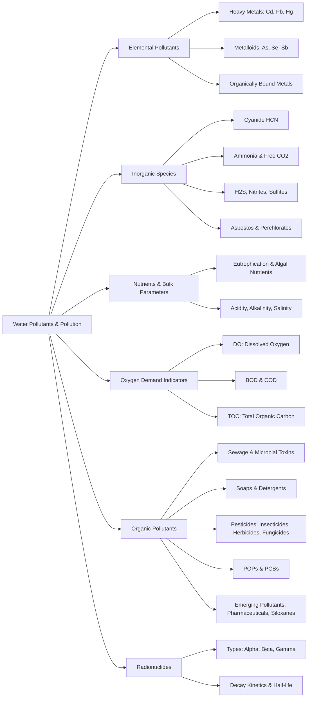

Here is the note based on the provided chapter on Water Pollutants and Water Pollution.

## 1. Chapter Global Mind Map

## 2. Key Concepts & Definitions

- **Markers of water pollution**: Chemical substances (like herbicides) or organisms (like fecal coliform bacteria) whose presence directly indicates specific pollution sources (e.g., agricultural runoff or sewage).
- **Biomarkers of water pollution**: Organisms (such as fish or osprey at the top of the food web) that accumulate pollutants in their lipid tissues and manifest the physical/biological effects of pollutant exposure.
- **Micelle**: A spherical aggregate formed by amphiphilic soap or detergent molecules in water, capable of entraining water-insoluble organic matter (grease and oil) within its hydrophobic core.
- **Xenoestrogens**: Synthetic or naturally occurring chemical compounds (such as degradation products of alkylphenol polyethoxylates) that imitate estrogen, disrupting the endocrine and reproductive systems of aquatic organisms.
- **Emerging water pollutants**: Relatively new substances coming into widespread use—such as nanomaterials, pharmaceuticals, siloxanes, and disinfection byproducts—whose long-term pollution effects on aquatic environments are not yet fully discovered.
- **Biorefractory compounds**: Persistent organic compounds that resist biological degradation and cannot be well removed by standard biological wastewater treatment, often requiring physical removal methods like carbon adsorption.

## 3. Crucial Formulas & Theorems

**1. Bioconcentration Factor (BCF)** $$BCF = \frac{C_{\text{organism}}}{C_{\text{water}}}$$ _Parameters:_ $C_{\text{organism}}$ is the concentration of a specific substance in the biological organism, and $C_{\text{water}}$ is its concentration in the surrounding water. _Significance:_ Quantifies the degree to which a waterborne pollutant (especially lipophilic organic pollutants) accumulates in the tissues of aquatic life.

**2. First-Order Radionuclide Decay Kinetics** $$\text{Decay rate} = -\frac{dN}{dt} = \lambda N$$ $$A = A_0 e^{-\lambda t}$$ _Parameters:_ $N$ is the number of radioactive nuclei present, $\lambda$ is the decay rate constant, $t$ is time, $A$ is the measured activity at time $t$, and $A_0$ is the initial activity. _Significance:_ Describes the exponential breakdown of unstable radionuclides in the aquatic environment, where the decay rate is strictly proportional to the amount of radioactive material currently present.

**3. Radionuclide Half-Life** $$t_{1/2} = \frac{0.693}{\lambda}$$ _Parameters:_ $t_{1/2}$ is the half-life (the time required for half of the radioactive nuclei to decay), and $\lambda$ is the decay constant. _Significance:_ A critical metric for determining the long-term persistence and environmental hazard of radioactive pollutants (e.g., Strontium-90, Carbon-14).

**4. Core Reaction of Biochemical Oxygen Demand (BOD)** $${\text{CH}_2\text{O}} + \text{O}_2 \xrightarrow{\text{Microorganisms}} \text{CO}_2 + \text{H}_2\text{O}$$ _Parameters:_ ${\text{CH}_2\text{O}}$ represents generic biodegradable organic matter (biomass). _Significance:_ Demonstrates how the microbial degradation of sewage and organic waste consumes dissolved oxygen ($O_2$), leading to potential anoxia in natural waters.

**5. Soap Inactivation by Water Hardness** $$2\text{C}_{17}\text{H}_{35}\text{COO}^-\text{Na}^+ + \text{Ca}^{2+} \rightarrow \text{Ca}(\text{C}_{17}\text{H}_{35}\text{CO}_2)_2(s) + 2\text{Na}^+$$ _Parameters:_ $\text{C}_{17}\text{H}_{35}\text{COO}^-\text{Na}^+$ is a soluble sodium soap (sodium stearate), and $\text{Ca}^{2+}$ represents water hardness ions. _Significance:_ Shows why traditional soaps lose their cleaning efficacy and form insoluble solid scum when used in hard water containing calcium or magnesium ions.

## 4. Logic & Step-by-step Walkthrough

### Walkthrough 1: The Dynamics of the Oxygen Sag Curve

**Scenario:** A massive influx of untreated sewage (oxidizable pollutants) is discharged into a flowing stream. How does the river biologically and chemically respond over distance/time?

- **Step 1: Clean Zone (Pre-discharge).** The river possesses a high, steady level of Dissolved Oxygen (DO) and minimal oxidizable pollutants.
- **Step 2: Decomposition Zone (Addition of Pollutant).** Sewage enters. The concentration of oxidizable pollutants spikes instantly. Microorganisms rapidly begin metabolizing the biomass (BOD), heavily consuming $O_2$. The DO level begins to plummet ("sag").
- **Step 3: Septic Zone.** The oxidizable pollutant levels steadily drop as they are digested, but the DO hits its absolute minimum. If DO reaches zero, the zone becomes anoxic, killing fish and promoting foul-smelling anaerobic decay.
- **Step 4: Recovery Zone.** The vast majority of the BOD has been exhausted. The rate of natural re-aeration (oxygen dissolving from the atmosphere) finally outpaces microbial oxygen consumption, allowing DO levels to gradually climb back up.
- **Step 5: Clean Zone.** The system resets. Oxidizable pollutants are gone, and DO has returned to its natural maximum baseline.

### Walkthrough 2: Mobilization of Mercury via Methylation

**Scenario:** Relatively insoluble inorganic mercury is dumped into sediment but eventually poisons organisms at the top of the food web.

- **Step 1: Deposition.** Inorganic mercury (e.g., $HgCl_2$) from industrial wastes or mining settles into the anoxic bottom sediments of a water body.
- **Step 2: Bacterial Mediation.** Anaerobic bacteria in the sediment interact with the inorganic mercury. Through enzymatic processes (utilizing methylcobalamin), they transfer methyl ($-CH_3$) groups onto the mercury atoms.
- **Step 3: Mobilization.** The reaction converts insoluble inorganic mercury into highly soluble and toxic organometallic species, primarily methylmercury ($CH_3Hg^+$ or $Hg(CH_3)_2$).
- **Step 4: Bioaccumulation.** Because these organically bound metals are highly lipophilic (lipid-seeking), they are readily absorbed by aquatic life, bioaccumulating exponentially up the food chain (e.g., causing the Minamata Bay incident).

## 5. Exhaustive Take-home Messages (Exam Prep Focus)

This section strictly covers 100% of the requirements from the "Take-home Message" section (Slide 61) of the source material.

### A. Core Definitions

1. **Biomarkers of water pollution:** Living organisms (like fish or osprey) that indicate the presence and severity of pollution either by physically accumulating pollutants in their lipid tissues or by exhibiting biological/health defects from exposure.
2. **Eutrophication:** A condition—meaning "well nourished"—where an aquatic ecosystem receives excessive algal nutrients (primarily Nitrogen and Phosphorus), causing an explosive growth of biomass followed by massive decay and oxygen depletion.
3. **DO, BOD and TOC:**
    - _DO (Dissolved Oxygen):_ Free oxygen dissolved in water, critical for aquatic life.
    - _BOD (Biochemical Oxygen Demand):_ The amount of oxygen consumed by microorganisms while degrading the _biodegradable_ organic matter in a water sample over a specific period (usually 5 days).
    - _TOC (Total Organic Carbon):_ An instrumental measurement of all carbon covalently bound in organic molecules, serving as a substitute for BOD but notably measuring _both_ biodegradable and non-biodegradable organics.
4. **BCF and BAF:**
    - _BCF (Bioconcentration Factor):_ The ratio of a substance's concentration inside an organism strictly to its concentration in the surrounding water.
    - _BAF (Bioaccumulation Factor):_ Similar to BCF, but broadly accounts for the organism's exposure to the pollutant from _both_ the water and its food sources over a long period.
5. **PCBs, POPs:**
    - _PCBs (Polychlorinated Biphenyls):_ A class of highly stable, synthetic chlorinated hydrocarbons formerly used in electrical equipment, now banned due to extreme environmental persistence and toxicity.
    - _POPs (Persistent Organic Pollutants):_ A broad category of poorly biodegradable, highly stable organic chemicals (including PCBs, DDT, and dioxins) that resist environmental degradation and strongly bioaccumulate.
6. **Radionuclides and half-life:** Radionuclides are unstable, radioactive atomic nuclei that emit ionizing radiation (alpha, beta, gamma) as they decay into stable forms. _Half-life_ ($t_{1/2}$) is the strict, mathematically defined timeframe required for exactly 50% of a given radioactive sample to decay.

### B. Process Discussions & Analysis

1. **Effects of heavy metal and metalloids pollution:** Heavy metals (Cd, Pb, Hg) and metalloids (As, Se) are highly toxic even at trace levels (ppm). They operate by binding tightly to biological sulfur, precipitating as sulfides, or completely replacing essential metals in vital enzymes (e.g., Cadmium replacing Zinc). Arsenic acts as an acute poison and carcinogen, often mobilized from natural geology or coal combustion.
2. **Typical water pollutants and their hazardous effects:** Pollutants range wildly from inorganic acids (acid mine drainage causing lethal pH drops) and salts (increasing salinity and destroying irrigation utility), to microbial toxins from cyanobacteria/dinoflagellates (causing paralysis or respiratory failure), to man-made pesticides and organohalides (causing neurological damage, reproductive dysfunction, and cancer).
3. **Discuss on oxygen sag curve:** When heavy loads of BOD (like raw sewage) enter a stream, they trigger massive bacterial respiration. Because oxygen solubility in water is naturally low, microbial consumption rapidly outstrips the rate at which oxygen can dissolve from the air, causing a severe "sag" (drop) in DO. This creates a septic, anoxic zone downstream until the organic load is fully metabolized and re-aeration can eventually restore the water to a clean state.
4. **Function and biodegradation of surfactant:** Surfactants are amphiphilic molecules (hydrophilic head, hydrophobic tail) that lower water's surface tension and entrain dirt/oil into micelles. Historically, highly branched Alkyl Benzene Sulfonates (ABS) were used, but they were biorefractory (resisted microbial breakdown) and caused massive environmental foaming. Modern detergents use Linear Alkyl Sulfonates (LAS), whose straight carbon chains are easily digested via microbial beta-oxidation, rendering them highly biodegradable.
5. **Hazardous of radionuclides:** Radioactive isotopes introduced via uranium fission, weapons testing, or cosmic processes pose extreme, localized cellular threats. Strontium-90 mimics calcium and lodges permanently in bone marrow; Iodine-131 concentrates perfectly in the thyroid; Cesium-137 replaces sodium. The ionizing radiation ($\alpha, \beta, \gamma$) emitted fundamentally damages cellular DNA, causing acute radiation sickness or long-term genetic mutations and cancer.

> **⚠️ Common Pitfalls / Key Exam Concepts:**
> 
> - **BOD vs. TOC vs. COD:** Do not confuse these. BOD _only_ measures organics that bacteria can actually eat. TOC and COD will always be higher than BOD because they forcefully measure/oxidize _everything_ (including biorefractory plastics and complex POPs that microbes cannot digest).
> - **BCF vs. BAF:** BCF strictly isolates water-to-tissue absorption. BAF is the more comprehensive ecological term because it includes biomagnification through _eating contaminated prey_.
> - **Soap vs. Detergent in Hard Water:** Know the chemical difference. Soaps physically precipitate with $Ca^{2+}$ to form solid scum. Synthetic detergents were specifically engineered _not_ to precipitate with hardness ions.