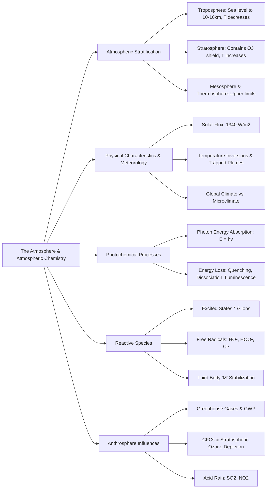

Here is the note based on the provided chapter on The Atmosphere and Atmospheric Chemistry.

## 1. Chapter Global Mind Map

## 2. Key Concepts & Definitions

- **Solar constant (Insolation)**: The steady solar energy flux reaching the top limits of the atmosphere perpendicular to the line of solar flux, amounting to approximately 1340 $W/m^2$.
- **Global Warming Potential (GWP)**: A comparative metric used to quantify the ability of a specific greenhouse gas (like $CH_4$ or $CFCs$) to trap heat in the atmosphere relative to the baseline gas, $CO_2$.
- **Microclimate**: Highly localized climatic conditions—such as the moisture under a plant canopy or the heat dome over an urbanized city—that differ significantly from the general regional climate.
- **Luminescence**: A photochemical energy-loss process where an electronically excited molecule returns to its ground state by directly emitting a photon of light (e.g., $NO_2^* \rightarrow NO_2 + h\nu$).
- **Temperature inversion**: A meteorological anomaly where a layer of warmer air overlies a layer of cooler air near the ground, physically trapping pollutant plumes and preventing vertical dispersal.

## 3. Crucial Formulas & Theorems

**1. Photon Energy Formula** $$E = h\nu = \frac{hc}{\lambda}$$ _Parameters:_ $E$ is the energy of the photon, $h$ is Planck's constant, $\nu$ is the frequency of light, $c$ is the speed of light, and $\lambda$ is the wavelength. _Significance:_ Determines the threshold energy available to break chemical bonds. Only high-energy (short-wavelength, UV) photons have sufficient energy to drive critical atmospheric photochemical reactions.

**2. Stratospheric Ozone Formation and UV Filtration** $$O_2 + h\nu \ (\lambda < 240 \text{ nm}) \rightarrow O^* + O$$ $$O_2 + O^* + M \rightarrow O_3 + M$$ $$O_3 + h\nu \ (240 \text{ nm} < \lambda < 320 \text{ nm}) \rightarrow O_2 + O^*$$
 _Parameters_: $O^*$ denotes an energetically excited oxygen atom. $M$ is a "third body" (usually $N_2$ or $O_2$). Significance: This cycle represents the creation of the ozone layer and its critical biological function: absorbing highly damaging, mid-range ultraviolet radiation before it reaches the Earth's surface.

**3. Acid Base Reactions (Acid Rain Formation)** $$SO_2 + H_2O \rightleftharpoons H^+ + HSO_3^-$$ $$Ca(OH)_2(s) + H_2SO_4(aq) \rightleftharpoons CaSO_4(s) + 2H_2O$$ _Parameters:_ $SO_2$ is the primary acid-forming gaseous pollutant, reacting to form sulfurous and eventually sulfuric acid ($H_2SO_4$). $Ca(OH)_2$ represents natural basic rock material. _Significance:_ Demonstrates the mechanism by which anthropogenic pollutant gases create acid rain, and how environmental bases (like limestone/calcium minerals or atmospheric ammonia) attempt to neutralize it.

## 4. Logic & Step-by-step Walkthrough

### Walkthrough 1: Stratospheric Ozone Depletion by Chlorofluorocarbons (CFCs)

**Scenario:** Synthetic CFCs (like $CFCl_3$) migrate into the stratosphere where they disrupt the natural ozone cycle through a radical chain reaction.

- **Step 1: Photodissociation.** In the upper atmosphere, CFCs are struck by high-energy UV radiation, breaking the relatively weak $C-Cl$ bond and generating a free chlorine radical. $$CFCl_3 + h\nu \rightarrow CFCl_2 + Cl\cdot$$
- **Step 2: Ozone Attack.** The highly reactive chlorine radical attacks an ozone molecule, stripping an oxygen atom to form chlorine monoxide and normal oxygen gas. $$Cl\cdot + O_3 \rightarrow ClO + O_2$$
- **Step 3: Radical Regeneration.** The chlorine monoxide reacts with a free atmospheric oxygen radical. This releases the $Cl\cdot$ radical back into the atmosphere intact. $$ClO + O\cdot \rightarrow Cl\cdot + O_2$$
- **Conclusion:** If we sum the reactions from Steps 2 and 3, the net reaction is $O_3 + O\cdot \rightarrow 2O_2$. The chlorine radical ($Cl\cdot$) acts as a pure catalyst—it is not consumed. A single $Cl\cdot$ radical can circulate and destroy thousands of ozone molecules before it is eventually removed by a chain-terminating reaction.

### Walkthrough 2: Generation of the Hydroxyl Radical ($HO\cdot$)

**Scenario:** The hydroxyl radical is the atmosphere's primary chemical "detergent," initiating the breakdown of most trace pollutants. How is it formed in the unpolluted troposphere?

- **Step 1: Ozone Photolysis.** Tropospheric ozone is struck by UV light, breaking into an oxygen molecule and an excited oxygen atom ($O^*$). $$O_3 + h\nu (\lambda < 315 \text{ nm}) \rightarrow O^* + O_2$$
- **Step 2: Water Reaction.** The highly energized $O^*$ atom is extremely unstable. It immediately reacts with ambient water vapor in the troposphere. $$O^* + H_2O \rightarrow 2HO\cdot$$
- **Conclusion:** This sequence effectively harnesses solar energy to split atmospheric water, creating the powerful $HO\cdot$ radical that subsequently reacts with, and removes, greenhouse gases like $CH_4$ and pollutants like $CO$.

## 5. Exhaustive Take-home Messages (Exam Prep Focus)

This section strictly covers 100% of the requirements from the "Take-home Message" section (Slide 49) of the source material.

### A. Core Definitions

1. **Excited state:** A chemically unstable, energetically rich species formed when a molecule absorbs a photon of light; typically designated with an asterisk ($*$).
2. **Free radicals:** Highly reactive atoms or molecular fragments possessing an unpaired electron (denoted with a dot, $\cdot$); they actively drive chain reactions in the atmosphere.
3. **Third body:** An unreactive energy-absorbing molecule (usually atmospheric $N_2$ or $O_2$, designated as $M$) that absorbs excess collisional energy from newly formed molecules, preventing them from instantly vibrating apart (dissociating).
4. **Photochemical reactions:** Chemical reactions that strictly require the absorption of electromagnetic radiation energy (photons), mostly in the ultraviolet (UV) region, to overcome activation energy barriers.
5. **NOx, CFCs:** $NO_x$ represents nitrogen oxides ($NO, NO_2$) which are key precursors to photochemical smog. $CFCs$ (Chlorofluorocarbons) are synthetic halocarbons that migrate to the upper atmosphere and catalytically destroy the ozone layer.
6. **Greenhouse gases:** Trace gases (such as $CO_2, CH_4, N_2O$, and $CFCs$) that transmit incoming solar radiation but strongly absorb and trap outgoing infrared radiation from the Earth's surface, causing global warming.

### B. Process Discussions & Analysis

1. **Physical characteristics of the atmosphere:** The atmosphere's density and pressure drop exponentially with increasing altitude (defined by $P = P_0 e^{-Mgh/RT}$). The movement of these air masses (meteorology), dictated by topographical features, winds, and temperature gradients, is the primary driver of pollutant transport, dispersal, and localized trapping (temperature inversions).
2. **Stratification of the atmosphere:** The atmosphere is vertically segregated into specific layers based on alternating temperature trends: the troposphere (temperature decreases with height), the stratosphere (temperature increases due to UV absorption by ozone), the mesosphere (temperature decreases again to the coldest point), and the thermosphere (temperature shoots up due to extreme solar radiation).
3. **Various photochemical processes:** When a molecule absorbs light to reach an excited state ($M^*$), it must dump that excess energy. It does so via several highly specific pathways: _physical quenching_ (transferring kinetic energy to a third body), _dissociation_ (breaking chemical bonds to form free radicals), _direct chemical reaction_ with another gas, _luminescence_ (re-emitting light), or _photoionization_ (ejecting an electron to form an ion in the upper ionosphere).
4. **Hydroxyl and hydroperoxyl radicals in atmosphere:** The hydroxyl radical ($HO\cdot$) is the most dominant and important reactive intermediate in the troposphere. Formed primarily via the reaction of excited oxygen atoms with water vapor, it dictates the lifetime of most trace gases by oxidizing carbon monoxide ($CO$) to $CO_2$ and methane ($CH_4$) to methyl radicals, often forming the secondary hydroperoxyl radical ($HOO\cdot$) in the process.
5. **Ozone depletion:** In the stratosphere, the steady-state equilibrium of the ozone shield is violently disrupted by anthropogenic $CFCs$. High-energy UV radiation fractures the $CFCs$ to release free chlorine radicals ($Cl\cdot$). Because the chlorine acts as a regenerative catalyst, it relentlessly strips oxygen atoms from $O_3$, devastating the ozone layer's capacity to filter harmful UV radiation before it reaches the Earth.

> **⚠️ Common Pitfalls / Key Exam Concepts:**
> 
> - **Role of the "Third Body" ($M$):** Students often forget why $M$ is necessary in ozone formation ($O + O_2 + M \rightarrow O_3 + M$). Without a third body physically present to absorb the excess kinetic energy of the collision, the newly bonded $O_3$ molecule would be too energetic to exist and would instantly shatter back into $O$ and $O_2$.
> - **Ozone: Good vs. Bad:** Do not confuse the geographic roles of ozone. In the _stratosphere_, ozone is essential and protective (UV filtration). In the _troposphere_ (where we breathe), ozone is highly toxic, causing lung damage, and is considered a primary component of photochemical smog.