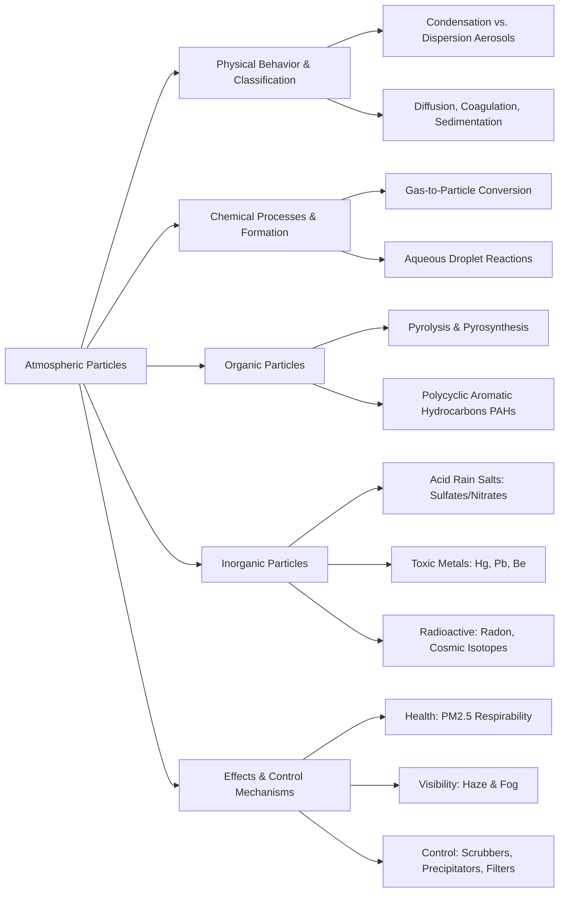

Here is the note based on the provided chapter on Particles in the Atmosphere.

## 1. Chapter Global Mind Map

## 2. Key Concepts & Definitions

- **Aerosol**: Colloidal-sized atmospheric particles that are typically smaller than 100 micrometers ($\mu m$) in diameter.
- **Condensation aerosol**: Aerosols formed strictly from the condensation of gases or vapors, typically resulting in very fine, highly respirable particles.
- **Dispersion aerosol**: Aerosols formed from the physical grinding of bulk solids or the mechanical dispersion of liquids, generally resulting in larger particles (above 1 $\mu m$).
- **Smoke**: Particulate matter resulting from the incomplete combustion of carbonaceous fuels.
- **Pyrosynthesis**: A chemical process occurring at high temperatures under oxygen-deficient conditions where complex, toxic organic molecules (like PAHs) are synthesized from simpler hydrocarbon fragments.
- **Polycyclic Aromatic Hydrocarbons (PAHs)**: Condensed aromatic ring molecules (such as Benzo(a)pyrene) primarily produced by internal combustion engines, many of which are highly carcinogenic when metabolized by the human body.

## 3. Crucial Formulas & Theorems

**1. Acid Rain and Secondary Salt Particulate Formation** $$\text{Oxidation of Pyrite: } 4\text{FeS}_2 + 11\text{O}_2 \rightarrow 2\text{Fe}_2\text{O}_3 + 8\text{SO}_2$$ $$\text{Sulfuric Acid Formation: } 2\text{SO}_2 + \text{O}_2 + 2\text{H}_2\text{O} \rightarrow 2\text{H}_2\text{SO}_4$$ $$\text{Ammonium Sulfate Particulate: } \text{H}_2\text{SO}_4(\text{droplet}) + 2\text{NH}_3(g) \rightarrow (\text{NH}_4)_2\text{SO}_4(g, \text{particulate})$$ _Parameters:_ $\text{FeS}_2$ is pyrite (often found in coal), $\text{SO}_2$ is sulfur dioxide gas, $\text{H}_2\text{SO}_4$ is sulfuric acid droplets, and $\text{NH}_3$ is atmospheric ammonia gas. _Significance:_ Demonstrates the gas-to-particle conversion mechanism where primary gaseous emissions from fossil fuels oxidize into strong acids, which are then neutralized by atmospheric ammonia to form persistent, fine inorganic salt aerosols.

**2. Photochemical Radical Generation in Water Droplets** $$\text{H}_2\text{O}_2(aq) + h\nu \rightarrow 2\text{HO}^\bullet(aq)$$ _Parameters:_ $\text{H}_2\text{O}_2$ is aqueous hydrogen peroxide, $h\nu$ represents a photon of solar energy, and $\text{HO}^\bullet$ is the highly reactive hydroxyl radical. _Significance:_ Shows that suspended atmospheric water droplets act as crucial micro-reactors. Solar radiation cleaves peroxide to yield hydroxyl radicals, which rapidly drive the oxidation of dissolved trace pollutants (like $\text{SO}_2$).

## 4. Logic & Step-by-step Walkthrough

### Walkthrough 1: Chemical Modification of Sea-Salt Particles

**Scenario:** Natural primary particles, such as sea-salt droplets, undergo extensive chemical aging and transformation as they interact with polluted atmospheric gases and radicals.

- **Step 1: Primary Aerosol Generation.** Bursting bubbles on the ocean surface eject fine seawater droplets into the air. Water evaporates, leaving behind a solid sodium chloride ($\text{NaCl}$) nucleus.
- **Step 2: Hydroxyl Radical Attack.** Highly reactive atmospheric hydroxyl radicals attack the solid $\text{NaCl}$ surface, stripping the chlorine to form sodium hydroxide and chlorine gas: $$2\text{NaCl} + 2\text{HO}^\bullet \rightarrow 2\text{NaOH} + \text{Cl}_2$$
- **Step 3: Condensation of Acids.** Anthropogenic sulfur dioxide ($\text{SO}_2$) or sulfuric acid ($\text{H}_2\text{SO}_4$) in the atmosphere encounters the newly formed basic $\text{NaOH}$ on the particle's surface.
- **Step 4: Acid-Base Neutralization.** A neutralization reaction occurs, ultimately coating the original sea-salt particle with a layer of solid sodium sulfate ($\text{Na}_2\text{SO}_4$): $$2\text{NaOH} + \text{H}_2\text{SO}_4 \rightarrow \text{Na}_2\text{SO}_4 + \text{H}_2\text{O}$$
- **Conclusion:** This multi-step heterogeneous reaction illustrates how "clean" natural aerosols physically scavenge and permanently accumulate anthropogenic inorganic pollutants as they age in the atmosphere.

### Walkthrough 2: Formation and Danger of PAHs

**Scenario:** The high-temperature combustion in diesel or automobile engines leads to the formation of highly toxic organic particulate matter.

- **Step 1: Pyrolysis.** At elevated temperatures, longer-chain alkanes present in fuels begin to thermally decompose (pyrolysis) into highly reactive, smaller hydrocarbon fragments.
- **Step 2: Pyrosynthesis.** If the engine chamber is oxygen-deficient, these fragments undergo rapid dehydrogenation and fuse together (aromatization > cycloolefins > olefins) rather than combusting cleanly into $\text{CO}_2$ and $\text{H}_2\text{O}$.
- **Step 3: Ring Condensation.** The rings continue to condense, forming large Polycyclic Aromatic Hydrocarbons (PAHs) like Benzo(a)pyrene, which quickly adsorb onto carbonaceous soot particles.
- **Conclusion:** These PAH-coated particles are emitted in engine exhaust. Because they are typically less than 1 $\mu m$, they bypass human respiratory defenses and lodge deep in the lungs, where enzymes metabolize the PAHs into their final carcinogenic epoxide forms.

## 5. Exhaustive Take-home Messages (Exam Prep Focus)

### A. Core Definitions

1. **Particles in the atmosphere:** Pollutants ranging from 0.001 to 10 $\mu m$ in diameter, encompassing inorganic salts, organic soot, and biological materials (pollen) suspended near urban and industrial sources.
2. **Terms Pertaining to Particles:** Distinct categorizations of particulate matter, including aerosols (colloids), mists (liquid), fog (water droplets), haze (visibility-reducing particles), and smoke (combustion products).
3. **Aerodynamic diameters:** The standardized measurement used to classify the physical size of irregularly shaped particles, fundamentally determining how far they will penetrate into the human respiratory tract and their atmospheric lifespan.
4. **Aerosol and dispersion aerosols:** Aerosols broadly refer to colloidal particles (< 100 $\mu m$). Dispersion aerosols specifically describe particles formed via mechanical grinding or liquid dispersion, which are characteristically larger (> 1 $\mu m$) and less deeply respirable than condensation aerosols.
5. **Chemical reaction in atmosphere:** The transformative gas-to-particle processes (e.g., $NO_x$ converting to smog, or $SO_2$ converting to sulfates) and the heterogeneous reactions occurring on particle surfaces or inside water droplets.
6. **Pyrolysis and pyrosynthesis:** The dual thermal processes inside combustion engines where complex fuels first thermally fragment (pyrolysis) and then logically recombine under low oxygen to build heavier, toxic structures (pyrosynthesis).
7. **PAHs & PM 2.5:** PAHs (Polycyclic Aromatic Hydrocarbons) are complex, ringed organic toxins. PM 2.5 refers to particulate matter smaller than 2.5 micrometers, which is the exact size range necessary to carry PAHs and heavy metals deep into human alveolar tissue, causing severe health episodes (like the 1952 London Smog).
8. **6 Priority Pollutants:** The six critical atmospheric pollutants strictly regulated by the U.S. EPA: $\text{SO}_2$, $\text{CO}$, $\text{O}_3$, $\text{NO}_2$, Atmospheric particles (PM), and Lead ($\text{Pb}$).

### B. Process Discussions & Analysis

- **Chemical Gas-to-Particle Conversion Mechanisms:** The atmosphere naturally acts as a massive reaction vessel that transforms hazardous gases into solid or liquid particles. For instance, volatile inorganic gases (ammonia, nitric acid, hydrochloric acid) aggressively react with one another to form solid salt dispersion aerosols (e.g., $\text{NH}_4\text{NO}_3$, $\text{NH}_4\text{Cl}$). Similarly, the atmospheric oxidation products of hydrocarbons yield aldehydes, ketones, and carboxylic acids which subsequently condense into secondary organic aerosols.
- **Control of Particle Emissions:** Removing particles relies on intercepting these physical processes. Gravity/sedimentation works for massive particles. **Fabric filters** act as physical sieves. **Venturi scrubbers** forcefully use liquid mists to coagulate and wash particles out of the gas stream. **Electrostatic precipitators** exploit particle surface charge, shooting electrons through a gas stream to charge particles negatively, which are then magnetically ripped out of the air by a positively charged grounded surface.

> **⚠️ Common Pitfalls / Key Exam Concepts:**
> 
> - **Condensation vs. Dispersion Aerosol Toxicity:** You must remember that size dictates danger. _Condensation aerosols_ (formed chemically from gases) are almost always sub-micron (< 1 $\mu m$), making them highly toxic and fully respirable. _Dispersion aerosols_ (dust, sea spray) are generally > 1 $\mu m$, meaning human mucous membranes and upper respiratory tracts can usually filter them out.
> - **Role of Water in Particle Chemistry:** Do not treat fog and clouds just as weather phenomena. They are active _particulate matter_ acting as crucial liquid reaction media where radicals ($\text{HO}^\bullet$) and trace metals ($\text{Fe}$) dissolve to exponentially accelerate the oxidation of pollutants like $\text{SO}_2$ into strong acids.